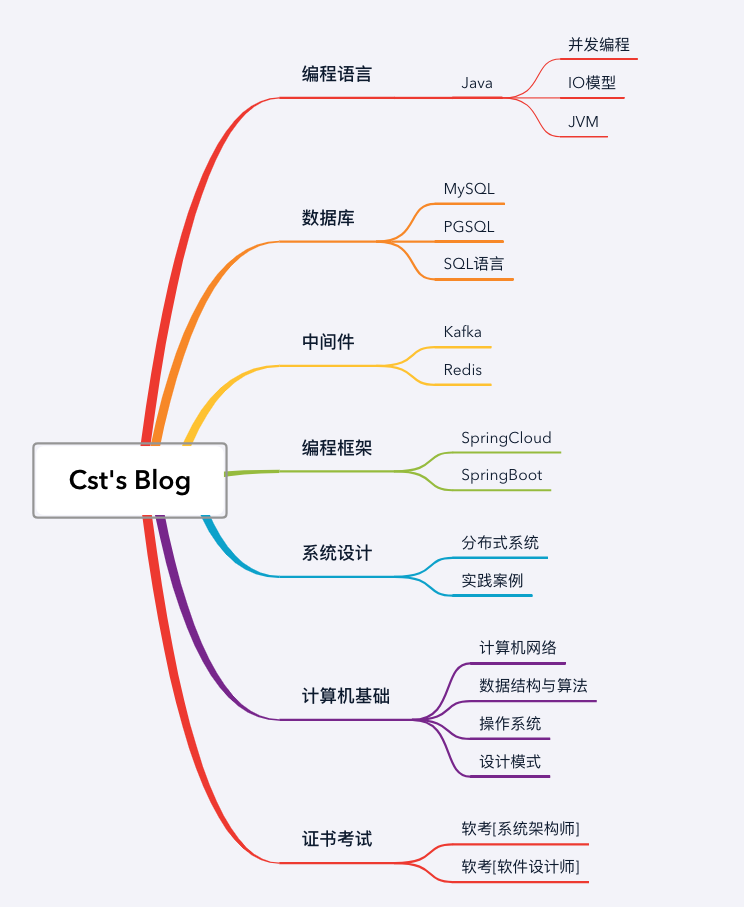

# Cst's Blog

Cst的技术栈积累

> practice makes perfect
>
> Just do it 




每个版块会分为知识讲解和面试八股，相对而言，八股更为提炼。


🙈🙈Need to do：

- [ ] Sentinel 限流熔断框架，底层细节实现再细看
- [ ] Seta分布式事务组件待看
- [ ] JVM相关的书籍再深入看一下 
- [ ] 并发编程-JMM
- [ ] AES js加密配置
- [ ] 


字数统计，仅匹配中文字符，去掉空格空行后统计词。

```shell
 find . -regex '[^_]*.md' -exec cat {} \;|sed -r 's/|[+]|[@]|[~]|[*]|[//(]|[//)]|[|]|[`]|[#]|[:]|[;]|[=]|[-]|[___]|["]|[¥]|[.]|[?]|[!]|[&]|[^[\u4E00-\u9FA5A-Za-z0-9_]+$]|[<]|[>]|[/]|[0-9]|[a-z]|[A-Z]|[%]//g' | sed -r 's/[[:space:]]//g' | sed '/^$/d' | wc -m
```


