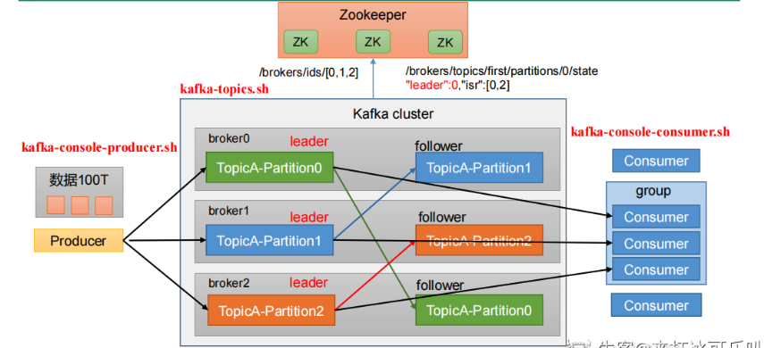

@autoHeader: 2.1.1.1.1.1

<p align="right">update time : {docsify-updated}</p>


## Kafka消息模型

###  消息模型分类

点对点模式和发布订阅模式

1. 点对点模型：一个生产者向一个特定的队列发布消息，只有一个消费者进行消费。生产者不需要在接收者消费时处于运行状态，接收者也不需要在消息发送时处于运行状态；多个消费者对于队列内的消息是竞争关系，每个消费者只能收到队列的一部分消息。
2. 发布-订阅模型：一个生产者向一个特定的队列发布消息，0个或多个订阅者可以接收特定主题的消息；发布者需要创建一个主题，一个主题至少是一个队列组成的，每个消费者都能收到全量的消息。

###  Kafka消息模型 --- 消费者组机制

kafka中的两种消息模型，队列和发布订阅，就是通过consumer group实现的：

- 队列模型：所有的Consumer实例都属于一个group，即一条消息仅被消费一次。[单播]
- 发布/订阅模型：所有的Consumer实例都单独使用一个group，即一条消息会被广播到所有消费者。[广播]


一个主题可以配置几个分区，生产者发送的消息分发到不同的分区中，消费者接收数据的时候是按照消费者组来接收的：

1. 每个分区的消息只能被同一个消费者组中的同一个消费者消费。 --- 单播
2. 每个分区的消息可以被不同消费者组里的消费者消费。 --- 广播

###  消费者组分区分配策略

Kafka有两种分配策略，一是roundrobin，一是range。最新还有一个StickyAssignor策略。

目前我们还不能自定义分区分配策略，只能通过`partition.assignment.strategy`参数选择 range 或 roundrobin。`partition.assignment.strategy`参数默认的值是range。

**1 Range策略**

RangeAssignor对每个Topic进行独立的分区分配。对于每一个Topic，首先对分区按照分区ID进行排序，然后订阅这个Topic的消费组的消费者再进行排序，之后尽量均衡的将分区分配给消费者。这里只能是尽量均衡，因为分区数可能无法被消费者数量整除，那么有一些消费者就会多分配到一些分区。

Range策略：首先对同一个Topic里面的分区按照序号进行排序，并对消费者按照字母顺序进行排序。然后用Partitions分区的个数除以消费者线程的总数来决定每个消费者线程消费几个分区。假设n=分区数/消费者数量，m=分区数%消费者数量，那么前m个消费者每个分配n+1个分区，后面的（消费者数量-m）个消费者每个分配n个分区。

> 假如有10个分区，3个消费者线程，把分区按照序号排列0，1，2，3，4，5，6，7，8，9；消费者线程为C1-0，C2-0，C2-1，那么用partition数除以消费者线程的总数来决定每个消费者线程消费几个partition，如果除不尽，前面几个消费者将会多消费一个分区。在我们的例子里面，我们有10个分区，3个消费者线程，10/3 = 3，而且除除不尽，那么消费者线程C1-0将会多消费一个分区，所以最后分区分配的结果看起来是这样的：
>
> ```text
> C1-0：0，1，2，3
> C2-0：4，5，6
> C2-1：7，8，9
> ```
>
> 如果有11个分区将会是：
>
> ```text
> C1-0：0，1，2，3
> C2-0：4，5，6，7
> C2-1：8，9，10
> ```

> 假如我们有两个主题T1,T2，分别有10个分区，最后的分配结果将会是这样：
>
> ```text
> C1-0：T1（0，1，2，3） T2（0，1，2，3）
> C2-0：T1（4，5，6） T2（4，5，6）
> C2-1：T1（7，8，9） T2（7，8，9）
> ```

如果有 N 多个 topic，那么针对每个 topic，消费者 C1-0 都将多消费 1 个分区，topic越多，C1-0 消费的分区会比其他消费者明显多消费 N 个分区。这就是 Range 范围分区的一个很明显的弊端了

**2  RoundRobin**

RoundRobin策略的原理是将消费组内所有消费者以及消费者所订阅的所有topic的partition按照字典序排序【==注意的是这里排序的是该消费者组订阅的所有topic的partition，和策略1中的range不同，range是一个topic 一个topic的排序分配==】，然后通过轮询方式逐个将分区以此分配给每个消费者。


RoundRobinAssignor的分配策略是将消费组内订阅的所有Topic的分区及所有消费者进行排序后尽量均衡的分配（RangeAssignor是针对单个Topic的分区进行排序分配的）。

如果消费组内，消费者订阅的Topic列表是相同的（每个消费者都订阅了相同的Topic），那么分配结果是尽量均衡的（消费者之间分配到的分区数的差值不会超过1）。如果订阅的Topic列表是不同的，那么分配结果是不保证“尽量均衡”的，因为某些消费者不参与一些Topic的分配。


**3.StickyAssignor**

Kafka从0.11.x版本开始引入这种分配策略，它主要有两个目的：

1. 分区的分配要尽可能的均匀，分配给消费者者的主题分区数最多相差一个；
2. 分区的分配尽可能的与上次分配的保持相同。

当两者发生冲突时，第一个目标优先于第二个目标。

这里代码实现很复杂，大致知道有这个东西就行了。

StickyAssignor分配算法的核心逻辑如下：

1. 先构建出当前的分配状态：currentAssignment
   1. 如果currentAssignment为空，则是全新的分配
2. 构建出partition2AllPotentialConsumers和consumer2AllPotentialPartitions两个辅助后续分配的数据结构
   1. partition2AllPotentialConsumers是一个Map<TopicPartition, List<String>>，记录着每个Partition可以分配给哪些Consumer
   2. consumer2AllPotentialPartitions是一个Map<String, List<TopicPartition>>，记录着每个Consumer可以分配的Partition列表
3. 补全currentAssignment，将不属于currentAssignment的Consumer添加进去（如果新增了一个Consumer，这个Consumer上一次是没参与分配的，新添加进去分配的Partition列表为空）
4. 构建出currentPartitionConsumer来用于辅助的分配，currentPartitionConsumer记录了当前每个Partition分配给了哪个Consumer——就是把currentAssignment从Consumer作为Key转换到Partition作为Key用于辅助分配
5. 对所有分区进行排序（排序结果为sortedPartitions），排序有两种规则：
   1. 如果不是初次分配，并且每个Consumer订阅是相同的：
      1. 对Consumer按照它所分配的Partition数进行排序
      2. 按照上一步的排序结果，将每个Consumer分配的分区插入到List中（List就是排序后的分区）
      3. 将不属于任何Consumer的分区加入List中
   2. 否则：分区之间按照可以被分配的Consumer的数量进行排序
6. 构造unassignedPartitions记录所有要被分配的分区（初始为上一步排序过的所有分区，后续进行调整：将已分配的，不需要移除了Partition从unassignedPartitions中移除）
7. 进行分区调整，来达到分区分配均衡的目的；分区的Rebalance包含多个步骤
   1. 将上一步未分配的分区（unassignedPartitions）分配出去。分配的策略是：按照当前的分配结果，每一次分配时将分区分配给订阅了对应Topic的Consumer列表中拥有的分区最少的那一个Consumer
   2. 校验每一个分区是否需要调整，如果分区不需要调整，则从sortedPartitions中移除。分区是否可以被调整的规则是：如果这个分区是否在partition2AllPotentialConsumers中属于两个或超过两个Consumer。
   3. 校验每个Consumer是否需要调整被分配的分区，如果不能调整，则将这个Consumer从sortedCurrentSubscriptions中移除，不参与后续的重分配。判断是否调整的规则是：如果当前Consumer分配的分区数少于它可以被分配的最大分区数，或者它的分区满足上一条规则。
   4. 将以上步骤中获取的可以进行重分配的分区，进行重新的分配。每次分配时都进行校验，如果当前已经达到了均衡的状态，则终止调整。均衡状态的判断依据是Consumer之间分配的分区数量的差值不超过1；或者所有Consumer已经拿到了它可以被分配的分区之后仍无法达到均衡的上一个条件（比如c1订阅t1，c2订阅t2，t1 t2分区数相差超过1，此时没法重新调整）。如果不满足上面两个条件，且一个Consumer所分配的分区数少于同一个Topic的其他订阅者分配到的所有分区的情况，那么还可以继续调整，属于不满足均衡的情况。
8. 后续流程和普通分配一致


##  Kafka存储结构

###Kafka用什么存储消息

Kafka 最终会选用 logging（日志文件）+ 哈希索引的结构来存储消息。

Kafka 所处业务场景的特点是：

1. 写入操作：并发非常高，百万级 TPS，但都是顺序写入，无需考虑更新。
2. 查询操作：需求简单，能按照 offset 查询消息。

Kafka采用的Append追加写日志文件的方式，是满足写入操作并发性能要求的。

在读操作中，需要有一个offset和对应消息的对应关系，也就是要建立一个哈希索引，由于都是顺序写入，没有必要为每个消息都建立哈希索引，所以采用了稀疏的哈希索引的方式，把消息将消息划分成若干个 block，只索引每个 block 第一条消息的 offset ，先根据大小关系找到对应 block，然后在 block 中顺序搜索。


###  Kafka Topic下存储模型


Kafka是面向主题的，分区 + 分段 + 索引三层结构

1. 每个 Topic 被分成多个 Partition，Partition 从物理上可以理解成一个文件夹。Partition 主要是为了解决 Kafka 存储上的水平扩展问题，如果一个 Topic 的所有消息都只存在一个 Broker，这个 Broker 必然会成为瓶颈。因此，将 Topic 内的数据分成多个 Partition，然后分布到整个集群是很自然的设计方式。

> parition的命名规则为topic名称+有序序号，第一个partiton序号从0开始，序号最大值为partitions数量减1

2. 每个 Partition 又被分成了多个 Segment，Segment 从物理上可以理解成一个「数据文件 + 索引文件」。如果不引入 Segment，一个 Partition 只对应一个文件，那这个文件会一直增大，势必造成单个 Partition 文件过大，查找和维护不方便。比如，在做历史消息删除时，必然需要将文件前面的内容删除，不符合 Kafka 顺序写的思路。而在引入 Segment 后，则只需将旧的 Segment 文件删除即可，保证了每个 Segment 的顺序写。

> 日志文件的大小是Kafka **server.properties**设置的

## Kafka架构模型

### Kafka包含的组件

Kafka架构中的组件主要包括：

1. Producer：发送消息者
2. Consumer：消息接受者
3. broker：每个kafka实例(server)。
4. Kafka Controller：其中有一个broker会被选举为控制器（Kafka Controller），**它的主要作用是在 ZooKeeper 的帮助下管理和协调整个 Kafka 集群**，
5. Zookeeper：依赖集群保持元信息。他的作用包括
   1. 管理和协调Broker，broker的注册、出现故障的broker等
   2. 存储元数据，Kafka有多少topic、partition、consumer；topic各个partition的offset等

### KafkaController

#### Controller的职责

具备控制器身份的broker需要比其他普通的broker多一份职责，具体细节如下：

1. 主题管理： Kafka Controller 可以帮助我们完成对 Kafka 主题创建、删除和增加分区的操作，简而言之就是对分区拥有最高行使权。当我们执行**kafka-topics 脚本**时，大部分的后台工作都是控制器来完成的。

   > 为Zookeeper中的/brokers/topics节点添加TopicChangeListener，用来处理topic增减的变化；为Zookeeper中的/admin/delete_topics节点添加TopicDeletionListener，用来处理删除topic的动作。

2. 监听分区的变化，处理副本leader的选举动作。

   > zookeeper中的/admin/reassign_partitions节点注册PartitionReassignmentListener，用来处理分区重分配的动作。为Zookeeper中的/isr_change_notification节点注册IsrChangeNotificetionListener，用来处理ISR集合变更的动作。为Zookeeper中的/admin/preferred-replica-election节点添加PreferredReplicaElectionListener，用来处理优先副本的选举动作。

   > 当控制器发现一个 broker 离开集群（通过观察相关 ZooKeeper 路径），控制器会收到消息：这个 broker 所管理的那些分区需要一个新的 Leader。控制器会依次遍历每个分区，确定谁能够作为新的 Leader，然后向所有包含新 Leader 或现有 Follower 的分区发送消息，该请求消息包含谁是新的 Leader 以及谁是 Follower 的信息。随后，新的 Leader 开始处理来自生产者和消费者的请求，Follower 用于从新的 Leader 那里进行复制。

   > 如果参数auto.leader.rebalance.enable设置为true，则还会开启一个名为“auto-leader-rebalance-task”的定时任务来负责维护分区的优先副本的均衡

3. 集群成员管理，监听broker的变化。

   > 通过观察zookeeper路径，接收broker的增减。为Zookeeper中的/brokers/ids/节点添加BrokerChangeListener，用来处理broker增减的变化。

4. 数据服务，更新集群的元数据信息，向其他 broker 提供数据服务。控制器上保存了最全的集群元数据信息，其他所有 broker 会定期接收控制器发来的元数据更新请求，从而更新其内存中的缓存数据。

#### Controller存储的信息有哪些


broker controller 会提供数据服务，用于保存大量的 Kafka 集群数据。主要分为三类

1. broker 上的所有信息，包括 broker 中的所有分区，broker 所有分区副本，当前都有哪些运行中的 broker，哪些正在关闭中的 broker 。
2. 所有主题信息，包括具体的分区信息，比如领导者副本是谁，ISR 集合中有哪些副本等。
3. 所有涉及运维任务的分区。包括当前正在进行 Preferred 领导者选举以及分区重分配的分区列表。

Kafka 是离不开 ZooKeeper的，所以这些数据信息在 ZooKeeper 中也保存了一份。

每当控制器初始化时，它都会从 ZooKeeper 上读取对应的元数据并填充到自己的缓存中。

#### Controller选举机制

Kafka 当前选举控制器的规则是：==Kafka 集群中第一个启动的 broker 通过在 ZooKeeper 里创建一个临时节点 `/controller` 让自己成为 controller 控制器。==

其他 broker 在启动时也会尝试创建这个节点，但是由于这个节点已存在，所以后面想要创建 /controller 节点时就会收到一个 **节点已存在** 的异常。然后其他 broker 会在这个控制器上注册一个 ZooKeeper 的 watch 对象，`/controller` 节点发生变化时，其他 broker 就会收到节点变更通知。这种方式可以确保只有一个控制器存在。

如果控制器关闭或者与 ZooKeeper 断开链接，ZooKeeper 上的临时节点就会消失。集群中的其他节点收到 watch   对象发送控制器下线的消息后，其他 broker 节点都会尝试让自己去成为新的控制器。其他节点的创建规则和第一个节点的创建原则一致，都是第一个在 ZooKeeper 里成功创建控制器节点的 broker 会成为新的控制器，那么其他节点就会收到节点已存在的异常，然后在新的控制器节点上再次创建 watch 对象进行监听。

#### 控制器脑裂是什么

如果控制器所在broker挂掉了或者Full GC停顿时间太长出现假死情况下，Kafka集群必须选举出新的控制器，但如果之前被取代的控制器又恢复正常了，它依旧是控制器身份，这样集群就会出现两个控制器，这就是控制器脑裂问题。

解决方法：

为了解决Controller脑裂问题，ZooKeeper中还有一个与Controller有关的持久节点/controller_epoch，存放的是一个整形值的epoch number（纪元编号，也称为隔离令牌），集群中每选举一次控制器，就会通过Zookeeper创建一个数值更大的epoch number，如果有broker收到比这个epoch数值小的数据，就会忽略消息。

### Kafka多分区多副本架构




##  Kafka的分区机制【高吞吐】

分区机制是kafka实现高吞吐的方式。

### 分区个数

从数据组织形式来说，kafka有三层形式，kafka有多个主题，每个主题有多个分区，每个分区又有多条消息。而每个分区可以分布到不同的机器上，这样一来，从服务端来说，分区可以实现高伸缩性，以及负载均衡，动态调节的能力。

分区越多，所需要消耗的资源就越多，并不是分区越多性能越好。确定分区个数的方式有：

1. 结合具体业务的处理速度和时间来估算。假如每秒钟需要从主题写入和读取1GB数据，而消费者1秒钟最多处理50MB的数据，那么这个时候就可以设置20-25个分区，当然还要结合具体的物理资源情况。
2. 基准测试来测试，创建不同分区的topic，逐步压测测出最终的结果。
3. 一般推荐确定分区数的方式就是broker机器数量的2~3倍。

### 分区策略

每个分区可以分布到不同的机器上，这样一来，从服务端来说，分区可以实现高伸缩性，以及负载均衡，动态调节的能力。

我们可以通过replication-factor指定创建topic时候所创建的分区数。

所谓分区策略就是决定生产者将消息发送到哪个分区的算法。

- RoundRobinPartitioner：轮询分区策略，按照分区编号依次将消息分配到不同的分区。
- HashedPartitioner：哈希分区策略，将消息的key进行哈希计算，然后将哈希结果对分区数取余，得到消息所在的分区。
- RangePartitioner：范围分区策略，根据消息key的范围将消息分配到不同的分区。需要在创建主题时指定分区边界。
- StickyPartitioner：粘性分区策略，将消息发送到同一个分区，直到该分区的消息数量超过阈值，才会将消息发送到下一个分区。这个策略可以用来保证消息的顺序性。
- CustomPartitioner：自定义分区策略，用户可以根据自己的业务逻辑自定义分区策略。重写实现Partitioner类中的partition()方法。

```java
public class MyParatitioner implements Partitioner {
    @Override
    public void configure(Map<String, ?> configs) {
    }
   @Override
public int partition(String topic, Object key, byte[] keyBytes,
                     Object value, byte[] valueBytes, Cluster cluster) {
    //key不能空，如果key为空的会通过轮询的方式 选择分区
    if(keyBytes == null || (!(key instanceof String))){
        throw new RuntimeException("key is null");
    }
    //获取分区列表
    List<PartitionInfo> partitions = cluster.partitionsForTopic(topic);

    //以下是上述各种策略的实现，不能共存
    //随机策略
    return ThreadLocalRandom.current().nextInt(partitions.size());

    //按消息键保存策略
    return Math.abs(key.hashCode()) % partitions.size();

    //自定义分区策略, 比如key为123的消息，选择放入最后一个分区
    if(key.toString().equals("123")){
        return partitions.size()-1;
    }else{
        //否则随机
        ThreadLocalRandom.current().nextInt(partitions.size());
    }
}
}
```


## Kafka的副本机制【高可用】

副本机制是Kafka实现高可用的方式。

在kafka中，每个主题可以有多个分区，每个分区又可以有多个副本。这多个副本中，只有一个是leader，而其他的都是follower副本。仅有leader副本可以对外提供服务。多个follower副本通常存放在和leader副本不同的broker中。通过这样的机制实现了高可用，当某台机器挂掉后，其他follower副本也能迅速”转正“，开始对外提供服务。

###  kafka的副本都有哪些作用

在kafka中，实现副本的目的就是冗余备份，且仅仅是冗余备份，所有的读写请求都是由leader副本进行处理的。follower副本仅有一个功能，那就是从leader副本拉取消息，尽量让自己跟leader副本的内容一致。

### follower副本为什么不对外提供服务

这个问题本质上是对性能和一致性的取舍。

性能虽然提升了，但可能出现数据不一致的问题，例如现在写入一条数据到kafka主题a，消费者b从主题a消费数据，却发现消费不到，因为消费者b去读取的那个分区副本中，最新消息还没写入。而这个时候，另一个消费者c却可以消费到最新那条数据，因为它消费了leader副本。

### leader副本挂掉后，如何选举新副本

副本leader的选举是由kafka controller执行的。

在Kafka集群中，常见的LeaderReplica选举策略有以下三种：

1. 首选副本选举策略。在这种策略下，每个分区都有一个首选副本（Preferred Replica），通常是副本集合中的第一个副本。当触发选举时，控制器会优先选择该首选副本作为新的Leader Replica，只有在首选副本不可用的情况下，才会考虑其他副本。

   > 当然，也可以使用命令手动指定每个分区的首选副本：
   > bin/kafka-topics.sh--zookeeperlocalhost:2181--topicmy-topic-name--replica-assignment
   > 0:1,1:2,2:0--partitions 3
   > 意思是：my-topic-name有3个partition，partitiono的首选副本是Broker1，partition1首选副本
   > 是Broker2，partition2的首选副本是Brokero。

2. ISR[In-Sync Replicas 副本同步队列]选举策略：即从 AR 中挑选首个在 ISR 中的副本，作为新 Leader。（AR[Assigned Replicas]是所有副本的集合，其顺序在创建时即定好）

3. UncleanLeader选举策略。当所有SR副本都不可用时。在这种情况下，会从所有副本中（包含OsR[Out-of-Sync Replicas 非同步副本队列]集合）选择一个副本作为新的Leader副本，即使这个副本与当前Leader副本不同步。这种选举策略可能会导致数据丢失，因此只应在紧急情况下使用。

   > 修改下面的配置，可以开启UncleanLeader选举策略，默认关闭。
   > unclean.leader.election.enable=true

### 在ISR中保留的条件

其实跟一个参数有关：replica.lag.time.max.ms。【副本同步最大时间】

如果持续拉取速度慢于leader副本写入速度，慢于时间超过replica.lag.time.max.ms后，它就变成“非同步”副本，就会被踢出ISR副本集合中。但后面如何follower副本的速度慢慢提上来，那就又可能会重新加入ISR副本集合中了。

### 触发ISR选举的时机

1. Leader Replica失效：当Leader Replica出现故障或失去连接时选举。
2. Broker岩机：当LeaderReplica所在的Broker节点发生故障或者岩机时，Kafka也会触发
   LeaderReplica选举。
3. 新增Broker时：当集群新增Broker时，触发选举，以重新分配Partition的Leader。
4. 新建分区：当一个新的分区被创建时，需要选举一个LeaderReplica。
5. ISR列表数量减少：当Partition的ISR列表数量减少时，可能会触发LeaderReplica选举。当
   ISR列表中副本数量小于ReplicationFactor（副本因子）时，为了保证数据的安全性，就会触
   发LeaderReplica选举。
6. 手动触发：通过Kafka管理工具（kafka-preferred-replica-election.sh），可以手动触发选
   举，以平衡负载或实现集群维护。

### 副本同步策略

#### 同步复制

过程如下：

1. producer 向leader副本写入消息
2. leader副本收到消息后会把消息写入到本地 log
3. follower 副本会从leader副本那里拉取消息
4. follower 副本向本地写入 log
5. follower 副本向leader副本发送写入成功的消息
6. leader副本会收到所有的follower发送的消息
7. leader副本向producer发送写入成功的消息

###   异步复制

和同步复制的区别在于，leader 副本在写入本地log之后[即上面步骤2]，直接向客户端发送写入成功消息[上面步骤7]，不需要等待所有跟随者复制完成。

###  副本分配策略

分配副本应该处于哪些broker上，原则为：

1. 将副本平均分布在所有的 Broker 上;
2. partition 的多个副本应该分配在不同的 Broker 上;
3. 如果所有的 Broker 有机架信息的话, partition 的副本应该分配到不同的机架上。

#### 无机架分配

所有的broker都没有配置机架信息

1. 从 broker.list 随机选择一个 Broke作为分区的第一个副本,随机生成副本间隔参数nextReplicaShit，用以分配下一个副本
2. 分配后面的分区,分区的第一个副本位置都是按照broker list顺序遍历的;
3. 对于副本分配来说,每经历一轮Broker List的遍历，nextReplicaShit参数+1;


> 上面是分配的情况,我们每一行每一行看, 每次都是先把每个分区的副本分配好的;
>
> 1. 最开始的时候,随机一个Broker作为第一个来接受P0; 这里我们假设随机到了 broker-0; 所以第一个P0在broker-0上; 那么第二个`p0-2`的位置跟`nextReplicaShit`有关,这个值也是随机的,这里假设随机的起始值也是0; 这个值意思可以简单的理解为,第一个副本和第二个副本的间隔;
> 2. 因为`nextReplicaShit=0`; 所以p0的分配分别再 {0,1,2}
> 3. 然后再分配后面的分区,分区的第一个副本位置都是按照broker顺序遍历的;
> 4. 直到这一次的broker遍历完了,那么就要重头再进行遍历了, 同时`nextReplicaShit=nextReplicaShit+1=1`;
> 5. P5-1 再broker-0上,然后p5-2要跟p5-1间隔`nextReplicaShit=1`个位置,所以p5-2这时候在broker-2上,P5-3则在P5-2基础上顺推一位就行了,如果顺推的位置上已经有了副本,则继续顺推到没有当前分区副本的Broker
> 6. 如果分区过多,有可能nextReplicaShift就变的挺大,在算第一个跟第二个副本的间隔的时候,不用把第一个副本算进去; 假如下面起始是 5，其中经历过的间隔就是 （ 1->2->3->4->1 ）所以PN-2就落在 BrokerLIst[2]上了


Q:startlndex和nextReplicaShi为啥要用随机值

A：之所以 `startlndex`选择随机产生，是因为这样可以在多个主题的情况下尽可能地均匀分布分区副本，如果这里固定为一个特定值，那么每次的第一个副本都是在这个 broker 上，进而导致少数几个 broker 所分配到的分区副本过多而其余 broker 分配到的分区副本过少，最终导致负载不均衡。尤其是某些主题的副本数和分区数都比较少，甚至都为 1 的情况下，所有的副本都落到了那个指定的 broker 上。与此同时，在分配时位移量 nextReplicaShit 也可以更好地使分区副本分配得更加均匀。


Q:BrokerList顺序是由什么决定的

A：

1. 创建Topic的时候 是用的 `metadataCache.getAliveBrokers` 是一个无序的map对象
2. 新增分区的时候 是将Broker List 作了排序
3. 执行分区副本重分配任务, 也是将BrokerList做了排序

#### 有机架分配

所有的broker都配置了机架信息，如果出现部分broker配置了机架信息而另一部分没有配置的话，则会抛出AdminOperationException的异常，如果还想要顺利创建topic的话，此时需加上“–disable-rack-aware”

机架感知的意思是Kafka会把partition的各个replicas分散到不同的机架上，以提高机架故障时的数据安全性。

有机架分配按照交替机架的方式来选择broker：假设broker0、broker1和broker2放置在同一个机架上，broker3、broker4、broker5分别放置在其它不同的机架上。我们不是按照0-5的顺序来选择broker，而是按照0，3，1，4，2，5的顺序来选择，这样每个相邻的broker都在不同的机架上。


## 消费者组重平衡机制

###  Kafka中有哪几种协调器


Kafka中主要有两种协调器：

**消费组协调器**

消费组协调器【服务端】（Group Coordinator）：每个broker启动时，都会创建一个组协调器实例，负责监控这个消费组里的所有消费者的心跳以及判断是否宕机，然后开启消费者Rebalance。

> kafka上的组协调器(**GroupCoordinator**)协调器有很多, 跟Controller不一样的是, Controller只有一个, 而组协调器(**GroupCoordinator**)是根据内部Topic `__consumer_offset`数量决定的，有多少个 `__consumer_offset`分区, 那么就有多少个组协调器(**GroupCoordinator**)。
>
> 每个`__consumer_offset`分区的Leader副本在哪个Borker上, 那么对应协调器就在哪里。

消费组协调器的作用：

1. 选举Leader消费者客户端
2. 处理申请加入组的客户端
3. 再平衡后同步新的分配方案
4. 维护与客户端的心跳检测
5. 管理消费者已消费偏移量,并存储至`__consumer_offset`中

**消费者协调器**

消费者协调器【客户端】（Consumer Coordinator）：每个Consumer启动时，会创建一个消费者协调器实例并会向Kafka集群中的某个节点发送FindCoordinatorRequest请求来查找对应的组协调器，并跟其建立网络连接。

每个客户端都会有一个消费者协调器, 他的主要作用就是向组协调器发起请求做交互, 以及处理回调逻辑

1. 向组协调器发起入组请求
2. 向组协调器发起同步组请求(如果是Leader客户端,则还会计算分配策略数据放到入参传入)
3. 发起离组请求
4. 保持跟组协调器的心跳线程
5. 向组协调器发送提交已消费偏移量的请求

客户端的消费者协调器和服务端的组协调器会通过心跳保持通信。

### 消费者组状态机


1. 消费者组一开始处于 `Empty` 状态，当重平衡开启后，它会被置于 `PreparingRebalance` 状态等待新消费者的加入，一旦有新的消费者加入后，消费者群组就会处于 `CompletingRebalance` 状态等待分配，只要有新的消费者加入群组或者离开，就会触发重平衡，消费者的状态处于 PreparingRebalance 状态。
2. 当消费者群组都到达 `Stable` 状态后，一旦有新的**消费者加入/离开/心跳过期**，那么触发重平衡，消费者群组的状态重新处于 PreparingRebalance 状态。
3. 消费者群组处于 PreparingRebalance 状态后，很不幸，没人玩儿了，所有消费者都离开了，这时候还可能会保留有消费者消费的位移数据，一旦位移数据过期或者被刷新，那么消费者群组就处于 `Dead` 状态了
4. 在 `PreparingRebalance`或者 `CompletingRebalance` 或者 `Stable` 任意一种状态下发生位移主题分区 Leader 发生变更，群组会直接处于 Dead 状态

### 重平衡

即消费者组分区分配策略，重新为消费者组内成员分配分区。


