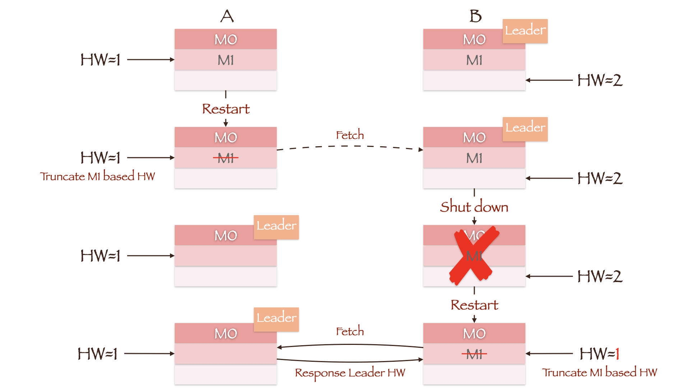

@autoHeader: 2.1.1.1.1.1
<p align="right">update time : {docsify-updated}</p>

## 消息队列

目前企业中比较常见的消息队列产品主要有Kafka、ActiveMQ、RabbitMQ、RocketMQ等。

在大数据场景主要采用Kafka作为消息队列。在JavaEE开发中主要采用ActiveMQ、RabbitMQ、RocketMQ。

- ActiveMQ：历史悠久，实现了JMS（Java Message Service）规范，支持性较好，性能相对不高。
- RabbitMQ：可靠性高、安全。
- RocketMQ：阿里开源的消息中间件，纯Java实现。
- Kafka：分布式、高性能、跨语言。

### 应用场景

传统的消息队列的主要应用场景包括:缓冲/消峰、解耦和异步通信。

- **缓冲/消峰：有助于控制和优化数据流经过系统的速度，解决生产消息和消费消息的处理速度不一致的情况**


 

- **解耦：允许你独立的扩展或修改两边的处理过程，只要确保它们遵守同样的接口约束。**


 

- **异步通信:允许用户把一个消息放入队列，但并不立即处理它，然后在需要的时候再去处理它们。**


### 消息队列模式

#### 点对点

消费者主动拉取数据，消息收到之后清除消息。


一个生产者向一个特定的队列发布消息，只有一个消费者进行消费。生产者不需要在接收者消费时处于运行状态，接收者也不需要在消息发送时处于运行状态；多个消费者对于队列内的消息是竞争关系，每个消费者只能收到队列的一部分消息。

#### 发布-订阅

1. 可以有多个topic主题
2. 消费者消费数据之后，不删除数据
3. 每个消费者相互独立，都可以消费到数据


一个生产者向一个特定的队列发布消息，0个或多个订阅者可以接收特定主题的消息；发布者需要创建一个主题，一个主题至少是一个队列组成的，每个消费者都能收到全量的消息。

##  存储结构

### 用什么存储消息

Kafka 最终会选用 logging（日志文件）+ 哈希索引的结构来存储消息。

Kafka 所处业务场景的特点是：

1. 写入操作：并发非常高，百万级 TPS，但都是顺序写入，无需考虑更新。
2. 查询操作：需求简单，能按照 offset 查询消息。

Kafka采用的Append追加写日志文件的方式，是满足写入操作并发性能要求的。

在读操作中，需要有一个offset和对应消息的对应关系，也就是要建立一个哈希索引，由于都是顺序写入，没有必要为每个消息都建立哈希索引，所以采用了稀疏的哈希索引的方式，把消息将消息划分成若干个 block，只索引每个 block 第一条消息的 offset ，先根据大小关系找到对应 block，然后在 block 中顺序搜索。


###  Topic下存储模型


Kafka是面向主题的，分区 + 分段 + 索引三层结构。

Topic是逻辑上的概念，而partition是物理上的概念，每个partition对应于一个log文件，该log文件中存储的就是Producer生产的数据。Producer生产的数据会被不断追加到该log文件末端。

为防止log文件过大导致数据定位效率低下，Kafka采取了分片和索引机制，将每个partition分为多个segment。每个segment包括：“.index”文件、“.log”文件和.timeindex等文件。

这些文件位于一个文件夹下，该文件夹的命名规则为：topic名称+分区序号，例如：first-0。

#### topic三层结构


**topic和分区**

每个 Topic 被分成多个 Partition，Partition 从物理上可以理解成一个文件夹。Partition 主要是为了解决 Kafka 存储上的水平扩展问题，如果一个 Topic 的所有消息都只存在一个 Broker，这个 Broker 必然会成为瓶颈。因此，将 Topic 内的数据分成多个 Partition，然后分布到整个集群是很自然的设计方式。

parition的命名规则为topic名称+有序序号，第一个partiton序号从0开始，序号最大值为partitions数量减1。

**分区和segment**

每个 Partition 又被分成了多个 Segment，Segment 从物理上可以理解成一个「数据文件 + 索引文件」。如果不引入 Segment，一个 Partition 只对应一个文件，那这个文件会一直增大，势必造成单个 Partition 文件过大，查找和维护不方便。比如，在做历史消息删除时，必然需要将文件前面的内容删除，不符合 Kafka 顺序写的思路。而在引入 Segment 后，则只需将旧的 Segment 文件删除即可，保证了每个 Segment 的顺序写。

日志文件的大小是Kafka **server.properties**设置的

#### 定位过程

<font color=red>index文件为稀疏索引，将消息划分成若干个 block，只索引每个 block 第一条消息的 offset ，先根据大小关系找到对应 block，然后在 block 中顺序搜索。</font>

默认块大小为4kb

 

定位过程：

1. 通过目标offset定位到segment文件
2. 在index文件中找到目标offset对应block的索引项
3. 定位到log文件
4. 向下遍历寻找到目标Record

官网有数据表明，同样的磁盘，顺序写能到600M/s，而随机写只有100K/s。这与磁盘的机械机构有关，顺序写之所以快，是因为其省去了大量磁头寻址的时间。

### 文件清理

Kafka中默认的日志保存时间为7天，可以通过调整如下参数修改保存时间。

```properties
log.retention.hours，最低优先级小时，默认7天。
log.retention.minutes，分钟。 
log.retention.ms，最高优先级毫秒。 
log.retention.check.interval.ms，负责设置检查周期，默认5分钟
```

Kafka中提供的日志清理策略有delete和compact两种。

#### delete

delete日志删除：将过期数据删除。

`log.cleanup.policy = delete`所有数据启用删除策略。

- 基于时间：默认打开。以segment中所有记录中的最大时间戳作为该文件时间戳。 
- 基于大小：默认关闭。超过设置的所有日志总大小，删除最早的segment。log.retention.bytes，默认等于-1，表示无穷大。 

#### compact

compact日志压缩，对于相同key的不同value值，只保留最后一个版本。

​	`log.cleanup.policy=compact`所有数据启用压缩策略。


压缩后的offset可能是不连续的，比如上图中没有6，当从这些offset消费消息时，将会拿到比这个offset大的offset对应的消息，实际上会拿到offset为7的消息，并从这个位置开始消费。

这种策略只适合特殊场景，比如消息的key是用户ID，value是用户的资料，通过这种压缩策略，整个消息集里就保存了所有用户最新的资料。

### 性能

#### 零拷贝

Kafka的数据加工处理操作交由Kafka生产者和Kafka消费者处理。Kafka Broker应用层不关心存储的数据，所以就不用走应用层，传输效率高。


#### 页缓存

Kafka重度依赖底层操作系统提供的PageCache功能。当上层有写操作时，操作系统只是将数据写入PageCache。当读操作发生时，先从PageCache中查找，如果找不到，再去磁盘中读取。

实际上PageCache是把尽可能多的空闲内存都当做了磁盘缓存来使用。

#### 分区+顺序写

1. Kafka是分布式集群，可以采用分区技术，并行度高。
2. 读数据采用稀疏索引，可以快速定位到要消费的数据。
3. 顺序写磁盘。Kafka的producer生产数据，要写入到log文件中，写的过程是一直追加到文件末端，为顺序写。

官网有数据表明，同样的磁盘，顺序写能到600M/s，而随机写只有100K/s。这与磁盘的机械机构有关，顺序写之所以快，是因为其省去了大量磁头寻址的时间。


## 架构模型

### 基础架构

**Kafka为多分区多副本架构**


Kafka架构中的组件主要包括：

1. Producer：发送消息者，生产者负责创建消息，然后将其发送到 Kafka。
2. Consumer：消息接受者，消费者连接到 Kafka 并接收消息，进而进行相应的业务逻辑处理。
3. Consumer Group(消费组): 一个消费者组可以包含一个或多个消费者。消费者组内每个消费者负责消费不同分区的数据，一个分区只能由一个组内消费者消费；消费者组之间互不影响，所有的消费者都属于某个消费者组，即消费者组是逻辑上的一个订阅者。
4. broker：每个kafka实例(server)。Broker 是 Kafka 的服务节点，即 Kafka 的服务器。一个集群由多个broker组成。一个broker可以容纳多个topic。
5. Topic:可以理解为一个队列，一个 Topic 又分为一个或多个分区。
6. Partition(分区)：是Kafka实现高吞吐的方式，一个非常大的topic可以分布到多个broker（即服务器）上，一个topic可以分为多个partition，每个partition是一个有序的队列。
7. Offset：是消息在分区中的唯一标识，Kafka 通过它来保证消息在分区内的顺序性，不过 Offset 并不跨越分区， 也就是说，<font color=red>Kafka 保证的是分区有序性而不是主题有序性，即局部有序</font>。
8. Replication(副本)：是 Kafka 保证数据高可用的方式，Kafka 同一Partition 的数据可以在多 Broker 上存在多 个副本，通常只有主副本对外提供读写服务，当主副本所在 Broker 崩溃或发生网络异常，Kafka 会在 Controller 的管理下会重新选择新的 Leader 副本对外提供读写服务。
9. Leader：每个分区多个副本的“主”，生产者发送数据的对象，以及消费者消费数据的对象都是Leader。
10. Follower：每个分区多个副本中的“从”，实时从Leader中同步数据，保持和Leader数据的同步。Leader发生故障时，某个Follower会成为新的Leader。
11. Record：实际写入 Kafka 中并可以被读取的消息记录。每个 Record 包含了 key、value 和 timestamp。
12. Kafka Controller：其中有一个broker会被选举为控制器（Kafka Controller），**它的主要作用是在 ZooKeeper 的帮助下管理和协调整个 Kafka 集群**，
13. Zookeeper：依赖集群保持元信息。他的作用包括
    1. 管理和协调Broker，broker的注册、出现故障的broker等
    2. 存储元数据，Kafka有多少topic、partition、consumer；topic各个partition的offset等

### Kafka-Controller

#### Controller的职责

具备控制器身份的broker需要比其他普通的broker多一份职责，具体细节如下：

1. 主题管理： Kafka Controller 可以帮助我们完成对 Kafka 主题创建、删除和增加分区的操作，简而言之就是对分区拥有最高行使权。当我们执行**kafka-topics 脚本**时，大部分的后台工作都是控制器来完成的。

   > 为Zookeeper中的/brokers/topics节点添加TopicChangeListener，用来处理topic增减的变化；为Zookeeper中的/admin/delete_topics节点添加TopicDeletionListener，用来处理删除topic的动作。

2. 监听分区的变化，处理副本leader的选举动作。

   > zookeeper中的/admin/reassign_partitions节点注册PartitionReassignmentListener，用来处理分区重分配的动作。为Zookeeper中的/isr_change_notification节点注册IsrChangeNotificetionListener，用来处理ISR集合变更的动作。为Zookeeper中的/admin/preferred-replica-election节点添加PreferredReplicaElectionListener，用来处理优先副本的选举动作。

   > 当控制器发现一个 broker 离开集群（通过观察相关 ZooKeeper 路径），控制器会收到消息：这个 broker 所管理的那些分区需要一个新的 Leader。控制器会依次遍历每个分区，确定谁能够作为新的 Leader，然后向所有包含新 Leader 或现有 Follower 的分区发送消息，该请求消息包含谁是新的 Leader 以及谁是 Follower 的信息。随后，新的 Leader 开始处理来自生产者和消费者的请求，Follower 用于从新的 Leader 那里进行复制。

   > 如果参数auto.leader.rebalance.enable设置为true，则还会开启一个名为“auto-leader-rebalance-task”的定时任务来负责维护分区的优先副本的均衡

3. 集群成员管理，监听broker的变化。

   > 通过观察zookeeper路径，接收broker的增减。为Zookeeper中的/brokers/ids/节点添加BrokerChangeListener，用来处理broker增减的变化。

4. 数据服务，更新集群的元数据信息，向其他 broker 提供数据服务。控制器上保存了最全的集群元数据信息，其他所有 broker 会定期接收控制器发来的元数据更新请求，从而更新其内存中的缓存数据。

#### Controller存储的信息有哪些


broker controller 会提供数据服务，用于保存大量的 Kafka 集群数据。主要分为三类

1. broker 上的所有信息，包括 broker 中的所有分区，broker 所有分区副本，当前都有哪些运行中的 broker，哪些正在关闭中的 broker 。
2. 所有主题信息，包括具体的分区信息，比如领导者副本是谁，ISR 集合中有哪些副本等。
3. 所有涉及运维任务的分区。包括当前正在进行 Preferred 领导者选举以及分区重分配的分区列表。

Kafka 是离不开 ZooKeeper的，所以这些数据信息在 ZooKeeper 中也保存了一份。

每当控制器初始化时，它都会从 ZooKeeper 上读取对应的元数据并填充到自己的缓存中。

#### Controller选举机制

Kafka 当前选举控制器的规则是：<font color=red>Kafka 集群中第一个启动的 broker 通过在 ZooKeeper 里创建一个临时节点 `/controller` 让自己成为 controller 控制器。</font>

其他 broker 在启动时也会尝试创建这个节点，但是由于这个节点已存在，所以后面想要创建 /controller 节点时就会收到一个 **节点已存在** 的异常。然后其他 broker 会在这个控制器上注册一个 ZooKeeper 的 watch 对象，`/controller` 节点发生变化时，其他 broker 就会收到节点变更通知。这种方式可以确保只有一个控制器存在。

如果控制器关闭或者与 ZooKeeper 断开链接，ZooKeeper 上的临时节点就会消失。集群中的其他节点收到 watch   对象发送控制器下线的消息后，其他 broker 节点都会尝试让自己去成为新的控制器。其他节点的创建规则和第一个节点的创建原则一致，都是第一个在 ZooKeeper 里成功创建控制器节点的 broker 会成为新的控制器，那么其他节点就会收到节点已存在的异常，然后在新的控制器节点上再次创建 watch 对象进行监听。

#### 控制器脑裂是什么

如果控制器所在broker挂掉了或者Full GC停顿时间太长出现假死情况下，Kafka集群必须选举出新的控制器，但如果之前被取代的控制器又恢复正常了，它依旧是控制器身份，这样集群就会出现两个控制器，这就是控制器脑裂问题。

解决方法：

为了解决Controller脑裂问题，ZooKeeper中还有一个与Controller有关的持久节点/controller_epoch，存放的是一个整形值的epoch number（纪元编号，也称为隔离令牌），集群中每选举一次控制器，就会通过Zookeeper创建一个数值更大的epoch number，如果有broker收到比这个epoch数值小的数据，就会忽略消息。

### zookeeper


Zookeeper中存储的信息有：

- /kafka/brokers/ids：[0,1,2]，记录有哪些服务器。

- /kafka/brokers/topics/first/partitions/0/state：{"leader":1,"isr":[1,0,2] } 记录谁是Leader，有哪些服务器可用。

- /kafka/controller：{“brokerid”:0} 辅助选举Leader

### broker启动流程


1. broker启动后在zk中注册
2. controller谁先注册，谁说了算
3. 由选举出来的controller监听brokers节点变化
4. controller决定Leader选举
5. controller将节点信息上传到zk中
6. 其他controller从zk同步相关信息
7. 假设broker1中Leader挂了
8. controller监听到节点发生变化
9. 获取ISR
10. 选举新的Leader（在isr中存活为前提，按照AR中排在前面的优先，例如：ar[1,0,2]，那么leader就会按照1,0,2的顺序轮询）
11. 更新Leader及ISR

##  分区机制【高吞吐】

分区机制是kafka实现高吞吐的方式。

### 分区个数

从数据组织形式来说，kafka有三层形式，kafka有多个主题，每个主题有多个分区，每个分区又有多条消息。而每个分区可以分布到不同的机器上，这样一来，从服务端来说，分区可以实现高伸缩性，以及负载均衡，动态调节的能力。

分区越多，所需要消耗的资源就越多，并不是分区越多性能越好。确定分区个数的方式有：

1. 结合具体业务的处理速度和时间来估算。假如每秒钟需要从主题写入和读取1GB数据，而消费者1秒钟最多处理50MB的数据，那么这个时候就可以设置20-25个分区，当然还要结合具体的物理资源情况。
2. 基准测试来测试，创建不同分区的topic，逐步压测测出最终的结果。
3. 一般推荐确定分区数的方式就是broker机器数量的2~3倍。

### 分区原则

 Kafka中的分区分配原则分几个部分，分别有生产者的分区分配、消费者的分区分配和分区副本的分区分配：

- 生产者的分区分配：指每条消息指定其要发往的分区
- 消费者的分区分配：指为消费者指定其可以消费的分区

#### 生产者分区分配

每个分区可以分布到不同的机器上，这样一来，从服务端来说，分区可以实现高伸缩性，以及负载均衡，动态调节的能力。

我们可以通过replication-factor指定创建topic时候所创建的分区数。

所谓分区策略就是决定生产者将消息发送到哪个分区的算法。

- RoundRobinPartitioner：轮询分区策略，按照分区编号依次将消息分配到不同的分区。
- HashedPartitioner：哈希分区策略，将消息的key进行哈希计算，然后将哈希结果对分区数取余，得到消息所在的分区。
- RangePartitioner：范围分区策略，根据消息key的范围将消息分配到不同的分区。需要在创建主题时指定分区边界。
- StickyPartitioner：粘性分区策略，将消息发送到同一个分区，直到该分区的消息数量超过阈值，才会将消息发送到下一个分区。这个策略可以用来保证消息的顺序性。
- CustomPartitioner：自定义分区策略，用户可以根据自己的业务逻辑自定义分区策略。重写实现Partitioner类中的partition()方法。

```java
public class MyParatitioner implements Partitioner {
    @Override
    public void configure(Map<String, ?> configs) {
    }
   @Override
public int partition(String topic, Object key, byte[] keyBytes,
                     Object value, byte[] valueBytes, Cluster cluster) {
    //key不能空，如果key为空的会通过轮询的方式 选择分区
    if(keyBytes == null || (!(key instanceof String))){
        throw new RuntimeException("key is null");
    }
    //获取分区列表
    List<PartitionInfo> partitions = cluster.partitionsForTopic(topic);

    //以下是上述各种策略的实现，不能共存
    //随机策略
    return ThreadLocalRandom.current().nextInt(partitions.size());

    //按消息键保存策略
    return Math.abs(key.hashCode()) % partitions.size();

    //自定义分区策略, 比如key为123的消息，选择放入最后一个分区
    if(key.toString().equals("123")){
        return partitions.size()-1;
    }else{
        //否则随机
        ThreadLocalRandom.current().nextInt(partitions.size());
    }
}
}
```

#### 消费者分区分配

见消费者组分区分配原则。

## 副本机制【高可用】

副本机制是Kafka实现高可用的方式。

在kafka中，每个主题可以有多个分区，每个分区又可以有多个副本。这多个副本中，只有一个是leader，而其他的都是follower副本。仅有leader副本可以对外提供服务。多个follower副本通常存放在和leader副本不同的broker中。通过这样的机制实现了高可用，当某台机器挂掉后，其他follower副本也能迅速”转正“，开始对外提供服务。

###  副本概念

#### 副本作用

在kafka中，实现副本的目的就是冗余备份，且仅仅是冗余备份，所有的读写请求都是由leader副本进行处理的。follower副本仅有一个功能，那就是从leader副本拉取消息，尽量让自己跟leader副本的内容一致。

#### 副本分类

Kafka中副本分为：Leader和Follower。

Kafka生产者只会把数据发往Leader，然后Follower找Leader进行同步数据。

#### AR/ISR/OSR

Kafka分区中的所有副本统称为AR（Assigned Repllicas），AR = ISR + OSR。

- ISR，表示和Leader保持同步的Follower集合。如果Follower长时间未向Leader发送通信请求或同步数据，则该Follower将被踢出ISR。该时间阈值由replica.lag.time.max.ms参数设定，默认30s。Leader发生故障之后，就会从ISR中选举新的Leader。

- OSR，表示Follower与Leader副本同步时，延迟过多的副本。

#### follower副本为什么不对外提供服务

这个问题本质上是对性能和一致性的取舍。

性能虽然提升了，但可能出现数据不一致的问题，例如现在写入一条数据到kafka主题a，消费者b从主题a消费数据，却发现消费不到，因为消费者b去读取的那个分区副本中，最新消息还没写入。而这个时候，另一个消费者c却可以消费到最新那条数据，因为它消费了leader副本。

### Leader选举

Kafka集群中有一个broker的Controller会被选举为Controller Leader，**负责管理集群broker的上下线，所有topic的分区副本分配和Leader选举等工作**。Controller的信息同步工作是依赖于Zookeeper的。 


#### 选举策略

副本leader的选举是由kafka controller执行的。

在Kafka集群中，常见的LeaderReplica选举策略有以下三种。

##### 首选副本选举策略

在这种策略下，每个分区都有一个首选副本（Preferred Replica），通常是副本集合中的第一个副本。当触发选举时，控制器会优先选择该首选副本作为新的Leader Replica，只有在首选副本不可用的情况下，才会考虑其他副本。

> 当然，也可以使用命令手动指定每个分区的首选副本：
> `bin/kafka-topics.sh--zookeeperlocalhost:2181--topicmy-topic-name--replica-assignment
> 0:1,1:2,2:0--partitions 3`
>
> 意思是：my-topic-name有3个partition，partitiono的首选副本是Broker1，partition1首选副本
> 是Broker2，partition2的首选副本是Brokero。

##### 副本同步队列选举策略：

ISR[In-Sync Replicas 副本同步队列]选举策略，从 AR 中挑选首个在 ISR 中的副本，作为新 Leader。

（AR[Assigned Replicas]是所有副本的集合，<font color=red>其顺序在创建时即定好</font>）

##### UncleanLeader选举策略

当所有SR副本都不可用时。在这种情况下，会从所有副本中（包含OsR[Out-of-Sync Replicas 非同步副本队列]集合）选择一个副本作为新的Leader副本，即使这个副本与当前Leader副本不同步。

这种选举策略可能会导致数据丢失，因此只应在紧急情况下使用。

> 修改下面的配置，可以开启UncleanLeader选举策略，默认关闭。
> unclean.leader.election.enable=true

#### 副本leader选举的时机

1. Leader Replica失效：当Leader Replica出现故障或失去连接时选举。
2. Broker岩机：当LeaderReplica所在的Broker节点发生故障或者岩机时，Kafka也会触发
   LeaderReplica选举。
3. 新增Broker时：当集群新增Broker时，触发选举，以重新分配Partition的Leader。
4. 新建分区：当一个新的分区被创建时，需要选举一个LeaderReplica。
5. ISR列表数量减少：当Partition的ISR列表数量减少时，可能会触发LeaderReplica选举。当
   ISR列表中副本数量小于ReplicationFactor（副本因子）时，为了保证数据的安全性，就会触
   发LeaderReplica选举。
6. 手动触发：通过Kafka管理工具（kafka-preferred-replica-election.sh），可以手动触发选
   举，以平衡负载或实现集群维护。

#### 在ISR中保留的条件

其实跟一个参数有关：replica.lag.time.max.ms。【副本同步最大时间】

如果持续拉取速度慢于leader副本写入速度，慢于时间超过replica.lag.time.max.ms后，它就变成“非同步”副本，就会被踢出ISR副本集合中。但后面如何follower副本的速度慢慢提上来，那就又可能会重新加入ISR副本集合中了。

### 副本同步策略

Kafka的复制机制既不是完全的同步复制，也不是单纯的异步复制，**而是基于ISR的动态复制方案**。

同步机制要求所有能工作的follower都复制完，这条消息才会被commit，这种复制方式极大的影响了吞吐率。

异步复制方式下，follower异步的从leader复制数据，数据只要被Leader写入log就被任务已经commit，这种情况下如果follower没有全复制完，落后与Leader，突然leader宕机，则会丢数据。

因此，Kafka使用的是基于ISR的动态复制，由Leader动态维护ISR集合，如果Follower不能紧“跟上”Leader，它将被Leader从ISR中移除，待它又重新“跟上”Leader后，会被Leader再次加加ISR中。每次改变ISR后，Leader都会将最新的ISR持久化到Zookeeper中。

Kafka这种使用ISR的方式则很好的均衡了确保数据不丢失以及吞吐率。

> [!note]如何理解这个呢？
>
> 我的理解是，分为两个层面：
>
> 1、Kafka利用动态的ISR集合，作为哪些需要进行同步，在整体上，这点是让它区分完全的同步和异步的关键点。
>
> 2、对于ISR局部中，依然可以选择同步【ISR副本集合全部同步完成】还是异步【Leader写完即返回】，对应`acks`参数。

#### 常见的同步策略

##### 同步复制

写完leader之后，同时也要保证follower写入完成，leader只要返回，就代表数据主副本都写入成功，可以保证强的一致性，但是会降低可用性。

#####   异步复制

写完leader之后，leader就可以返回，告诉客户端数据写入成功，然后follower异步的从leader获取最新数据，可以是leader异步push，也可以是follower异步pull。

#### ISR复制机制

##### 高水位

在 kafka 中，高水位的作用主要是 2 个：

- 定义消息可见性，既用来告诉我们的消费者哪些消息是可以进行消费的
- 帮助 kafka 完成副本机制的同步

每个 kafka 副本对象都有两个重要的属性：LEO 和 HW。**注意是所有的副本（leader + Follower）**

- LEO：当前日志末端的位移（log end offset），记录了该副本底层日志（log）中下一条消息的位移值。
- HW：高水位值（High Watermark），对于同一个副本对象，其 HW 的值不会超越 LEO。


在高水位线之下的为 已提交消息，在水位线之上的为未提交消息，对于 已提交消息，我们的消费者可以进行消费。

需要关注的是，位移值等于高水位的消息也属于未提交消息。也就是说，高水位上的消息是不能被消费者消费的。

##### 高水位更新机制


###### Leader节点

leader 副本会保存 remote LEO，表示所有 follower LEO集合。

当leader收到请求后：

1. 把消息追加到log文件，同时更新leader副本的LEO
2. Remote LEO要等到Follower向Leader发送同步请求时，才会根据请求携带的当前Follower LEO值更新。
3. 随后，Leader计算所有副本LEO的最小值，将其作为新的Leader HW。

###### Follow节点

Follower在接收到Leader的响应（Response）后：

1. 首先将消息写入.log文件中，随后更新Follower LEO
2. 由于Response中携带了新的Leader HW，Follower将其与刚刚更新过的Follower LEO相比较，取最小值作为Follower HW

###### 举例

如果一开始Leader和Follower中没有任何数据，即所有值均为0。那么当Prouder向Leader写入第一条消息，上述几个值的变化顺序如下：

|                    | Leader LEO | Remote LEO | Leader HW | Follower LEO | Follower HW |
| ------------------ | ---------- | ---------- | --------- | ------------ | ----------- |
| Producer Write     | 1          | 0          | 0         | 0            | 0           |
| Follower Fetch     | 1          | 0          | 0         | 0            | 0           |
| Leader Update HW   | 1          | 0          | 0         | 0            | 0           |
| Leader Response    | 1          | 0          | 0         | 1            | 0           |
| Follower Update HW | 1          | 0          | 0         | 1            | 0           |
| Follower Fetch     | 1          | 1          | 0         | 1            | 0           |
| Leader Update HW   | 1          | 1          | 1         | 1            | 0           |
| Leader Response    | 1          | 1          | 1         | 1            | 0           |
| Follower Update HW | 1          | 1          | 1         | 1            | 1           |

###### 劣势

通过上面的表格我们发现，Follower往往需要进行两次Fetch请求才能成功更新HW。Follower HW在某一阶段内总是落后于Leader HW，因此副本在根据HW值截取数据时将有可能发生数据的丢失或不一致。



图中两副本的LEO均为2，但Leader副本B上的HW为2，Follower副本A上的HW为1。正常情况下，副本A将在接收Leader Response后根据Leader HW更新其Follower HW为2。但假如此时副本A所在的Broker重启，它会把Follower LEO修改为重启前自身的HW值1，因此数据M1（Offset=1）被截断。当副本A重新向副本B发送同步请求时，如果副本B所在的Broker发生宕机，副本A将被选举成为新的Leader。即使副本B所在的Broker能够成功重启且其LEO值依然为2，但只要它向当前Leader（副本A）发起同步请求后就会更新其HW为1（计算`min(Follower LEO, Leader HW)`），数据M1（Offset=1）随即被截断。如果`min.insync.replicas`参数为1，那么Producer不会因副本A没有同步成功而重新发送消息，M1也就永远丢失了。


图中Leader副本B写入了两条数据M0和M1，Follower副本A只写入了一条数据M0。此时Leader HW为2，Follower HW为1。如果在Follower同步第二条数据前，两副本所在的Broker均发生重启且副本B所在的Broker先重启成功，那么副本A将成为新的Leader。这时Producer向其写入数据M2，副本A作为集群中的唯一副本，更新其HW为2。当副本B所在的Broker重启后，它将向当前的Leader副本A同步数据。由于两者的HW均为2，因此副本B不需要进行任何截断操作。在这种情况下，副本B中的数据为重启前的M0和M1，副本A中的数据却是M0和M2，副本间的数据出现了不一致。

###### Leader Epoch

Kakfa引入Leader Epoch后，Follower就不再参考HW，而是根据Leader Epoch信息来截断Leader中不存在的消息。这种机制可以弥补基于HW的副本同步机制的不足，Leader Epoch由两部分组成：

- Epoch：一个单调增加的版本号。每当Leader副本发生变更时，都会增加该版本号。Epoch值较小的Leader被认为是过期Leader，不能再行使Leader的权力；
- 起始位移（Start Offset）：Leader副本在该Epoch值上写入首条消息的Offset。

举例来说，某个Partition有两个Leader Epoch，分别为(0, 0)和(1, 100)。这意味该Partion历经一次Leader副本变更，版本号为0的Leader从Offset=0处开始写入消息，共写入了100条。而版本号为1的Leader则从Offset=100处开始写入消息。

每个副本的Leader Epoch信息既缓存在内存中，也会定期写入消息目录下的leaderer-epoch-checkpoint文件中。当一个Follower副本从故障中恢复重新加入ISR中，它将：

1. 向Leader发送LeaderEpochRequest，请求中包含了Follower的Epoch信息；
2. Leader将返回其Follower所在Epoch的Last Offset；
3. 如果Leader与Follower处于同一Epoch，那么Last Offset显然等于Leader LEO；
4. 如果Follower的Epoch落后于Leader，则Last Offset等于Follower Epoch + 1所对应的Start Offset。这可能有点难以理解，我们还是以(0, 0)和(1, 100)为例进行说明：Offset=100的消息既是Epoch=1的Start Offset，也是Epoch=0的Last Offset；
5. Follower接收响应后根据返回的Last Offset截断数据；
6. 在数据同步期间，只要Follower发现Leader返回的Epoch信息与自身不一致，便会随之更新Leader Epoch并写入磁盘。


在刚刚介绍的数据丢失场景中，副本A所在的Broker重启后根据自身的HW将数据M1截断。而现在，副本A重启后会先向副本B发送一个请求（LeaderEpochRequest）。由于两副本的Epoch均为0，副本B返回的Last Offset为Leader LEO值2。而副本A上并没有Offset大于等2的消息，因此无需进行数据截断,同时其HW也会更新为2。之后副本B所在的Broker宕机，副本A成为新的Leader，Leader Epoch随即更新为(1, 2)。当副本B重启回来并向当前Leader副本A发送LeaderEpochRequest，得到的Last Offset为Epoch=1对应的Start Offset值2。同样，副本B中消息的最大Offset值只有1，因此也无需进行数据截断，消息M1成功保留了下来。


在刚刚介绍的数据不一致场景中，由于最后两副本HW值相等，因此没有将不一致的数据截断。而现在，副本A重启后并便会更新Leader Epoch为(1, 1)，同时也会更新其HW值为2。副本B重启后向当前Leader副本A发送LeaderEpochRequest，得到的Last Offset为Epoch=1对应的Start Offset值1，因此截断Offset=1的消息M1。这样只要副本B再次发起请求同步消息M2，两副本的数据便可以保持一致。

###  副本分配策略

分配副本应该处于哪些broker上，原则为：

1. 将副本平均分布在所有的 Broker 上;
2. partition 的多个副本应该分配在不同的 Broker 上;
3. 如果所有的 Broker 有机架信息的话, partition 的副本应该分配到不同的机架上。

 在创建主题时 ：

- 如果使用了replica-assignment 参数，那么就按照指定的方案来进行分区副本的创建；
- 如果没有指定replica-assignment 参数，那么就按照Kafka内部逻辑来分配，内部逻辑按照机架信息分为两种策略：**无机架分配** 和 **有机架分配**。

#### 无机架分配

所有的broker都没有配置机架信息，分配逻辑为：

1. 从 broker.list 随机选择一个 Broke作为分区的第一个副本，随机生成副本间隔参数nextReplicaShit，用以分配下一个副本
2. 分配后面的分区，分区的第一个副本位置都是按照broker list顺序遍历的;
3. 对于副本分配来说,每经历一轮Broker List的遍历，nextReplicaShit参数+1;


> 上面是分配的情况,我们每一行每一行看, 每次都是先把每个分区的副本分配好的;
>
> 1. 最开始的时候,随机一个Broker作为第一个来接受P0; 这里我们假设随机到了 broker-0; 所以第一个P0在broker-0上; 那么第二个`p0-2`的位置跟`nextReplicaShit`有关,这个值也是随机的,这里假设随机的起始值也是0; 这个值意思可以简单的理解为,第一个副本和第二个副本的间隔;
> 2. 因为`nextReplicaShit=0`; 所以p0的分配分别再 {0,1,2}
> 3. 然后再分配后面的分区,分区的第一个副本位置都是按照broker顺序遍历的;
> 4. 直到这一次的broker遍历完了,那么就要重头再进行遍历了, 同时`nextReplicaShit=nextReplicaShit+1=1`;
> 5. P5-1 再broker-0上,然后p5-2要跟p5-1间隔`nextReplicaShit=1`个位置,所以p5-2这时候在broker-2上,P5-3则在P5-2基础上顺推一位就行了,如果顺推的位置上已经有了副本,则继续顺推到没有当前分区副本的Broker
> 6. 如果分区过多,有可能nextReplicaShift就变的挺大,在算第一个跟第二个副本的间隔的时候,不用把第一个副本算进去; 假如下面起始是 5，其中经历过的间隔就是 （ 1->2->3->4->1 ）所以PN-2就落在 BrokerLIst[2]上了


Q:startlndex和nextReplicaShi为啥要用随机值

A：之所以 `startlndex`选择随机产生，是因为这样可以在多个主题的情况下尽可能地均匀分布分区副本，如果这里固定为一个特定值，那么每次的第一个副本都是在这个 broker 上，进而导致少数几个 broker 所分配到的分区副本过多而其余 broker 分配到的分区副本过少，最终导致负载不均衡。尤其是某些主题的副本数和分区数都比较少，甚至都为 1 的情况下，所有的副本都落到了那个指定的 broker 上。与此同时，在分配时位移量 nextReplicaShit 也可以更好地使分区副本分配得更加均匀。


Q:BrokerList顺序是由什么决定的

A：

1. 创建Topic的时候 是用的 `metadataCache.getAliveBrokers` 是一个无序的map对象
2. 新增分区的时候 是将Broker List 作了排序
3. 执行分区副本重分配任务, 也是将BrokerList做了排序

#### 有机架分配

所有的broker都配置了机架信息，如果出现部分broker配置了机架信息而另一部分没有配置的话，则会抛出AdminOperationException的异常，如果还想要顺利创建topic的话，此时需加上“–disable-rack-aware”

机架感知的意思是Kafka会把partition的各个replicas分散到不同的机架上，以提高机架故障时的数据安全性。

有机架分配按照交替机架的方式来选择broker：假设broker0、broker1和broker2放置在同一个机架上，broker3、broker4、broker5分别放置在其它不同的机架上。我们不是按照0-5的顺序来选择broker，而是按照0，3，1，4，2，5的顺序来选择，这样每个相邻的broker都在不同的机架上。

**vs 无机架分配的不同**

1、按照交替机架的顺序来选择broker

2、不是简单地将这个broker添加到当前分区的副本列表中，而是还要经过一层筛选，满足以下任意一个条件的broker不能添加：

- 如果此broker所在的机架已经存在一个broker拥有该分区的副本，并且还有其他机架中没有任何一个broker拥有该分区的副本。
- 如果此broker已经拥有该分区的副本，并且还有其他broker中没有该分区的副本。

## 生产者

### 消息发送流程

在消息发送的过程中，涉及到了两个线程——main线程和Sender线程：

- 在main线程中创建了一个双端队列RecordAccumulator [默认32m]，main线程将消息发送给RecordAccumulator
- Sender线程不断从RecordAccumulator中拉取消息发送到Kafka Broker


#### main线程

##### 初始化


##### 发送数据


#### sender线程

##### 初始化


##### 发送数据


### 配置参数

| 参数                                      | 描述                                                         |
| ----------------------------------------- | ------------------------------------------------------------ |
| **bootstrap.servers**                     | **生产者连接集群所需的broker地址清单**。例如kafka1:9092,kafka2:9092,kafka3:9092，可以设置1个或者多个，中间用逗号隔开。注意这里并非需要所有的broker地址，因为生产者从给定的broker里查找到其他broker信息。 |
| key.serializer和value.serializer          | 指定发送消息的key和value的序列化类型。**一定要写全类名**。   |
| **buffer.memory**                         | RecordAccumulator**缓冲区总大小，****默认32m。**             |
| **batch.size**                            | 缓冲区一批数据最大值，**默认16k**。**适当增加该值，可以提高吞吐量，但是如果该值设置太大，会导致数据传输延迟增加。** |
| **linger.ms**                             | **如果数据迟迟未达到batch.size，sender等待linger.time之后就会发送数据**。**单位ms，默认值是0ms**，表示没有延迟。生产环境建议该值大小为5-100ms之间。 |
| **acks**                                  | 0：生产者发送过来的数据，**不需要等数据落盘应答。**  1：生产者发送过来的数据，**Leader收到数据后应答。**  -1（all）：生产者发送过来的数据，**Leader+和isr队列里面的所有节点收齐数据后应答**。**默认值是-1，-1和all是等价的**。 |
| **max.in.flight.requests.per.connection** | **允许最多没有返回ack的次数**，**默认为5**，**开启幂等性要保证该值是 1-5的数字。** |
| retries                                   | 当消息发送出现错误的时候，系统会重发消息。**retries表示重试次数**。默认是int最大值，2147483647。 **如果设置了重试，还想保证消息的有序性，需要设置****MAX_IN_FLIGHT_REQUESTS_PER_CONNECTION=1，否则在重试此失败消息的时候，其他的消息可能发送成功了。** |
| retry.backoff.ms                          | 两次重试之间的时间间隔，默认是100ms。                        |
| **enable.idempotence**                    | **是否开启幂等性，默认true，开启幂等性**。                   |
| compression.type                          | 生产者发送的所有数据的压缩方式。**默认是none，也就是不压缩。** 支持压缩类型：**none、gzip、snappy、lz4和zstd。** |

### 常见问题

#### 吞吐量

提高生产者吞吐量

1. batch.size：修改批次大小，默认16K。
2. linger.ms：修改等待时间，默认0。
3. RecordAccumulator：修改缓冲区大小，默认32M：buffer.memory
4. compression.type：修改压缩，默认none，可配置值：gzip、snappy、lz4和zstd 

```java
// 4.batch.size: 批次大小，默认16K
properties.put(ProducerConfig.BATCH_SIZE_CONFIG,16384);

// 5.linger.ms: 等待时间，默认为0
properties.put(ProducerConfig.LINGER_MS_CONFIG,1);

// 6.RecordAccumulator：缓冲区大小，默认32M：buffer.memory
properties.put(ProducerConfig.BUFFER_MEMORY_CONFIG,33554432);

// 6.compression.type：压缩，默认none，可配置值gzip、snappy、lz4和zstd
properties.put(ProducerConfig.COMPRESSION_TYPE_CONFIG,"snappy");
```

#### 可靠性

##### ack应答

- acks：0，生产者发送过来的数据，不需要等数据落盘应答。Leader节点收到消息之后，在数据落盘之前就挂掉了，则会导致数据丢失。数据可靠性分析：数据丢失。

- acks：1，生产者发送过来的数据，Leader收到数据后应答。应答完成之后，还没开始同步副本，Leader节点就挂掉了，新的Leader不会再收到之前发送的消息，因为生产者已经认为消息发送成功了。 数据可靠性分析：数据丢失。

- acks：-1（all）：生产者发送过来的数据，Leader和ISR队列里面的所有节点收齐数据后应答。

> [!Note]
>
> 在生产环境中，acks=0很少使用；
>
> acks=1，一般用于传输普通日志，允许丢个别数据；
>
> acks=-1，一般用于传输和钱相关的数据，对可靠性要求比较高的场景。

#### 数据去重

##### 数据传递语义

- 至少一次（AtLeastOnce）

  `ACK级别设置为-1` + `分区副本大于等于2` + `ISR里应答的最小副本数量大于等于2`

  可以保证数据不丢失，但是不能保证数据不重复；

- 最多一次（AtMostOnce）

  `ACK级别设置为0`

  可以保证数据不重复，但是不能保证数据不丢失。

- 精确一次（ExactlyOnce

  `幂等性 ` +`至少一次（ack=-1+分区副本数>=2+ISR最小副本数量>=2）`

  对于一些非常重要的信息，比如和钱相关的数据，要求数据既不能重复也不丢失。

##### 幂等性

Kafka0.11版本以后，引入了一项重大特性：幂等性和事务。

**<font color=red>幂等性：就是指Producer不论向Broker发送多少次重复数据，Broker端都只会持久化一条，保证了不重复。</font>**

**重复数据的判断标准**：具有<**PID,Partition,SeqNumber**>相同主键的消息提交时，Broker只会持久化一条：

- **PID是Kafka每次重启都会分配一个新的**
- Partition表示分区号
- SequenceNumber是单调自增

**所以幂等性只能保证的是在单分区单会话内不重复。**


开启参数enable.idempotence 默认为true，false关闭。

```properties
// 8.开启幂等性（开启事务，必须开启幂等性，默认为true）
properties.put(ProducerConfig.ENABLE_IDEMPOTENCE_CONFIG,true);
```

##### 生产者事务


#### 数据有序性

**Kafka内消息的顺序为：单分区内，有序。多分区内，分区与分区间无序。**

数据单分区有序的配置：

- kafka在1.x版本之前，max.in.flight.requests.per.connection=1（不需要考虑是否开启幂等性）

- kafka在1.x及以后版本保证数据单分区有序：

  - 未开启幂等性：max.in.flight.requests.per.connection需要设置为1。
  - 开启幂等性：max.in.flight.requests.per.connection需要设置小于等于5。因为在kafka1.x以后，启用幂等后，kafka服务端会缓存producer发来的最近5个request的元数据，故无论如何，都可以保证最近5个request的数据都是有序的

  

## 消费者

### 消费模式

#### 采用pull模式

consumer采用从broker中主动拉取数据。Kafka采用这种方式。

pull模式不足之处是，如果Kafka没有数据，消费者可能会陷入循环中，一直返回空数据。

#### 未采用push模式

Kafka没有采用这种方式，因为由broker决定消息发送速率，很难适应所有消费者的消费速率。

例如推送的速度是50m/s，Consumer1、Consumer2就来不及处理消息。


### 工作流程


###  消费者组机制

kafka中的两种消息模型，队列和发布订阅，就是通过consumer group实现的：

- 队列模型：所有的Consumer实例都属于一个group，即一条消息仅被消费一次。[单播]
- 发布/订阅模型：所有的Consumer实例都单独使用一个group，即一条消息会被广播到所有消费者。[广播]


一个主题可以配置几个分区，生产者发送的消息分发到不同的分区中，消费者接收数据的时候是按照消费者组来接收的：

1. **消费者组内每个消费者负责消费不同分区的数据，每个分区的消息只能被同一个消费者组中的同一个消费者消费。** --- 单播
2. **消费者组之间不影响，每个分区的消息可以被不同消费者组里的消费者消费。** --- 广播

#### 初始化流程


1. 每个consumer都发送JoinGroup请求。
2. 选出一个consumer作为leader。
3. 把要消费的topic情况发送给leader 消费者。
4. leader会负责制定消费方案。
5. 把消费方案发给coordinator。
6. Coordinator就把消费方案下发给各个consumer。
7. **每个消费者都会和coordinator保持心跳（默认3s）****，一旦超时（session.timeout.ms=45s），该消费者会被移除，并触发再平衡；****或者消费者处理消息的时间过长（max.poll.interval.ms5分钟），也会触发再平衡**。

####  分区分配策略及重平衡

一个consumer group中有多个consumer组成，一个topic有多个partition组成。那么问题来了，到底由哪个consumer来消费哪个partition的数据？

Kafka有四种主流的分区分配策略：

- Range范围分区策略
- RoundRobin轮询策略
- 粘性分区策略，包括Sticky、CooperativeSticky，CooperativeSticky和Sticky类似，只是支持了cooperative协议。

可以通过配置参数partition.assignment.strategy，修改分区的分配策略。

**默认策略是Range +  CooperativeSticky**。Kafka可以同时使用多个分区分配策略。

##### Range范围分区策略

###### 算法逻辑

RangeAssignor对每个Topic进行独立的分区分配。对于每一个Topic，首先对分区按照分区ID进行排序，然后订阅这个Topic的消费组的消费者再进行排序，之后尽量均衡的将分区分配给消费者。这里只能是尽量均衡，因为分区数可能无法被消费者数量整除，那么有一些消费者就会多分配到一些分区。


Range策略：首先对同一个Topic里面的分区按照序号进行排序，并对消费者按照字母顺序进行排序。然后用Partitions分区的个数除以消费者线程的总数来决定每个消费者线程消费几个分区。假设n=分区数/消费者数量，m=分区数%消费者数量，那么前m个消费者每个分配n+1个分区，后面的（消费者数量-m）个消费者每个分配n个分区。

###### 例子

假如有10个分区，3个消费者线程，把分区按照序号排列0，1，2，3，4，5，6，7，8，9；消费者线程为C1-0，C2-0，C2-1，那么用partition数除以消费者线程的总数来决定每个消费者线程消费几个partition，如果除不尽，前面几个消费者将会多消费一个分区。在我们的例子里面，我们有10个分区，3个消费者线程，10/3 = 3，而且除除不尽，那么消费者线程C1-0将会多消费一个分区，所以最后分区分配的结果看起来是这样的：

 ```text
 C1-0：0，1，2，3
 C2-0：4，5，6
 C2-1：7，8，9
 ```

如果有11个分区将会是：

 ```text
 C1-0：0，1，2，3
 C2-0：4，5，6，7
 C2-1：8，9，10
 ```

 假如我们有两个主题T1,T2，分别有10个分区，最后的分配结果将会是这样：

 ```text
 C1-0：T1（0，1，2，3） T2（0，1，2，3）
 C2-0：T1（4，5，6） T2（4，5，6）
 C2-1：T1（7，8，9） T2（7，8，9）
 ```

如果有 N 多个 topic，那么针对每个 topic，消费者 C1-0 都将多消费 1 个分区，topic越多，C1-0 消费的分区会比其他消费者明显多消费 N 个分区。这就是 Range 范围分区的一个很明显的弊端。即，**多个topic的时候Range分区策略容易产生数据倾斜！**

##### RoundRobin

RoundRobin策略的原理是将消费组内所有消费者以及消费者所订阅的所有topic的partition按照字典序排序【<font color=red>**注意的是这里排序的是该消费者组订阅的所有topic的partition，和策略1中的range不同，range是一个topic 一个topic的排序分配**</font>】，然后通过轮询方式逐个将分区以此分配给每个消费者。


RoundRobinAssignor的分配策略是将消费组内订阅的所有Topic的分区及所有消费者进行排序后尽量均衡的分配（RangeAssignor是针对单个Topic的分区进行排序分配的）。

如果消费组内，消费者订阅的Topic列表是相同的（每个消费者都订阅了相同的Topic），那么分配结果是尽量均衡的（消费者之间分配到的分区数的差值不会超过1）。如果订阅的Topic列表是不同的，那么分配结果是不保证“尽量均衡”的，因为某些消费者不参与一些Topic的分配。

##### StickyAssignor

**粘性分区定义**：可以理解为分配的结果带有“粘性的”。**即在执行一次新的分配之前，考虑上一次分配的结果，尽量少的调整分配的变动，可以节省大量的开销。**

 粘性分区是Kafka从0.11.x版本开始引入这种分配策略，首先会尽量均衡的放置分区到消费者上面，在出现同一消费者组内消费者出现问题的时候，会尽量保持原有分配的分区不变化,它主要有两个目的：

1. 分区的分配要尽可能的均匀，分配给消费者者的主题分区数最多相差一个；
2. 分区的分配尽可能的与上次分配的保持相同。

当两者发生冲突时，第一个目标优先于第二个目标。

###### 例子

（一）例子一

假设消费组内有3个消费者：C0、C1和C2，它们都订阅了4个主题：t0、t1、t2、t3，并且每个主题有2个分区，也就是说整个消费组订阅了t0p0、t0p1、t1p0、t1p1、t2p0、t2p1、t3p0、t3p1这8个分区。最终的分配结果如下：

```armasm
消费者C0：t0p0、t1p1、t3p0
消费者C1：t0p1、t2p0、t3p1
消费者C2：t1p0、t2p1
```

这样初看上去似乎与采用RoundRobinAssignor策略所分配的结果相同，但事实是否真的如此呢？

此时假设消费者C1脱离了消费组，那么消费组就会执行再平衡操作，进而消费分区会重新分配。如果采用RoundRobinAssignor策略，那么此时的分配结果如下：

```armasm
消费者C0：t0p0、t1p0、t2p0、t3p0
消费者C2：t0p1、t1p1、t2p1、t3p1
```

如分配结果所示，RoundRobinAssignor策略会按照消费者C0和C2进行重新轮询分配。而如果此时使用的是StickyAssignor策略，那么分配结果为：

```armasm
消费者C0：t0p0、t1p1、t3p0、t2p0
消费者C2：t1p0、t2p1、t0p1、t3p1
```

可以看到分配结果中**保留了上一次分配中对于消费者C0和C2的所有分配结果**，并将原来消费者C1的“负担”分配给了剩余的两个消费者C0和C2，最终C0和C2的分配还保持了均衡。

（二）例子二：来看一下订阅信息不同的情况下的处理。

举例，同样消费组内有3个消费者：C0、C1和C2，集群中有3个主题：t0、t1和t2，这3个主题分别有1、2、3个分区，也就是说集群中有t0p0、t1p0、t1p1、t2p0、t2p1、t2p2这6个分区。消费者C0订阅了主题t0，消费者C1订阅了主题t0和t1，消费者C2订阅了主题t0、t1和t2。

如果此时采用RoundRobinAssignor策略，那么最终的分配结果如下所示（和讲述RoundRobinAssignor策略时的一样，这样不妨赘述一下）：

```armasm
消费者C0：t0p0
消费者C1：t1p0
消费者C2：t1p1、t2p0、t2p1、t2p2
```

如果此时采用的是StickyAssignor策略，那么最终的分配结果为：

```armasm
消费者C0：t0p0
消费者C1：t1p0、t1p1
消费者C2：t2p0、t2p1、t2p2
```

可以看到这是一个最优解（消费者C0没有订阅主题t1和t2，所以不能分配主题t1和t2中的任何分区给它，对于消费者C1也可同理推断）。

假如此时消费者C0脱离了消费组，那么RoundRobinAssignor策略的分配结果为：

```armasm
消费者C1：t0p0、t1p1
消费者C2：t1p0、t2p0、t2p1、t2p2
```

可以看到RoundRobinAssignor策略保留了消费者C1和C2中原有的3个分区的分配：t2p0、t2p1和t2p2（针对结果集1）。而如果采用的是StickyAssignor策略，那么分配结果为：

```armasm
消费者C1：t1p0、t1p1、t0p0
消费者C2：t2p0、t2p1、t2p2
```

可以看到StickyAssignor策略保留了消费者C1和C2中原有的5个分区的分配：t1p0、t1p1、t2p0、t2p1、t2p2。

###### 算法逻辑

粘性策略的代码实现很复杂，大致知道有这个东西就行了。

StickyAssignor分配算法的核心逻辑如下：

1. 先构建出当前的分配状态：currentAssignment
   1. 如果currentAssignment为空，则是全新的分配
2. 构建出partition2AllPotentialConsumers和consumer2AllPotentialPartitions两个辅助后续分配的数据结构
   1. partition2AllPotentialConsumers是一个Map<TopicPartition, List>，记录着每个Partition可以分配给哪些Consumer
   2. consumer2AllPotentialPartitions是一个Map<String, List>，记录着每个Consumer可以分配的Partition列表
3. 补全currentAssignment，将不属于currentAssignment的Consumer添加进去（如果新增了一个Consumer，这个Consumer上一次是没参与分配的，新添加进去分配的Partition列表为空）
4. 构建出currentPartitionConsumer来用于辅助的分配，currentPartitionConsumer记录了当前每个Partition分配给了哪个Consumer——就是把currentAssignment从Consumer作为Key转换到Partition作为Key用于辅助分配
5. 对所有分区进行排序（排序结果为sortedPartitions），排序有两种规则：
   1. 如果不是初次分配，并且每个Consumer订阅是相同的：
      1. 对Consumer按照它所分配的Partition数进行排序
      2. 按照上一步的排序结果，将每个Consumer分配的分区插入到List中（List就是排序后的分区）
      3. 将不属于任何Consumer的分区加入List中
   2. 否则：分区之间按照可以被分配的Consumer的数量进行排序
6. 构造unassignedPartitions记录所有要被分配的分区（初始为上一步排序过的所有分区，后续进行调整：将已分配的，不需要移除了Partition从unassignedPartitions中移除）
7. 进行分区调整，来达到分区分配均衡的目的；分区的Rebalance包含多个步骤
   1. 将上一步未分配的分区（unassignedPartitions）分配出去。分配的策略是：按照当前的分配结果，每一次分配时将分区分配给订阅了对应Topic的Consumer列表中拥有的分区最少的那一个Consumer
   2. 校验每一个分区是否需要调整，如果分区不需要调整，则从sortedPartitions中移除。分区是否可以被调整的规则是：如果这个分区是否在partition2AllPotentialConsumers中属于两个或超过两个Consumer。
   3. 校验每个Consumer是否需要调整被分配的分区，如果不能调整，则将这个Consumer从sortedCurrentSubscriptions中移除，不参与后续的重分配。判断是否调整的规则是：如果当前Consumer分配的分区数少于它可以被分配的最大分区数，或者它的分区满足上一条规则。
   4. 将以上步骤中获取的可以进行重分配的分区，进行重新的分配。每次分配时都进行校验，如果当前已经达到了均衡的状态，则终止调整。均衡状态的判断依据是Consumer之间分配的分区数量的差值不超过1；或者所有Consumer已经拿到了它可以被分配的分区之后仍无法达到均衡的上一个条件（比如c1订阅t1，c2订阅t2，t1 t2分区数相差超过1，此时没法重新调整）。如果不满足上面两个条件，且一个Consumer所分配的分区数少于同一个Topic的其他订阅者分配到的所有分区的情况，那么还可以继续调整，属于不满足均衡的情况。
8. 后续流程和普通分配一致

###  协调器


Kafka中主要有两种协调器：

**消费组协调器**

消费组协调器【服务端】（Group Coordinator）：每个broker启动时，都会创建一个组协调器实例，负责监控这个消费组里的所有消费者的心跳以及判断是否宕机，然后开启消费者Rebalance。

> kafka上的组协调器(**GroupCoordinator**)协调器有很多, 跟Controller不一样的是, Controller只有一个, 而组协调器(**GroupCoordinator**)是根据内部Topic `__consumer_offset`数量决定的，有多少个 `__consumer_offset`分区, 那么就有多少个组协调器(**GroupCoordinator**)。
>
> 每个`__consumer_offset`分区的Leader副本在哪个Borker上, 那么对应协调器就在哪里。

消费组协调器的作用：

1. 选举Leader消费者客户端
2. 处理申请加入组的客户端
3. 再平衡后同步新的分配方案
4. 维护与客户端的心跳检测
5. 管理消费者已消费偏移量,并存储至`__consumer_offset`中

**消费者协调器**

消费者协调器【客户端】（Consumer Coordinator）：每个Consumer启动时，会创建一个消费者协调器实例并会向Kafka集群中的某个节点发送FindCoordinatorRequest请求来查找对应的组协调器，并跟其建立网络连接。

每个客户端都会有一个消费者协调器, 他的主要作用就是向组协调器发起请求做交互, 以及处理回调逻辑

1. 向组协调器发起入组请求
2. 向组协调器发起同步组请求(如果是Leader客户端,则还会计算分配策略数据放到入参传入)
3. 发起离组请求
4. 保持跟组协调器的心跳线程
5. 向组协调器发送提交已消费偏移量的请求

客户端的消费者协调器和服务端的组协调器会通过心跳保持通信。

### 消费者组状态机


1. 消费者组一开始处于 `Empty` 状态，当重平衡开启后，它会被置于 `PreparingRebalance` 状态等待新消费者的加入，一旦有新的消费者加入后，消费者群组就会处于 `CompletingRebalance` 状态等待分配，只要有新的消费者加入群组或者离开，就会触发重平衡，消费者的状态处于 PreparingRebalance 状态。
2. 当消费者群组都到达 `Stable` 状态后，一旦有新的**消费者加入/离开/心跳过期**，那么触发重平衡，消费者群组的状态重新处于 PreparingRebalance 状态。
3. 消费者群组处于 PreparingRebalance 状态后，很不幸，没人玩儿了，所有消费者都离开了，这时候还可能会保留有消费者消费的位移数据，一旦位移数据过期或者被刷新，那么消费者群组就处于 `Dead` 状态了
4. 在 `PreparingRebalance`或者 `CompletingRebalance` 或者 `Stable` 任意一种状态下发生位移主题分区 Leader 发生变更，群组会直接处于 Dead 状态

### 常见问题

#### 消费者事务

##### 重复消费和漏消费

重复消费：已经消费了数据，但是offset没提交。 

漏消费：先提交offset后消费，有可能会造成数据的漏消费。

 

 如何做到既不漏消费也不重复消费呢？**消费者事务**

##### 消费者事务

 **如果想完成Consumer端的精准一次性消费，那么需要Kafka消费端将消费过程和提交offset过程做原子绑定。**

#### 吞吐量

 1）如果是Kafka消费能力不足，则可以考虑增加Topic的分区数，并且同时提升消费组的消费者数量，**消费者数=分区数（两者缺一不可）**。

 2）如果是下游的数据处理不及时：**提高每批次拉取的数量**。批次拉取数据过少（拉取数据/处理时间 小于 生产速度），使处理的数据小于生产的数据，也会造成数据积压。 

| 参数名称         | 描述                                                         |
| ---------------- | ------------------------------------------------------------ |
| fetch.max.bytes  | 默认Default: 52428800（50 m）。消费者获取服务器端一批消息最大的字节数。如果服务器端一批次的数据大于该值（50m）仍然可以拉取回来这批数据，因此，这不是一个绝对最大值。一批次的大小受message.max.bytes （broker config）or max.message.bytes （topic config）影响。 |
| max.poll.records | 一次poll拉取数据返回消息的最大条数，默认是500条              |

#### offset

##### offset概念

Kafka0.9版本之前，consumer默认将offset保存在Zookeeper中。从0.9版本开始，consumer默认将offset保存在Kafka一个内置的topic中，该topic为__consumer_offsets。

 

 consumer_offsets主题里面采用key和value的方式存储数据。key是group.id+topic+分区号，value就是当前offset的值。每隔一段时间，kafka内部会对这个topic进行compact，也就是每个group.id+topic+分区号就保留最新数据。

在配置文件config/consumer.properties中添加配置`exclude.internal.topics=false`，默认是true，表示不能消费系统主题。为了查看该系统主题数据，所以该参数修改为false。

##### offset自动提交

自动提交offset的相关参数：

enable.auto.commit：是否开启自动提交offset功能，默认是true，消费者会自动周期性地向服务器提交偏移量。。

auto.commit.interval.ms：自动提交offset的时间间隔，默认是5s。如果设置了 enable.auto.commit 的值为true， 则该值定义了消
费者偏移量向Kafka提交的频率，默认5s。


##### offset手动提交

为什么要手动提交 offset？

虽然自动提交offset十分简单便利，但由于其是基于时间提交的，开发人员难以把握offset提交的时机。因此Kafka还提供了手动提交offset的API。

手动提交offset的方法有两种：分别是commitSync（同步提交）和commitAsync（异步提交）：

两者的相同点是，都会将本次提交的一批数据最高的偏移量提交；

不同点是，<font color=red>同步提交阻塞当前线程，一直到提交成功，并且会自动失败重试（由不可控因素导致，也会出现提交失败）；而异步提交则没有失败重试机制，故有可能提交失败</font>。

- commitSync（同步提交）：必须等待offset提交完毕，再去消费下一批数据。虽然同步提交offset更可靠一些，但是由于其会阻塞当前线程，直到提交成功。因此吞吐量会受到很大的影响。因此更多的情况下，会选用异步提交offset的方式。
- commitAsync（异步提交）：发送完提交offset请求后，就开始消费下一批数据了。

## 事务机制

### 应用场景

Kafka引入事务以实现：

- 跨会话或跨分区的Exactly-Once：Producer将消息发送到多个Topic/Partition时，可以封装在一个事务中，形成一个原子操作：多条消息要么都发送成功，要么都发送失败。所谓的失败是指消息对事务型Consumer不可见，而Consumer只读取成功提交事务（Committed）的消息。
- consume-process-produce场景的Exactly-Once：所谓consume-process-produce场景，是指Kafka Stream从若干源Topic消费数据，经处理后再发送到目标Topic中。Kafka可以将整个流程全部封装在一个事务中，并维护其原子性：要么源Topic中的数据被消费掉且处理后的结果正确写入了目标topic，要么数据完全没被处理，还能从源Topic里读取到。

事务无法实现跨系统的Exactly-Once：如果数据源和目的地不只是Kafka的Topic（如各种数据库），那么操作的原子性便无法保证。

### 事务应用

#### 启用

- 对于Producer，需将`transactional.id`参数设置为非空，并将`enable.idempotence`参数设置为`true`；
- 对于Consumer，需将`isolation.level`参数设置为`read_committed`，即Consumer只消费已提交事务的消息。除此之外，还需要设置`enable.auto.commit`参数为`false`来让Consumer停止自动提交Offset。

#### 生产者

Kafka将事务状态存储在内部的topic：`__transaction_state`中，并由Transaction Coordinator组件维护。每个事务型Producer都拥有唯一标识Transaction ID，它与ProducerID相绑定。Producer重启后会向Transaction Coordinator发送请求，根据Transaction ID找到原来的ProducerID以及事务状态。

另外,为了拒绝僵尸实例（Zombie Instance），每个Producer还会被分配一个递增的版本号Epoch。Kafka会检查提交事务的Proudcer的Epoch，若不为最新版本则拒绝该实例的请求。

> 在分布式系统中，一个instance的宕机或失联，集群往往会自动启动一个新的实例来代替它的工作。此时若原实例恢复了，那么集群中就产生了两个具有相同职责的实例，此时前一个instance就被称为“僵尸实例（Zombie Instance）”。

#### 消费者

两种方案：

- 读取消息 -> 更新（提交Offset -> 处理消息：若处理消息时发生故障，接管的Consumer从更新后的Offset读数据，则缺数据，类似于**At Most Once**
- 读取消息 -> 处理消息 -> 更新（提交）Offset：若更新Offset时发生故障，接管的Consumer重新读之前的数据，数据重复，类似于**At Least Once**

选取第二种方案，因为只要在消息中添加唯一主键，便可以让第二次写入的数据覆盖重复数据，从而做到**Exactly-Once**