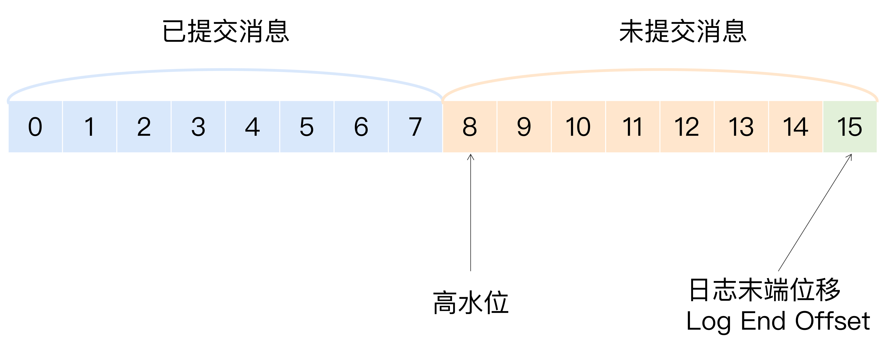
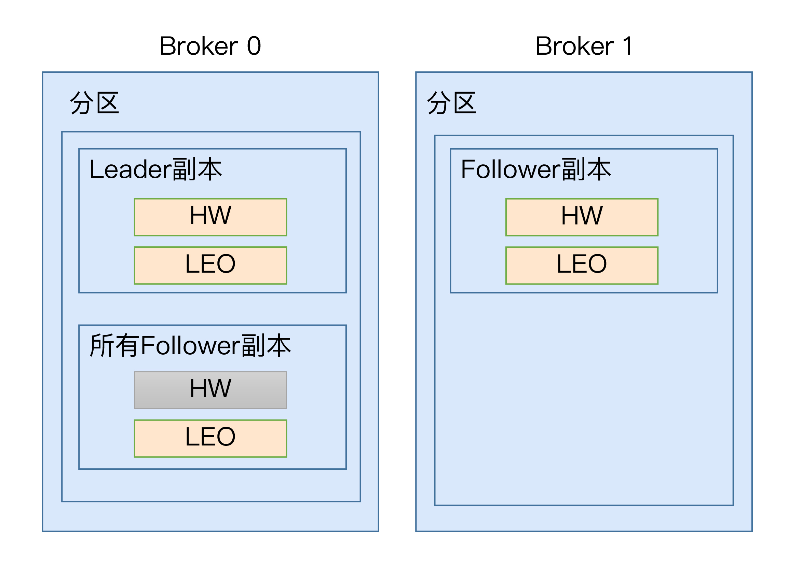
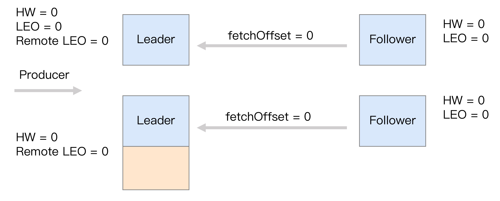
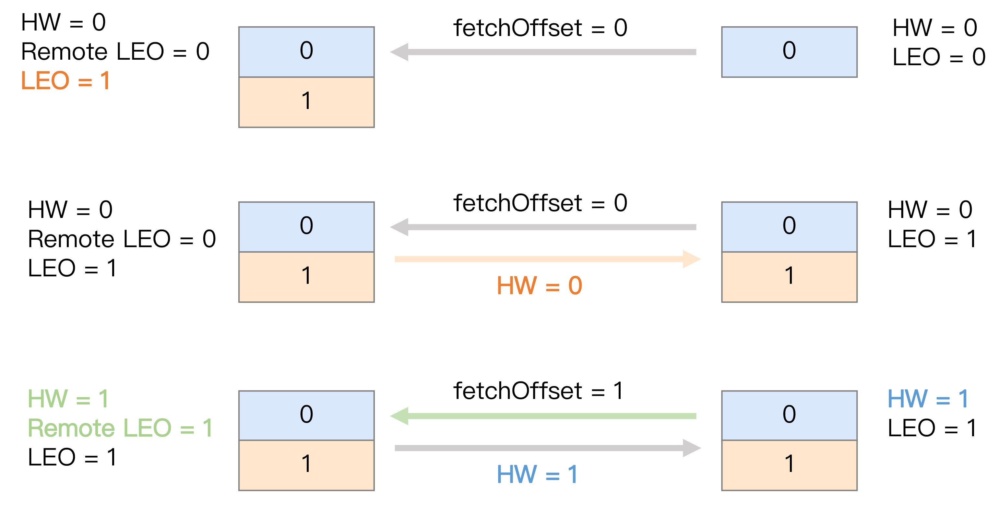
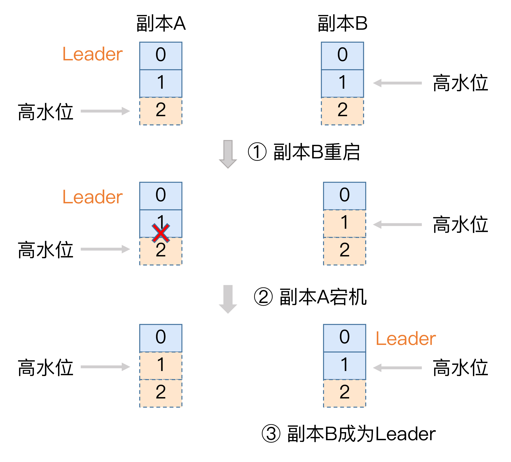
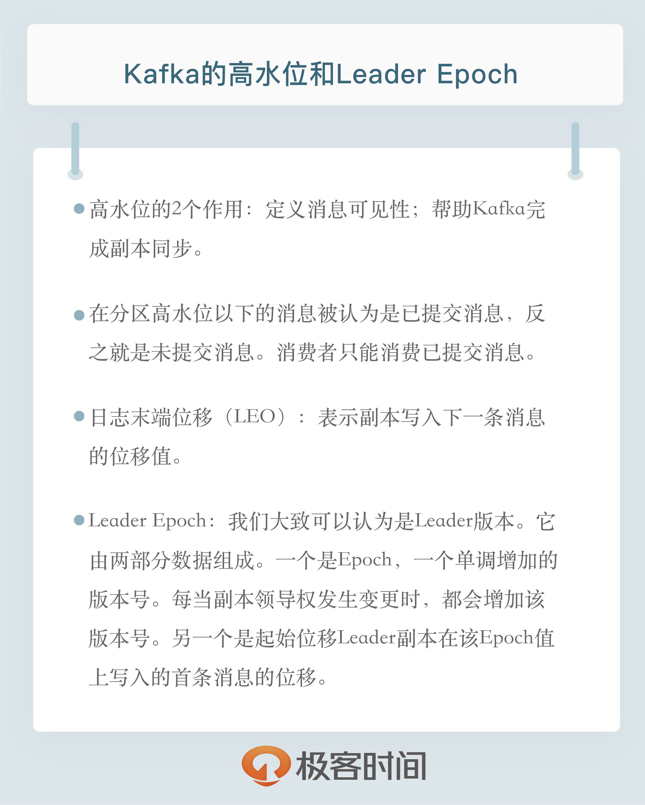

@autoHeader: 2.1.1.1.1.1

update time : {docsify-updated}

## 什么是高水位？

首先，我们要明确一下基本的定义：什么是高水位？或者说什么是水位？水位一词多用于流式处理领域，比如，Spark Streaming或Flink框架中都有水位的概念。教科书中关于水位的经典定义通常是这样的：

> 在时刻T，任意创建时间（Event Time）为T’，且T’≤T的所有事件都已经到达或被观测到，那么T就被定义为水位。

“Streaming System”一书则是这样表述水位的：

> 水位是一个单调增加且表征最早未完成工作（oldest work not yet completed）的时间戳。

为了帮助你更好地理解水位，我借助这本书里的一张图来说明一下。

图中标注“Completed”的蓝色部分代表已完成的工作，标注“In-Flight”的红色部分代表正在进行中的工作，两者的边界就是水位线。

在Kafka的世界中，水位的概念有一点不同。Kafka的水位不是时间戳，更与时间无关。它是和位置信息绑定的，具体来说，它是用消息位移来表征的。另外，Kafka源码使用的表述是高水位，因此，今天我也会统一使用“高水位”或它的缩写HW来进行讨论。值得注意的是，Kafka中也有低水位（Low Watermark），它是与Kafka删除消息相关联的概念，与今天我们要讨论的内容没有太多联系，我就不展开讲了。

## 高水位的作用

在Kafka中，高水位的作用主要有2个。

1. 定义消息可见性，即用来标识分区下的哪些消息是可以被消费者消费的。
2. 帮助Kafka完成副本同步。

下面这张图展示了多个与高水位相关的Kafka术语。我来详细解释一下图中的内容，同时澄清一些常见的误区。

我们假设这是某个分区Leader副本的高水位图。首先，请你注意图中的“已提交消息”和“未提交消息”。我们之前在专栏[第11讲](https://time.geekbang.org/column/article/102931)谈到Kafka持久性保障的时候，特意对两者进行了区分。现在，我借用高水位再次强调一下。在分区高水位以下的消息被认为是已提交消息，反之就是未提交消息。消费者只能消费已提交消息，即图中位移小于8的所有消息。注意，这里我们不讨论Kafka事务，因为事务机制会影响消费者所能看到的消息的范围，它不只是简单依赖高水位来判断。它依靠一个名为LSO（Log Stable Offset）的位移值来判断事务型消费者的可见性。

另外，需要关注的是，**位移值等于高水位的消息也属于未提交消息。也就是说，高水位上的消息是不能被消费者消费的**。

图中还有一个日志末端位移的概念，即Log End Offset，简写是LEO。它表示副本写入下一条消息的位移值。注意，数字15所在的方框是虚线，这就说明，这个副本当前只有15条消息，位移值是从0到14，下一条新消息的位移是15。显然，介于高水位和LEO之间的消息就属于未提交消息。这也从侧面告诉了我们一个重要的事实，那就是：**同一个副本对象，其高水位值不会大于LEO值**。

**高水位和LEO是副本对象的两个重要属性**。Kafka所有副本都有对应的高水位和LEO值，而不仅仅是Leader副本。只不过Leader副本比较特殊，Kafka使用Leader副本的高水位来定义所在分区的高水位。换句话说，**分区的高水位就是其Leader副本的高水位**。

## 高水位更新机制

现在，我们知道了每个副本对象都保存了一组高水位值和LEO值，但实际上，在Leader副本所在的Broker上，还保存了其他Follower副本的LEO值。我们一起来看看下面这张图。

在这张图中，我们可以看到，Broker 0上保存了某分区的Leader副本和所有Follower副本的LEO值，而Broker 1上仅仅保存了该分区的某个Follower副本。Kafka把Broker 0上保存的这些Follower副本又称为**远程副本**（Remote Replica）。Kafka副本机制在运行过程中，会更新Broker 1上Follower副本的高水位和LEO值，同时也会更新Broker 0上Leader副本的高水位和LEO以及所有远程副本的LEO，但它不会更新远程副本的高水位值，也就是我在图中标记为灰色的部分。

为什么要在Broker 0上保存这些远程副本呢？其实，它们的主要作用是，**帮助Leader副本确定其高水位，也就是分区高水位**。

为了帮助你更好地记忆这些值被更新的时机，我做了一张表格。只有搞清楚了更新机制，我们才能开始讨论Kafka副本机制的原理，以及它是如何使用高水位来执行副本消息同步的。

在这里，我稍微解释一下，什么叫与Leader副本保持同步。判断的条件有两个。

1. 该远程Follower副本在ISR中。
2. 该远程Follower副本LEO值落后于Leader副本LEO值的时间，不超过Broker端参数replica.lag.time.max.ms的值。如果使用默认值的话，就是不超过10秒。

乍一看，这两个条件好像是一回事，因为目前某个副本能否进入ISR就是靠第2个条件判断的。但有些时候，会发生这样的情况：即Follower副本已经“追上”了Leader的进度，却不在ISR中，比如某个刚刚重启回来的副本。如果Kafka只判断第1个条件的话，就可能出现某些副本具备了“进入ISR”的资格，但却尚未进入到ISR中的情况。此时，分区高水位值就可能超过ISR中副本LEO，而高水位 > LEO的情形是不被允许的。

下面，我们分别从Leader副本和Follower副本两个维度，来总结一下高水位和LEO的更新机制。

**Leader副本**

处理生产者请求的逻辑如下：

1. 写入消息到本地磁盘。
2. 更新分区高水位值。- i. 获取Leader副本所在Broker端保存的所有远程副本LEO值（LEO-1，LEO-2，……，LEO-n）。- ii. 获取Leader副本高水位值：currentHW。- iii. 更新 currentHW = max{currentHW, min（LEO-1, LEO-2, ……，LEO-n）}。

处理Follower副本拉取消息的逻辑如下：

1. 读取磁盘（或页缓存）中的消息数据。
2. 使用Follower副本发送请求中的位移值更新远程副本LEO值。
3. 更新分区高水位值（具体步骤与处理生产者请求的步骤相同）。

**Follower副本**

从Leader拉取消息的处理逻辑如下：

1. 写入消息到本地磁盘。
2. 更新LEO值。
3. 更新高水位值。- i. 获取Leader发送的高水位值：currentHW。- ii. 获取步骤2中更新过的LEO值：currentLEO。- iii. 更新高水位为min(currentHW, currentLEO)。

## 副本同步机制解析

搞清楚了这些值的更新机制之后，我来举一个实际的例子，说明一下Kafka副本同步的全流程。该例子使用一个单分区且有两个副本的主题。

当生产者发送一条消息时，Leader和Follower副本对应的高水位是怎么被更新的呢？我给出了一些图片，我们一一来看。

首先是初始状态。下面这张图中的remote LEO就是刚才的远程副本的LEO值。在初始状态时，所有值都是0。

当生产者给主题分区发送一条消息后，状态变更为：

此时，Leader副本成功将消息写入了本地磁盘，故LEO值被更新为1。

Follower再次尝试从Leader拉取消息。和之前不同的是，这次有消息可以拉取了，因此状态进一步变更为：

这时，Follower副本也成功地更新LEO为1。此时，Leader和Follower副本的LEO都是1，但各自的高水位依然是0，还没有被更新。**它们需要在下一轮的拉取中被更新**，如下图所示：

在新一轮的拉取请求中，由于位移值是0的消息已经拉取成功，因此Follower副本这次请求拉取的是位移值=1的消息。Leader副本接收到此请求后，更新远程副本LEO为1，然后更新Leader高水位为1。做完这些之后，它会将当前已更新过的高水位值1发送给Follower副本。Follower副本接收到以后，也将自己的高水位值更新成1。至此，一次完整的消息同步周期就结束了。事实上，Kafka就是利用这样的机制，实现了Leader和Follower副本之间的同步。

## Leader Epoch登场

故事讲到这里似乎很完美，依托于高水位，Kafka既界定了消息的对外可见性，又实现了异步的副本同步机制。不过，我们还是要思考一下这里面存在的问题。

从刚才的分析中，我们知道，Follower副本的高水位更新需要一轮额外的拉取请求才能实现。如果把上面那个例子扩展到多个Follower副本，情况可能更糟，也许需要多轮拉取请求。也就是说，Leader副本高水位更新和Follower副本高水位更新在时间上是存在错配的。这种错配是很多“数据丢失”或“数据不一致”问题的根源。基于此，社区在0.11版本正式引入了Leader Epoch概念，来规避因高水位更新错配导致的各种不一致问题。

所谓Leader Epoch，我们大致可以认为是Leader版本。它由两部分数据组成。

1. Epoch。一个单调增加的版本号。每当副本领导权发生变更时，都会增加该版本号。小版本号的Leader被认为是过期Leader，不能再行使Leader权力。
2. 起始位移（Start Offset）。Leader副本在该Epoch值上写入的首条消息的位移。

我举个例子来说明一下Leader Epoch。假设现在有两个Leader Epoch<0, 0>和<1, 120>，那么，第一个Leader Epoch表示版本号是0，这个版本的Leader从位移0开始保存消息，一共保存了120条消息。之后，Leader发生了变更，版本号增加到1，新版本的起始位移是120。

Kafka Broker会在内存中为每个分区都缓存Leader Epoch数据，同时它还会定期地将这些信息持久化到一个checkpoint文件中。当Leader副本写入消息到磁盘时，Broker会尝试更新这部分缓存。如果该Leader是首次写入消息，那么Broker会向缓存中增加一个Leader Epoch条目，否则就不做更新。这样，每次有Leader变更时，新的Leader副本会查询这部分缓存，取出对应的Leader Epoch的起始位移，以避免数据丢失和不一致的情况。

接下来，我们来看一个实际的例子，它展示的是Leader Epoch是如何防止数据丢失的。请先看下图。

我稍微解释一下，单纯依赖高水位是怎么造成数据丢失的。开始时，副本A和副本B都处于正常状态，A是Leader副本。某个使用了默认acks设置的生产者程序向A发送了两条消息，A全部写入成功，此时Kafka会通知生产者说两条消息全部发送成功。

现在我们假设Leader和Follower都写入了这两条消息，而且Leader副本的高水位也已经更新了，但Follower副本高水位还未更新——这是可能出现的。还记得吧，Follower端高水位的更新与Leader端有时间错配。倘若此时副本B所在的Broker宕机，当它重启回来后，副本B会执行日志截断操作，将LEO值调整为之前的高水位值，也就是1。这就是说，位移值为1的那条消息被副本B从磁盘中删除，此时副本B的底层磁盘文件中只保存有1条消息，即位移值为0的那条消息。

当执行完截断操作后，副本B开始从A拉取消息，执行正常的消息同步。如果就在这个节骨眼上，副本A所在的Broker宕机了，那么Kafka就别无选择，只能让副本B成为新的Leader，此时，当A回来后，需要执行相同的日志截断操作，即将高水位调整为与B相同的值，也就是1。这样操作之后，位移值为1的那条消息就从这两个副本中被永远地抹掉了。这就是这张图要展示的数据丢失场景。

严格来说，这个场景发生的前提是**Broker端参数min.insync.replicas设置为1**。此时一旦消息被写入到Leader副本的磁盘，就会被认为是“已提交状态”，但现有的时间错配问题导致Follower端的高水位更新是有滞后的。如果在这个短暂的滞后时间窗口内，接连发生Broker宕机，那么这类数据的丢失就是不可避免的。

现在，我们来看下如何利用Leader Epoch机制来规避这种数据丢失。我依然用图的方式来说明。

场景和之前大致是类似的，只不过引用Leader Epoch机制后，Follower副本B重启回来后，需要向A发送一个特殊的请求去获取Leader的LEO值。在这个例子中，该值为2。当获知到Leader LEO=2后，B发现该LEO值不比它自己的LEO值小，而且缓存中也没有保存任何起始位移值 > 2的Epoch条目，因此B无需执行任何日志截断操作。这是对高水位机制的一个明显改进，即副本是否执行日志截断不再依赖于高水位进行判断。

现在，副本A宕机了，B成为Leader。同样地，当A重启回来后，执行与B相同的逻辑判断，发现也不用执行日志截断，至此位移值为1的那条消息在两个副本中均得到保留。后面当生产者程序向B写入新消息时，副本B所在的Broker缓存中，会生成新的Leader Epoch条目：[Epoch=1, Offset=2]。之后，副本B会使用这个条目帮助判断后续是否执行日志截断操作。这样，通过Leader Epoch机制，Kafka完美地规避了这种数据丢失场景。

## 小结

今天，我向你详细地介绍了Kafka的高水位机制以及Leader Epoch机制。高水位在界定Kafka消息对外可见性以及实现副本机制等方面起到了非常重要的作用，但其设计上的缺陷给Kafka留下了很多数据丢失或数据不一致的潜在风险。为此，社区引入了Leader Epoch机制，尝试规避掉这类风险。事实证明，它的效果不错，在0.11版本之后，关于副本数据不一致性方面的Bug的确减少了很多。如果你想深入学习Kafka的内部原理，今天的这些内容是非常值得你好好琢磨并熟练掌握的。

