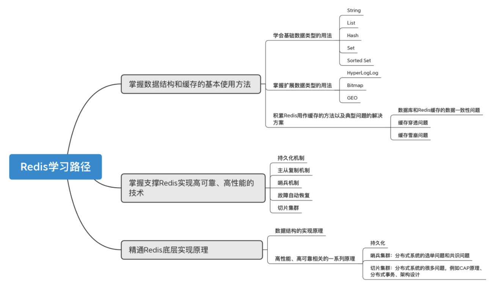
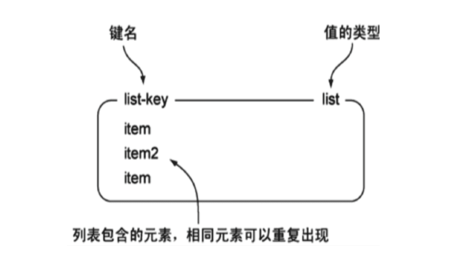
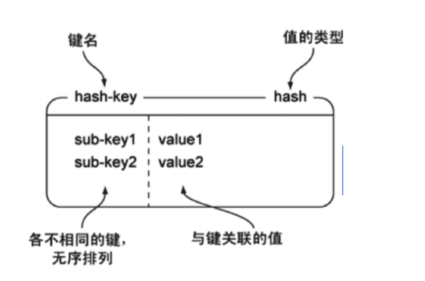
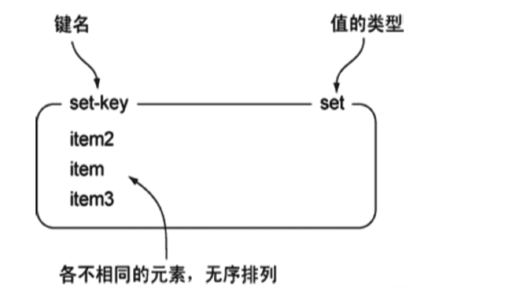
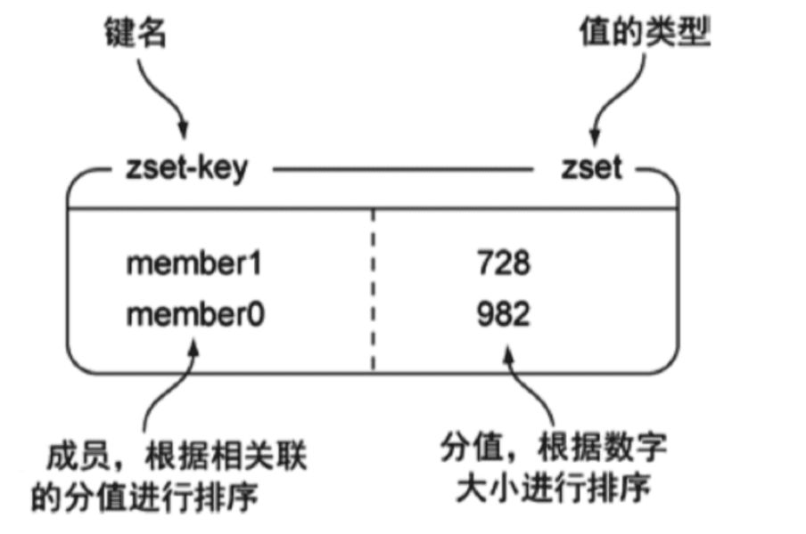

update time : {docsify-updated}

//上面的思维导图重新整理

# 数据类型

## 基础数据类型和用法

| 结构类型         | 结构存储的值                               | 结构的读写能力                                               |
| ---------------- | ------------------------------------------ | ------------------------------------------------------------ |
| **String字符串** | 可以是字符串、整数或浮点数                 | 对整个字符串或字符串的一部分进行操作；对整数或浮点数进行自增或自减操作； |
| **List列表**     | 一个链表，链表上的每个节点都包含一个字符串 | 对链表的两端进行push和pop操作，读取单个或多个元素；根据值查找或删除元素； |
| **Set集合**      | 包含字符串的无序集合                       | 字符串的集合，包含基础的方法有看是否存在添加、获取、删除；还包含计算交集、并集、差集等 |
| **Hash散列**     | 包含键值对的无序散列表                     | 包含方法有添加、获取、删除单个元素                           |
| **Zset有序集合** | 和散列一样，用于存储键值对                 | 字符串成员与浮点数分数之间的有序映射；元素的排列顺序由分数的大小决定；包含方法有添加、获取、删除单个元素以及根据分值范围或成员来获取元素 |

### String

#### 结构

一个key对应一个value。

String类型是二进制安全的，意思是 redis 的 string 可以包含任何数据。如数字，字符串，jpg图片或者序列化的对象。

#### 命令使用

| 命令   | 简述                   | 使用              |
| ------ | ---------------------- | ----------------- |
| GET    | 获取存储在给定键中的值 | GET name          |
| SET    | 设置存储在给定键中的值 | SET name value    |
| DEL    | 删除存储在给定键中的值 | DEL name          |
| INCR   | 将键存储的值加1        | INCR key          |
| DECR   | 将键存储的值减1        | DECR key          |
| INCRBY | 将键存储的值加上整数   | INCRBY key amount |
| DECRBY | 将键存储的值减去整数   | DECRBY key amount |

#### 实战场景

- **缓存**： 经典使用场景，把常用信息，字符串，图片或者视频等信息放到redis中，redis作为缓存层，mysql做持久化层，降低mysql的读写压力。
- **计数器**：redis是单线程模型，一个命令执行完才会执行下一个，同时数据可以一步落地到其他的数据源。
- **session**：常见方案spring session + redis实现session共享

### List

#### 结构

一个key对应着一个双端链表，可以选择从队头或者队尾插入/弹出元素，链表中的元素可以重复出现。

#### 命令使用

| 命令   | 简述                                                         | 使用             |
| ------ | ------------------------------------------------------------ | ---------------- |
| RPUSH  | 将给定值推入到列表右端                                       | RPUSH key value  |
| LPUSH  | 将给定值推入到列表左端                                       | LPUSH key value  |
| RPOP   | 从列表的右端弹出一个值，并返回被弹出的值                     | RPOP key         |
| LPOP   | 从列表的左端弹出一个值，并返回被弹出的值                     | LPOP key         |
| LRANGE | 获取列表在给定范围上的所有值                                 | LRANGE key 0 -1  |
| LINDEX | 通过索引获取列表中的元素。你也可以使用负数下标，以 -1 表示列表的最后一个元素， -2 表示列表的倒数第二个元素，以此类推。 | LINDEX key index |

#### 使用列表的技巧

- lpush+lpop=Stack(栈)
- lpush+rpop=Queue（队列）
- lpush+ltrim=Capped Collection（有限集合）
- lpush+brpop=Message Queue（消息队列）

#### 实战场景

- 微博TimeLine: 有人发布微博，用lpush加入时间轴，展示新的列表信息。
- 消息队列

#### 底层数据结构

### Hash

#### 结构

 hash 是一个 string 类型的 field（字段） 和 value（值） 的映射表，hash 特别适合用于存储对象。

key : {filed1:value1 ; filed2:value2....}

#### 命令使用

| 命令    | 简述                                     | 使用                          |
| ------- | ---------------------------------------- | ----------------------------- |
| HSET    | 添加键值对                               | HSET hash-key sub-key1 value1 |
| HGET    | 获取指定散列键的值                       | HGET hash-key key1            |
| HGETALL | 获取散列中包含的所有键值对               | HGETALL hash-key              |
| HDEL    | 如果给定键存在于散列中，那么就移除这个键 | HDEL hash-key sub-key1        |

#### 实战场景

- **缓存**： 能直观，相比string更节省空间，如用户信息，视频信息等。

### Set

#### 结构

String 类型的无序集合，集合成员是唯一的，这就意味着集合中不能出现重复的数据。

一个key对用一个String的无序集合。

#### 命令使用(非全部)

| 命令      | 简述                                  | 使用                 |
| --------- | ------------------------------------- | -------------------- |
| SADD      | 向集合添加一个或多个成员              | SADD key value       |
| SCARD     | 获取集合的成员数                      | SCARD key            |
| SMEMBERS  | 返回集合中的所有成员                  | SMEMBERS key member  |
| SISMEMBER | 判断 member 元素是否是集合 key 的成员 | SISMEMBER key member |

#### 实战场景

- **标签**（tag）,给用户添加标签，或者用户给消息添加标签，这样有同一标签或者类似标签的可以给推荐关注的事或者关注的人。
- **点赞，或点踩，收藏等**，可以放到set中实现

#### 底层数据结构

### ZSet

#### 结构

和Set一样，一个key对应String类型的集合，且不允许有重复的成员。

不同的是每个元素都会关联一个 double 类型的分数。redis 正是通过分数来为集合中的成员进行从小到大的排序。

#### 命令使用

| 命令   | 简述                                                     | 使用                      |
| ------ | -------------------------------------------------------- | ------------------------- |
| ZADD   | 将一个带有给定分值的成员添加到有序集合里面               | ZADD key score1 member1   |
| ZRANGE | 根据元素在有序集合中所处的位置，从有序集合中获取多个元素 | ZRANGE key 0-1 withccores |
| ZREM   | 如果给定元素成员存在于有序集合中，那么就移除这个元素     | ZREM key member1          |

[其他命令]https://www.runoob.com/redis/redis-sorted-sets.html

#### 实战场景

- **排行榜**：有序集合经典使用场景。例如小说视频等网站需要对用户上传的小说视频做排行榜，榜单可以按照用户关注数，更新时间，字数等打分，做排行。

#### 底层数据结构

## 扩展类型及用法

### HyperLogLogs(基数统计)

Redis 2.8.9 版本更新了 Hyperloglog 数据结构。

#### 结构

**基数计算（cardinality counting）指的是统计一批数据中的抛去重复元素后的数据**

例如A = {1, 2, 3, 4, 5}， B = {3, 5, 6, 7, 9}；那么基数（不重复的元素）= 1, 2, 4, 6, 7, 9

#### 应用场景

这个结构可以非常省内存的去统计各种计数，比如注册 IP 数、每日访问 IP 数、页面实时UV、在线用户数，共同好友数等。

> 比如我们一个人访问一次网站，就用一个数来记录，但是一个人可能会多次访问这个网站，那么如果想要知道多少人访问了网站，就需要去掉重复的数据。

#### 类型优势

HyperLogLogs的优势在于占有内存是固定的。

HyperLogLog 在 Redis 中每个键占用的内容都是 12K，理论存储近似接近 2^64 个值，不管存储的内容是什么，它一个基于基数估算的算法，只能比较准确的估算出基数，可以使用少量固定的内存去存储并识别集合中的唯一元素。而且这个估算的基数并不一定准确，是一个带有 0.81% 标准错误的近似值（对于可以接受一定容错的业务场景，比如IP数统计，UV等，是可以忽略不计的）

#### 命令使用

| 命令    | 简述                       | 使用                                                         |
| ------- | -------------------------- | ------------------------------------------------------------ |
| PFADD   | 创建数据                   | PFADD key element [element ...] element为数据集中的数据，可以输入多个，中间以空格分隔 |
| PFCOUNT | 统计一个数据集的基数是多少 | PFCOUNT key [key ...] key为要查询的数据集的索引，可以输入多个，以空格分开 |
| PFMERGE | 将多个数据集合并           | PFMERGE destkey sourcekey[sourcekey..] 将sourcekey中的数据合并到destkey中 |

#### 底层数据结构

### Bitmap（位存储）

#### 结构

位图数据结构，只有0 和 1 两个状态。

#### 应用场景

比如：统计用户信息，活跃，不活跃！ 登录，未登录！ 打卡，不打卡！

**两个状态的，都可以使用 Bitmaps**！

#### 类型优势

### geospatital (地理信息)
