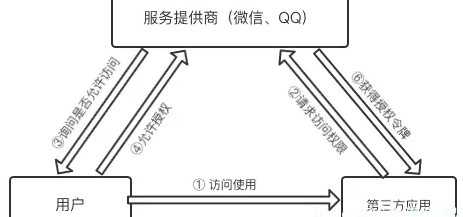
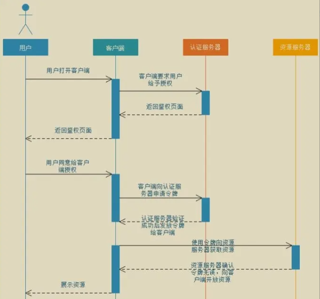
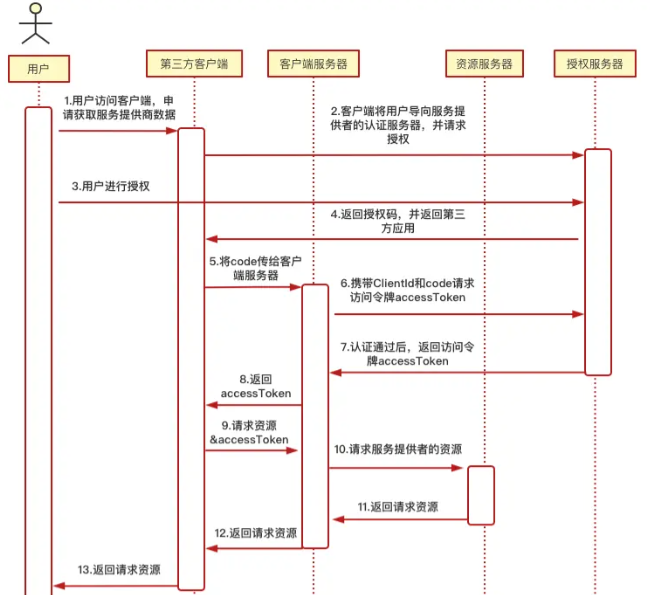
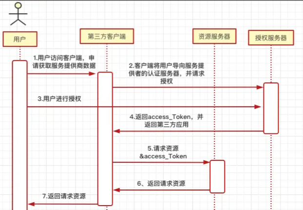
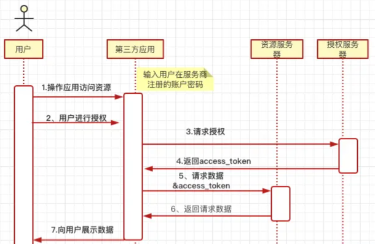
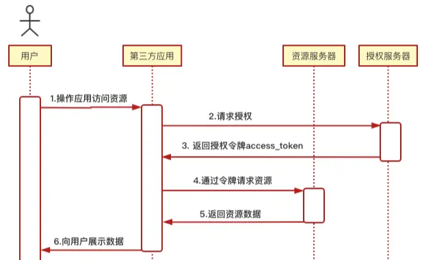
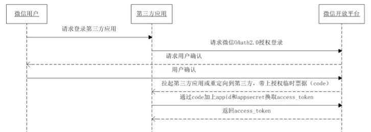

@autoHeader: 2.1.1.1.1.1

<p align="right">update time : {docsify-updated}</p>

> [!Note]
>
> OAuth是一个关于授权（authorization）的开放网络标准，用来授权第三方应用获取用户数据，是目前最流行的授权机制，它当前的版本是2.0

## 基础

### OAuth2.0

在OAuth2.0中“O”是Open的简称，表示“开放”的意思。Auth表示“授权”的意思，所以连起来OAuth表示“开放授权”的意思，它是一个关于授权（authorization）的开放网络标准，在全世界得到广泛应用。用一句话总结来说，OAuth2.0是一种授权协议。

OAuth允许用户授权第三方应用访问他存储在另外服务商里的各种信息数据，而这种授权不需要提供用户名和密码提供给第三方应用。<font color=red>**第三方应用只有在获得授权之后，才可以进一步访问授权者的数据。**</font>

### 组成结构及名词定义



- 第三方应用：要获取用户（资源拥有者）存储在服务提供商里的资源的实例，通常是客户端，这里我们的万视达App就是第三方应用；
- 服务提供者：存储用户（资源拥有者）的资源信息的地方，向第三方应用提供用户相关信息的服务方，例如三方登录时的微信、QQ;
- 用户/资源拥有者：拿三方登录来说，指的是在微信或QQ中注册的用户；

**名词定义**

1. **Third-party application**：第三方应用客户端， 扮演获取资源服务器数据信息的加色
2. **HTTP service**:服务提供商，例如微信
3. **Resource Owner**：用户/资源拥有者，例如在微信中注册的用户
4. **Authorization server**:认证服务器，在资源拥有者授权后,向客户端授权(颁发 access token)的服务器，负责向第三方应用提供授权许可凭证code、令牌token等
5. **Resource server**:资源服务器，存放用户生成的资源的服务器。它与认证服务器，可以是同一台服务器，也可以是不同的服务器。提供给第三方应用注册接口，需要提供给第三方应用app_id和app_secret，提供给第三方应用开放资源的接口。

### 解决的问题

用户登录应用时传统的方式是用户直接进入客户端应用的登录页面输入账号和密码，但有的用户感觉注册后再登录比较繁琐麻烦，于是用户选择使用相关社交账号（微信、QQ、微博）登录，这种方式通过用户的账号和密码去相关社交账号里获取数据存在严重的问题缺陷。

1、使用OAuth2.0可以避免向第三方暴露账号密码

2、第三方应用拥有了用户微信的所有权限，用户没法限制第三方应用获得授权的范围和有效期；因此OAuth2.0可以限制授权第三方应用获取微信部分功能，比如只可以获取用户信息，但不可以获取好友列表，有需求时再申请授权访问好友列表的权限

3、如果某个企业拥有多个应用系统平台，那么每个系统都需要设置一个账号密码，这种操作对于用户来说时繁琐麻烦的，没登录一个系统平台都要输入相应的账号密码，那么可不可以做一个平台，使任意用户可以在这个平台上注册了一个帐号以后，随后这个帐号和密码自动登记到这个平台中作为公共帐号，使用这个账号可以访问其它的已经授权访问的系统。在这种背景下，OAuth2.0协议就诞生了，使用OAuth2.0实现单点登录。

### 应用场景

现在各大开放平台，如微信开放平台、腾讯开放平台、百度开放平台等大部分的开放平台都是使用的**OAuth 2.0**协议作为支撑

1. 客户端App使用三方登录；
2. 微信小程序登录授权；
3. 多个服务的统一登录认证中心、内部系统之间受保护资源请求

## 原理解析

> [!Note]
>
> OAuth在"第三方应用"与"服务提供商"之间，设置了一个授权层:"第三方应用"不能直接登录"服务提供商"，只能登录授权层，以此将用户与客户端区分开来。
>
> "第三方应用"登录授权层所用的令牌（token），与用户的密码不同。用户可以在登录的时候，指定授权层令牌的权限范围和有效期。
>
> "第三方应用"登录授权层以后，"服务提供商"根据令牌的权限范围和有效期，向"第三方应用"开放用户储存的资料。 
>
> 当用户登录了第三方应用后，会跳转到服务提供商获取一次性用户授权凭据）,再跳转回来交给第三方应用，第三方应用的服务器会把授权凭据和服务提供商给它的身份凭据一起交给服务方，这样服务方既可以确定第三方应用得到了用户服务授权，又可以确定第三方应用的身份是可以信任的，最终第三方应用可以顺利的获取到服务商提供的web API的接口数据。

### 授权流程



1. 用户打第三方开客户端后，第三方客户端要访问服务提供方，要求用户给予授权；
2. 用户同意给予第三方客户端访问服务提供方的授权，并返回一个授权凭证Code；
3. 第三方应用使用第2步获取的授权凭证Code和身份认证信息（appid、appsecret）,向授权认证服务器申请授权令牌（token）；
4. 授权认证服务器验证三方客户端的授权凭证Code码和身份通过后，确认无误，同意授权，并返回一个资源访问的令牌（Access Token）；
5. 第三方客户端使用第4步获取的访问令牌Access Token）向资源服务器请求相关资源；
6. 资源服务器验证访问令牌（Access Token）通过后，将第三方客户端请求的资源返回，同意向客户端开放资源。

### 授权模式

#### 授权码模式



- **A [步骤1，2]**：用户访问客户端，需要使用服务提供商（微信）的数据，触发客户端相关事件后，客户端拉起或重定向到服务提供商的页面或APP。

  > 客户端申请认证的URI
  >
  > ```bash
  > https://server.example.com/oauth/auth?response_type=code&client_id=CLIENT_ID&redirect_uri=CALLBACK_URL&scope=read
  > ```
  >
  > - **response_type**：必选项，表示授权类型，此处的值固定为"code"，表示使用授权码模式；
  > - **client_id**：必选项，表示客户端的ID，第三方应用注册的id，身份认证；
  > - **redirect_uri**：可选项，表示重定向URI，接受或拒绝请求后的跳转网址；
  > - **scope**：可选项，表示申请的权限范围；
  > - **state**：表示客户端的当前状态，可以指定任意值，认证服务器会原封不动地返回这个值

- **B [步骤3]**：用户选择是否给予第三方客户端授权访问服务提供商（微信）数据的权限；

- **C [步骤4]**：用户同意授权，授权认证服务器将授权凭证code码返回给客户端，并且会拉起应用或重定（redirect_uri）向到第三方网站；

  > 服务器回应客户端的URI
  >
  > ```perl
  > https:///server.example.com/callback?code=AUTHORIZATION_CODE&state=xyz
  > ```
  >
  > - **code**：表示授权码，该码的有效期应该很短，通常设为10分钟，客户端只能使用该码一次，否则会被授权服务器拒绝。该码与客户端ID和重定向URI，是一一对应关系。
  >
  > - **state**：如果客户端的请求中包含这个参数，认证服务器的回应也必须一模一样包含这个参数

- **D [步骤5，6]**:客户端收到授权码后，将授权码code和ClientId或重定向URI发送给自己的服务器，客户端服务器再想认证服务器请求访问令牌access_token;

  > 客户端向认证服务器申请令牌的HTTP请求：
  >
  > ```ini
  > https://server.example.com/oauth/token?client_id=CLIENT_ID&client_secret=CLIENT_SECRET&grant_type=authorization_code&code=AUTHORIZATION_CODE&redirect_uri=CALLBACK_URL
  > ```
  >
  > - **client_id**：客户端id，第三方应用在服务提供者平台注册的；
  > - **client_secret**：授权服务器的秘钥，第三方应用在服务提供者平台注册的；
  > - **grant_type**：值是`AUTHORIZATION_CODE`，表示采用的授权方式是授权码；
  > - **code**:表示上一步获得的授权码;
  > - **redirect_uri**:redirect_uri参数是令牌颁发后的回调网址,且必须与A步骤中的该参数值保持一致;
  >
  > 注：client_id参数和client_secret参数用来让 B 确认 A 的身份（client_secret参数是保密的，因此只能在后端发请求）

- **E [步骤7，8]**：认证服务器核对了授权码和ClientId或重定向URI，确认无误后，向客户端服务器发送访问令牌（access_token）和更新令牌（refresh_token），然后客户端服务器再发送给客户端；

  > 服务提供者的平台收到请求以后，就会颁发令牌。具体做法是向`redirect_uri`指定的网址，发送一段 JSON 数据。
  >
  > ```json
  > {    
  >   "access_token":"ACCESS_TOKEN",
  >   "token_type":"bearer",
  >   "expires_in":2592000,
  >   "refresh_token":"REFRESH_TOKEN",
  >   "scope":"read",
  >   "uid":100101,
  >   "info":{...}
  > }
  > ```
  >
  > 上面 JSON 数据中，`access_token`字段就是访问令牌

- **F [步骤9，10]**：客户端持有access_token和需要请求的参数向客户端服务器发起资源请求，然后客户端服务器再向服务提供商的资源服务器请求资源（web API）；

- **G [步骤11，12，13]**：服务提供商的资源服务器返回数据给客户端服务器，然后再回传给客户端使用；

#### 简化模式

<font color=red>不需要获取授权码，第三方应用授权后授权认证服务器直接发送临牌给第三方应用，适用于静态网页应用，返回的access_token可见，access_token容易泄露且不可刷新。</font>

简化模式不通过第三方应用程序的服务器，直接在客户端中向认证服务器申请令牌，跳过了"授权码"这个步骤，所有步骤在客户端中完成，令牌对访问者是可见的，且客户端不需要认证。



- **A [步骤1，2]**：用户访问客户端，需要使用服务提供商（微信）的数据，触发客户端相关事件后，客户端拉起或重定向到服务提供商的页面或APP。

  > 客户端发出的HTTP请求
  >
  > ```bash
  > https://server.example.com/oauth/authorize?response_type=token&client_id=CLIENT_ID&redirect_uri=CALLBACK_URL&scope=read
  > ```
  >
  > - **response_type**：表示授权类型，此处的值固定为"token"，表示要求直接返回令牌，必选项；
  > - **client_id**：表示客户端的ID，第三方应用注册的id，用于身份认证，必选项；
  > - **redirect_uri**：表示重定向URI，接受或拒绝请求后的跳转网址，可选项；
  > - **scope**：表示申请的权限范围，可选项；
  > - **state**：表示客户端的当前状态，可以指定任意值，认证服务器会原封不动地返回这个值，可选项；

- **B [步骤3]**：用户选择是否给予第三方客户端授权访问服务提供商（微信）数据的权限；

- **C [步骤4]**：用户同意授权，授权认证服务器将访问令牌access_token返回给客户端，并且会拉起应用或重定（redirect_uri）向到第三方网站；

  > 认证服务器回应客户端的URI
  >
  > ```bash
  > https://server.example.com/cb#access_token=ACCESS_TOKEN&state=xyz&token_type=example&expires_in=3600
  > 或
  > https://a.com/callback#token=ACCESS_TOKEN
  > ```
  >
  > - **access_token**：表示访问令牌，必选项。 <font color=red>**注意，令牌的位置是 URL 锚点（fragment），而不是查询字符串（querystring），这是因为 OAuth 2.0 允许跳转网址是 HTTP 协议，因此存在"中间人攻击"的风险，而浏览器跳转时，锚点不会发到服务器，就减少了泄漏令牌的风险。**</font>
  > - **token_type**：表示令牌类型，该值大小写不敏感，必选项。
  > - **expires_in**：表示过期时间，单位为秒。如果省略该参数，必须其他方式设置过期时间。
  > - **scope**：表示权限范围，如果与客户端申请的范围一致，此项可省略。
  > - **state**：如果客户端的请求中包含这个参数，认证服务器的回应也必须一模一样包含这个参数。

- **D[步骤5]**：第三方客户端向资源服务器发出请求资源的请求；

- **E[步骤6，7]**：服务提供商的资源服务器返回数据给客户端服务器，然后再回传给客户端使用；

#### 密码模式

**如果高度信任某个应用，允许用户把用户名和密码，直接告诉该应用。该应用就使用你的密码，申请令牌，这种方式称为"密码式"**

使用用户名/密码作为授权方式从授权服务器上获取令牌，一般不支持刷新令牌。这种方式风险很大，用户向客户端提供自己的用户名和密码。客户端使用这些信息，向"服务商提供商"索要授权。在这种模式中，用户必须把自己的密码给客户端，但是客户端不得储存密码。这通常用在用户对客户端高度信任的情况下，而认证服务器只有在其他授权模式无法执行的情况下，才能考虑使用这种模式。



- **A[步骤1，2]**：用户向第三方客户端提供，其在服务提供商那里注册的账户名和密码；

- **B[步骤3]**：客户端将用户名和密码发给认证服务器，向后者请求令牌access_token；

  > 客户端发出的HTTP请求
  >
  > ```ini
  > https://oauth.example.com/token?grant_type=password&username=USERNAME&password=PASSWORD&client_id=CLIENT_ID
  > ```
  >
  > - **grant_type：** 标识授权方式，这里的password表示"密码式，必选项；
  > - **username：** 表示用户名，必选项；
  > - **password：** 表示用户的密码，必选项；
  > - **scope：** 表示权限范围，可选项；
  
- **C[步骤4]**：授权认证服务器确认身份无误后，向客户端提供访问令牌access_token；

  > 认证服务器向客户端发送访问令牌，是一段 JSON 数据 
  >
  > ```json
  > {
  > "access_token":"2YotnFZFEjr1zCsicMWpAA",
  >      "token_type":"example",
  >      "expires_in":3600,   "refresh_token":"tGzv3JOkF0XG5Qx2TlKWIA",
  >    "example_parameter":"example_value"
  >    }
  > ```
  >

#### 客户端模式

客户端以自己的名义，而不是以用户的名义，向"服务提供商"进行认证。

严格地说，客户端模式并不属于OAuth框架所要解决的问题。在这种模式中，用户直接向客户端注册，客户端以自己的名义要求"服务提供商"提供服务，其实不存在授权问题。



主要是第2步和第3步：

- 客户端向授权认证服务器进行身份认证，并申请访问临牌（token）;

  > 客户端发出的HTTP请求
  >
  > ```ini
  > https://oauth.example.com/token?grant_type=client_credentials&client_id=CLIENT_ID&client_secret=CLIENT_SECRET
  > ```
  >
  > - **grant_type**：值为client_credentials表示采用凭证式（客户端模式）
  > - **client_id**：客户端id，第三方应用在服务提供者平台注册的，用于身份认证；
  > - **client_secret**：授权服务器的秘钥，第三方应用在服务提供者平台注册的，用于身份认证；

- 授权认证服务器验证通过后，向客户端提供访问令牌。 

  > 服务提供者验证通过以后，直接返回令牌。
  >
  >  这种方式给出的令牌，是针对第三方应用的，而不是针对用户的，<font color=red>**即有可能多个用户共享同一个令牌。**</font>
  >
  > ```json
  > {
  >   "access_token":"2YotnFZFEjr1zCsicMWpAA",
  >   "token_type":"example",
  >   "expires_in":3600,
  >   "example_parameter":"example_value"
  > }
  > ```

### 三方登录中OAuth2.0的使用

无论使用那种平台授权登录，都需要去相应的开放平台备案，申请appid、appsecret，来证明你的身份，第三方持凭此就有资格去请求该平台的接口。这是为了防止令牌被滥用，没有备案过的第三方应用，是不会拿到令牌的。

<font color=red>目前移动应用上微信登录只提供原生的登录方式，需要用户安装微信客户端才能配合使用,通过通用链接（Universal Links）实现第三方应用与微信，QQ之间的跳转。</font>

#### 三方登录如何做到的

- 用户的授权信息在授权服认证务器中是有记录保存的，当用户第一次授权给第三方用用后，以后不需要再次授权；
- 授权令牌（token）是有实效性的， access_token 超时后，可以使用 refresh_token 进行刷新，refresh_token 拥有较长的有效期（30 天），当 refresh_token 失效的后，需要用户重新授权；
- 每个用户在资源服务器中都有一个唯一的ID，第三方应用可以将其存储起来并与本地用户系统一一对应起来；

#### 微信三方登录OAuth2.0获取access_token流程

微信 OAuth2.0 授权登录让微信用户使用微信身份安全登录第三方应用或网站，在微信用户授权登录已接入微信 OAuth2.0 的第三方应用后，第三方可以获取到用户的接口调用凭证（access_token），通过 access_token 可以进行微信开放平台授权关系接口调用，从而可实现获取微信用户基本开放信息和帮助用户实现基础开放功能等。

 微信 OAuth2.0 授权登录目前支持 authorization_code 模式，适用于拥有 server 端的应用授权。

1. 第三方发起微信授权登录请求，微信用户允许授权第三方应用后，微信会拉起应用或重定向到第三方网站，并且带上授权临时票据code参数；

2. 通过code参数加上AppID和AppSecret等，通过API换取access_token；

3. 通过access_token进行接口调用，获取用户基本数据资源或帮助用户实现基本操作。



access_token刷新机制 access_token 是调用授权关系接口的调用凭证，由于 access_token 有效期（目前为 2 个小时）较短，当 access_token 超时后，可以使用 refresh_token 进行刷新，access_token 刷新结果有两种：

- 若access_token已超时，那么进行refresh_token会获取一个新的access_token，新的超时时间

- 若access_token未超时，那么进行refresh_token不会改变access_token，但超时时间会刷新，相当于续期access_token
   refresh_token 拥有较长的有效期（30 天），当 refresh_token 失效的后，需要用户重新授权


### 令牌的使用

客户端拿到访问令牌后就可以通过web API向服务提供商的资源服务器请求资源了。 此时，每个发到 API 的请求，都必须带有令牌。具体做法是在请求的头信息，加上一个`Authorization`字段，令牌就放在这个字段里面。

```arduino
curl -H "Authorization: Bearer ACCESS_TOKEN" \
"https://api.example.com"
```

### 令牌的更新

令牌的有效期到了，如果让用户重新走一遍上面的流程，再申请一个新的令牌，很可能体验不好，而且也没有必要。OAuth 2.0 允许用户自动更新令牌。

具体方法是，服务提供商平台颁发令牌的时候，一次性颁发两个令牌，一个用于获取数据的access_token，另一个用于获取新的令牌refresh_token。

<font color=red>**令牌到期前，用户使用 refresh_token 发一个请求，去更新令牌。**</font>

```bash
https://server.example.com/oauth/token?grant_type=refresh_token&client_id=CLIENT_ID&client_secret=CLIENT_SECRET&refresh_token=REFRESH_TOKEN
```

参数解释：

- **grant_type**: 参数为refresh_token表示要求更新令牌;
- **client_id**：客户端id，第三方应用在服务提供者平台注册的，用于身份认证；
- **client_secret**：授权服务器的秘钥，第三方应用在服务提供者平台注册的，用于身份认证；
- **refresh_token**: 参数就是用于更新令牌的令牌

## OAuth2.0 vs OAuth1.0

OAuth2.0的最大改变就是不需要临时token了，直接authorize生成授权code，用code就可以换取access token了，同时access token加入过期，刷新机制，为了安全，要求第三方的授权接口必须是https的。

OAuth2.0不能向下兼容OAuth1.0版本，OAuth2.0使用Https协议，OAuth1.0使用Http协议； + **OAuth2.0去掉了签名，改用SSL确保安全性**：OAuth1.0需要保证授权码和令牌token在传输的时候不被截取篡改，所以用了很多签名反复验证，但在OAuth2.0中是基于Https的。这里有个问题Https也有可能被中间人劫持；

- **令牌刷新**：OAuth2.0的访问令牌是“短命的”，且有刷新令牌（OAuth1.0可以存储一年及以上）。
- OAuth2.0所有的token不再有对应的secret存在，签名过程简洁，这也直接导致OAuth2.0不兼容老版本。
- 对于redirect_uri的校验，OAuth1.0中没有提到redirect_uri的校验，那么OAuth2.0中要求进行redirect_uri的校验。
- **授权流程区别**：OAuth1.0授权流程太过单一，除了Web应用以外，对桌面、移动应用来说不够友好。而OAuth2.0提供了四中授权模式。