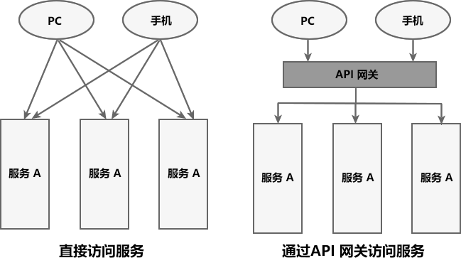

@autoHeader: 2.1.1.1.1.1

<p align="right">update time : {docsify-updated}</p>


## 微服务中的概念

###  什么是微服务架构

微服务架构就是将单体的应用程序分成多个应用程序，这多个应用程序就成为微服务，每个微服务运行在自己的进程中，并使用轻量级的机制通信。

这些服务围绕业务能力来划分，并通过自动化部署机制来独立部署。

这些服务可以使用不同的编程语言，不同数据库，以保证最低限度的集中式管理。

## Springcloud简介

### 什么是SpringCloud

Spring Cloud是一系列框架的有序集合。

它利用Spring Boot的开发便利性巧妙地简化了分布式系统基础设施的开发，如服务发现注册、配置中心、智能路由、消息总线、负载均衡、断路器、数据监控等，都可以用Spring Boot的开发风格做到一键启动和部署。

Spring Cloud 并不是一个拿来即可用的框架，它是一种微服务规范，共有以下 2 代实现：

- 第一代实现：Spring Cloud Netflix 
- 第二代实现：Spring Cloud Alibaba 

### SpringCloud 和 SpringBoot不同

- SpringBoot专注于快速方便的开发单个个体微服务。SpringCloud是关注全局的微服务协调整理治理框架，它将SpringBoot开发的一个个单体微服务整合并管理起来，为各个微服务之间提供，配置管理、服务发现、断路器、路由、微代理、事件总线、全局锁、决策竞选、分布式会话等等集成服务

- SpringBoot可以离开SpringCloud独立使用开发项目， 但是SpringCloud离不开SpringBoot ，属于依赖的关系。
- SpringBoot专注于快速、方便的开发单个微服务个体，SpringCloud关注全局的服务治理框架。

### Springcloud生态

SpringCloud是基于SpringBoot为基础实现的微服务架构风格一站式解决方案，例如配置管理、服务发现、断路器、智能路由、微代理、控制总线、一次性令牌、全局锁、领导选举、分布式会话，集群状态等等。

SpringCloud是基于SpringBoot为基础实现的，并且有版本的兼容关系。

生态中常见模块如下。

#### Spring Cloud Netflix

集成众多Netflix的开源软件。

Netflix公司开发了一系列解决微服务架构问题的组件，且开源并入了SpringCloud生态中，成为了SpringCloud生态中的一个模块，名为SpringCloudNetflix，常见的Eureka\Ribbon\Fegin组件都是该公司的，这也是在SpringCloudAlibaba没有出来之前，都使用Netflix解决方案的原因，后续因为相关项目不想开源停止了维护。

> **Netflix Eureka**
>
> 服务中心，云端服务发现，一个基于 REST 的服务，用于定位服务，以实现云端中间层服务发现和故障转移。这个可是springcloud最牛鼻的小弟，服务中心，任何小弟需要其它小弟支持什么都需要从这里来拿，同样的你有什么独门武功的都赶紧过报道，方便以后其它小弟来调用；它的好处是你不需要直接找各种什么小弟支持，只需要到服务中心来领取，也不需要知道提供支持的其它小弟在哪里，还是几个小弟来支持的，反正拿来用就行，服务中心来保证稳定性和质量。
>
> 
>
> **Netflix Hystrix**
>
> 熔断器，容错管理工具，旨在通过熔断机制控制服务和第三方库的节点,从而对延迟和故障提供更强大的容错能力。比如突然某个小弟生病了，但是你还需要它的支持，然后调用之后它半天没有响应，你却不知道，一直在等等这个响应；有可能别的小弟也正在调用你的武功绝技，那么当请求多之后，就会发生严重的阻塞影响老大的整体计划。这个时候Hystrix就派上用场了，当Hystrix发现某个小弟不在状态不稳定立马马上让它下线，让其它小弟来顶上来，或者给你说不用等了这个小弟今天肯定不行，该干嘛赶紧干嘛去别在这排队了。
>
> 
>
> **Netflix Zuul**
>
> Zuul 是在云平台上提供动态路由,监控,弹性,安全等边缘服务的框架。Zuul 相当于是设备和 Netflix 流应用的 Web 网站后端所有请求的前门。当其它门派来找大哥办事的时候一定要先经过zuul,看下有没有带刀子什么的给拦截回去，或者是需要找那个小弟的直接给带过去。
>
> 
>
> **Netflix Archaius**
>
> 配置管理API，包含一系列配置管理API，提供动态类型化属性、线程安全配置操作、轮询框架、回调机制等功能。可以实现动态获取配置，
>  原理是每隔60s（默认，可配置）从配置源读取一次内容，这样修改了配置文件后不需要重启服务就可以使修改后的内容生效，前提使用archaius的API来读取。

#### Spring Cloud Config 

俗称的配置中心，配置管理工具包，让你可以把配置放到远程服务器，集中化管理集群配置，目前支持本地存储、Git以及Subversion。

#### Spring Cloud Bus 

消息总线，利用分布式消息将服务和服务实例连接在一起，用于在一个集群中传播状态的变化。

#### Spring Cloud for Cloud Foundry 

Cloud Foundry是VMware推出的业界第一个开源PaaS云平台，它支持多种框架、语言、运行时环境、云平台及应用服务，使开发人员能够在几秒钟内进行应用程序的部署和扩展，无需担心任何基础架构的问题

其实就是与CloudFoundry进行集成的一套解决方案，抱了Cloud Foundry的大腿。

#### Spring Cloud Cluster 

基于Zookeeper, Redis, Hazelcast, Consul实现的领导选举和平民状态模式的抽象和实现。

pring Cloud Cluster将取代Spring Integration。提供在分布式系统中的集群所需要的基础功能支持，如：选举、集群的状态一致性、全局锁、tokens等常见状态模式的抽象和实现。

#### Spring Cloud Consul 

基于Hashicorp Consul实现的服务发现和配置管理。

Consul 是一个支持多数据中心分布式高可用的服务发现和配置共享的服务软件,由 HashiCorp 公司用 Go 语言开发, 基于 Mozilla Public License 2.0 的协议进行开源. Consul 支持健康检查,并允许 HTTP 和 DNS 协议调用 API 存储键值对.

Spring Cloud Consul 封装了Consul操作，consul是一个服务发现与配置工具，与Docker容器可以无缝集成。

#### Spring Cloud Security 

在Zuul代理中为OAuth2 rest客户端和认证头转发提供负载均衡。基于spring security的安全工具包，为你的应用程序添加安全控制。

#### Spring Cloud Sleuth 

日志收集工具包，封装了Dapper和log-based追踪以及Zipkin和HTrace操作，为SpringCloud应用实现了一种分布式追踪解决方案。

#### Spring Cloud Data Flow 

一个云本地程序和操作模型，组成数据微服务在一个结构化的平台上。

Data flow 是一个用于开发和执行大范围数据处理其模式包括ETL，批量运算和持续运算的统一编程模型和托管服务。对于在现代运行环境中可组合的微服务程序来说，Spring Cloud data flow是一个原生云可编配的服务。使用Spring Cloud data flow，开发者可以为像数据抽取，实时分析，和数据导入/导出这种常见用例创建和编配数据通道 （data pipelines）。

 Spring Cloud data flow 是基于原生云对 spring XD的重新设计，该项目目标是简化大数据应用的开发。Spring XD 的流处理和批处理模块的重构分别是基于 spring boot的stream 和 task/batch 的微服务程序。这些程序现在都是自动部署单元而且他们原生的支持像 Cloud Foundry、Apache YARN、Apache Mesos和Kubernetes 等现代运行环境。

 Spring Cloud data flow 为基于微服务的分布式流处理和批处理数据通道提供了一系列模型和最佳实践。


#### Spring Cloud Stream 

基于Redis,Rabbit,Kafka实现的消息微服务，简单声明模型用以在Spring Cloud应用中收发消息。

Spring Cloud Stream是基于spring boot创建，用来建立单独的／工业级spring应用，使用spring integration提供与消息代理之间的连接。数据流操作开发包，封装了与Redis,Rabbit、Kafka等发送接收消息。


#### Spring Cloud Stream App Starters 

基于Spring Boot为外部系统提供spring的集成。

#### Spring Cloud Task 

短生命周期的微服务，为SpringBooot应用简单声明添加功能和非功能特性，比如任务调度的工作，比如说某些定时任务晚上就跑一次，或者某项数据分析临时就跑几次。

#### Spring Cloud Zookeeper 

服务发现和配置管理基于Apache Zookeeper。

ZooKeeper是一个分布式的，开放源码的分布式应用程序协调服务，是Google的Chubby一个开源的实现，是Hadoop和Hbase的重要组件。它是一个为分布式应用提供一致性服务的软件，提供的功能包括：配置维护、域名服务、分布式同步、组服务等。ZooKeeper的目标就是封装好复杂易出错的关键服务，将简单易用的接口和性能高效、功能稳定的系统提供给用户。


#### Spring Cloud Connectors

 便于PaaS应用在各种平台上连接到后端像数据库和消息经纪服务。

Spring Cloud Connectors 简化了连接到服务的过程和从云平台获取操作的过程，有很强的扩展性，可以利用Spring Cloud Connectors来构建你自己的云平台，便于云端应用程序在各种PaaS平台连接到后端，如：数据库和消息代理服务。

#### Spring Cloud Starters 

（项目已经终止并且在Angel.SR2后的版本和其他项目合并）

#### Spring Cloud CLI 

基于 Spring Boot CLI，可以让你以命令行方式快速建立云组件。


## 常用官方社区组件

### Springcloud Gateway 

SpringCloud Gateway是Spring Cloud的一个全新项目， 基纡Spring 5.0+ Spring Boot 2.0和Project Reactor等技术开发的网关，它旨在为微服务架构提供一种简单有效的统- -的 API路由管理方式。SpringCloud Gateway作为Spring Cloud生态系统中的网关，目标是替代Zuul[Netflix公司已经不再维护该项目]。

#### API网关

在微服务架构中，一个系统往往由多个微服务组成，这种情况下，客户端想要直接请求这些服务，就需要知道它们具体的地址信息，例如 IP 地址、端口号等。

API 网关就像整个微服务系统的门面一样，是系统对外的唯一入口。有了它，客户端会先将请求发送到 API 网关，然后由 API 网关根据请求的标识信息将请求转发到微服务实例。

API 网关是一个搭建在客户端和微服务之间的服务，也可以在 API 网关中处理一些非业务功能的逻辑，例如权限验证、监控、缓存、请求路由等。



对于服务数量众多、复杂度较高、规模比较大的系统来说，使用 API 网关具有以下好处：

- 客户端通过 API 网关与微服务交互时，客户端只需要知道 API 网关地址即可，而不需要维护大量的服务地址，简化了客户端的开发。
- 客户端直接与 API 网关通信，能够减少客户端与各个服务的交互次数。
- 客户端与后端的服务耦合度降低。
- 节省流量，提高性能，提升用户体验。
- API 网关还提供了安全、流控、过滤、缓存、计费以及监控等 API 管理功能。

#### 注册中心 vs API网关

注册中心和网关都是常用的微服务架构中的组件，它们的作用有一些相似，但也有很大的区别。

注册中心是一个服务发现的组件，它的主要作用是维护微服务架构中的服务注册和发现。它允许开发人员向其注册他们的服务并查询其他服务的信息。当服务启动时，它会向注册中心注册自己的信息，包括服务名称、IP地址和端口号等信息。其他服务可以通过注册中心查询到这些服务的信息，从而实现服务之间的通信和调用。

API网关是微服务架构中的一种应用程序，它的主要作用是将客户端请求路由到相应的服务。它是一个负载均衡器，可以将客户端请求分发到不同的服务实例。同时，网关还可以处理一些常见的服务治理任务，如安全认证、流量控制、服务限流等

因此，注册中心和网关的主要区别在于，注册中心是一种服务发现的组件，用于服务注册和发现，而网关则是一种应用程序，用于路由客户端请求并处理服务治理任务。在实际的微服务架构中，这两种组件经常一起使用，共同构建起一个高可用、可靠的微服务系统。

#### 网关性能指标

API网关抗住的是整个微服务应用的流量请求，因此并发性能是API网关组件的一个重要指标。

这也是为什么SpringCloudGateWay 和 zuul2.0底层都选用了异步IO的Netty的原因。

下面是其它网友的思考结论，可供参考：

- **性能**：Nginx+Lua形式必然是高于Java语言实现的网关的，Java技术栈里面Zuul1.0是基于Servlet实现的，剩下都是基于webflux实现，性能是高于基于Servlet实现的。**在性能方面我觉得选择网关可能不算那么重要，多加几台机器就可以搞定。**

#### 使用方式

Spring Cloud GateWay 最主要的功能就是路由转发，而在定义转发规则时主要涉及了以下三个核心概念：

| 核心概念          | 描述                                                         |
| ----------------- | ------------------------------------------------------------ |
| Route（路由）     | 网关最基本的模块。它由一个 ID、一个目标 URI、一组断言（Predicate）和一组过滤器（Filter）组成。 |
| Predicate（断言） | 路由转发的判断条件，我们可以通过 Predicate 对 HTTP 请求进行匹配，例如请求方式、请求路径、请求头、参数等，如果请求与断言匹配成功，则将请求转发到相应的服务。 |
| Filter（过滤器）  | 过滤器，我们可以使用它对请求进行拦截和修改，还可以使用它对上文的响应进行再处理。 |

其中 Route 和 Predicate 必须同时声明。

##### Predicate断言

Spring Cloud Gateway 通过 Predicate 断言来实现 Route 路由的匹配规则。简单点说，Predicate 是路由转发的判断条件，请求只有满足了 Predicate 的条件，才会被转发到指定的服务上进行处理。

使用 Predicate 断言需要注意以下 3 点：

- Route 路由与 Predicate 断言的对应关系为“一对多”，一个路由可以包含多个不同断言。

- 一个请求想要转发到指定的路由上，就必须同时匹配路由上的所有断言。

- 当一个请求同时满足多个路由的断言条件时，请求只会被首个成功匹配的路由转发。


常见的 Predicate 断言如下表（假设转发的 URI 为 http://localhost:8001）

| 断言    | 示例                                                         | 说明                                                         |
| ------- | ------------------------------------------------------------ | ------------------------------------------------------------ |
| Path    | - Path=/dept/list/**                                         | 当请求路径与 /dept/list/** 匹配时，该请求才能被转发到 http://localhost:8001 上。 |
| Before  | - Before=2021-10-20T11:47:34.255+08:00[Asia/Shanghai]        | 在 2021 年 10 月 20 日 11 时 47 分 34.255 秒之前的请求，才会被转发到 http://localhost:8001 上。 |
| After   | - After=2021-10-20T11:47:34.255+08:00[Asia/Shanghai]         | 在 2021 年 10 月 20 日 11 时 47 分 34.255 秒之后的请求，才会被转发到 http://localhost:8001 上。 |
| Between | - Between=2021-10-20T15:18:33.226+08:00[Asia/Shanghai],2021-10-20T15:23:33.226+08:00[Asia/Shanghai] | 在 2021 年 10 月 20 日 15 时 18 分 33.226 秒 到 2021 年 10 月 20 日 15 时 23 分 33.226 秒之间的请求，才会被转发到 http://localhost:8001 服务器上。 |
| Cookie  | - Cookie=name,c.biancheng.net                                | 携带 Cookie 且 Cookie 的内容为 name=c.biancheng.net 的请求，才会被转发到 http://localhost:8001 上。 |
| Header  | - Header=X-Request-Id,\d+                                    | 请求头上携带属性 X-Request-Id 且属性值为整数的请求，才会被转发到 http://localhost:8001 上。 |
| Method  | - Method=GET                                                 | 只有 GET 请求才会被转发到 http://localhost:8001 上。         |

yaml的配置为：

```yaml
spring:
  application:
    name: microServiceCloudGateway
  cloud:
    gateway: #网关路由配置
      routes:
        #将 micro-service-cloud-provider-dept-8001 提供的服务隐藏起来，不暴露给客户端，只给客户端暴露 API 网关的地址 9527
        - id: provider_dept_list_routh   #路由 id,没有固定规则，但唯一，建议与服务名对应
          uri: http://xxxx:8001          #匹配后提供服务A的路由地址
          predicates:
            #以下是断言条件，必选全部符合条件
            - Path=/dept/list/**               #断言，路径匹配 注意：Path 中 P 为大写
            - Method=GET #只能时 GET 请求时，才能访问
```

##### 动态路由

默认情况下，Spring Cloud Gateway 会根据服务注册中心中维护的服务列表，以服务名（spring.application.name）作为路径创建动态路由进行转发，从而实现动态路由功能。

我们可以在配置文件中，将 Route 的 uri 地址修改为以下形式。

```
lb://service-name
以上配置说明如下：
```

- lb：uri 的协议，表示开启 Spring Cloud Gateway 的负载均衡功能。
- service-name：服务名，Spring Cloud Gateway 会根据它获取到具体的微服务地址。

##### Filter过滤器

通常情况下，出于安全方面的考虑，服务端提供的服务往往都会有一定的校验逻辑，例如用户登陆状态校验、签名校验等。

在微服务架构中，系统由多个微服务组成，所有这些服务都需要这些校验逻辑，此时我们就可以将这些校验逻辑写到 Spring Cloud Gateway 的 Filter 过滤器中。

Spring Cloud Gateway 提供了以下两种类型的过滤器，可以对请求和响应进行精细化控制。

| 过滤器类型 | 说明                                                         |
| :--------- | :----------------------------------------------------------- |
| Pre 类型   | 这种过滤器在请求被转发到微服务之前可以对请求进行拦截和修改，例如参数校验、权限校验、流量监控、日志输出以及协议转换等操作。 |
| Post 类型  | 这种过滤器在微服务对请求做出响应后可以对响应进行拦截和再处理，例如修改响应内容或响应头、日志输出、流量监控等。 |

按照作用范围划分，Spring Cloud gateway 的 Filter 可以分为 2 类：

1. GatewayFilter：应用在单个路由或者一组路由上的过滤器。

2. GlobalFilter：应用在所有的路由上的过滤器。

   

- 使用Yaml进行配置（以GatewayFilter为例子）

```yaml
spring:
  cloud:
    gateway: 
      routes:
        - id: xxxx
          uri: xxxx
          predicates:
            - Path=xxxx
          filters:
            - AddRequestParameter=X-Request-Id,1024 #过滤器工厂会在匹配的请求头加上一对请求头，名称为 X-Request-Id 值为 1024
            - PrefixPath=/dept #在请求路径前面加上 /dept
```

Spring Cloud Gateway 内置了多达 31 种 GatewayFilter，下表只是列举一下：

| 路由过滤器             | 描述                                                         | 参数                                                         | 使用示例                                               |
| ---------------------- | ------------------------------------------------------------ | ------------------------------------------------------------ | ------------------------------------------------------ |
| AddRequestHeader       | 拦截传入的请求，并在请求上添加一个指定的请求头参数。         | name：需要添加的请求头参数的 key； value：需要添加的请求头参数的 value。 | - AddRequestHeader=my-request-header,1024              |
| AddRequestParameter    | 拦截传入的请求，并在请求上添加一个指定的请求参数。           | name：需要添加的请求参数的 key； value：需要添加的请求参数的 value。 | - AddRequestParameter=my-request-param,c.biancheng.net |
| AddResponseHeader      | 拦截响应，并在响应上添加一个指定的响应头参数。               | name：需要添加的响应头的 key； value：需要添加的响应头的 value。 | - AddResponseHeader=my-response-header,c.biancheng.net |
| PrefixPath             | 拦截传入的请求，并在请求路径增加一个指定的前缀。             | prefix：需要增加的路径前缀。                                 | - PrefixPath=/consumer                                 |
| PreserveHostHeader     | 转发请求时，保持客户端的 Host 信息不变，然后将它传递到提供具体服务的微服务中。 | 无                                                           | - PreserveHostHeader                                   |
| RemoveRequestHeader    | 移除请求头中指定的参数。                                     | name：需要移除的请求头的 key。                               | - RemoveRequestHeader=my-request-header                |
| RemoveResponseHeader   | 移除响应头中指定的参数。                                     | name：需要移除的响应头。                                     | - RemoveResponseHeader=my-response-header              |
| RemoveRequestParameter | 移除指定的请求参数。                                         | name：需要移除的请求参数。                                   | - RemoveRequestParameter=my-request-param              |
| RequestSize            | 配置请求体的大小，当请求体过大时，将会返回 413 Payload Too Large。 | maxSize：请求体的大小。                                      | - name: RequestSize   args:    maxSize: 5000000        |

- 自定义重写 （以GlobalFilter为例）

```java
public class MyGlobalFilter implements GlobalFilter, Ordered {
    @Override
    public Mono<Void> filter(ServerWebExchange exchange, GatewayFilterChain chain) {
       //xxxxxx业务逻辑
        return chain.filter(exchange);
    }
    @Override
    public int getOrder() {
        //xxxx业务逻辑
        return 0;
    }
}
```

##### 启动类配置

使用 @EnableDiscoveryClient 注解开启注册到注册中心后，启动即可

```java
@SpringBootApplication
@EnableDiscoveryClient
public class MicroServiceCloudGateway9527Application {
    public static void main(String[] args) {
        SpringApplication.run(MicroServiceCloudGateway9527Application.class, args);
    }
}
```


#### 工作流程


Spring Cloud Gateway 的工作流程说明如下：

1. 客户端将请求发送到 Spring Cloud Gateway 上。
2. Spring Cloud Gateway 通过 Gateway Handler Mapping 找到与请求相匹配的路由，将其发送给 Gateway Web Handler。
3. Gateway Web Handler 通过指定的过滤器链（Filter Chain），将请求转发到实际的服务节点中，执行业务逻辑返回响应结果。
4. 过滤器之间用虚线分开是因为过滤器可能会在转发请求之前（pre）或之后（post）执行业务逻辑。
5. 过滤器（Filter）可以在请求被转发到服务端前，对请求进行拦截和修改，例如参数校验、权限校验、流量监控、日志输出以及协议转换等。
6. 过滤器可以在响应返回客户端之前，对响应进行拦截和再处理，例如修改响应内容或响应头、日志输出、流量监控等。
7. 响应原路返回给客户端。

#### SpringCloudGateway Vs Zuul

Zuul目前有两大版本，1.x和2.x系列，其中1.x系列基于 JavaEE Servlet 技术栈，使用阻塞 API，处理的是 http 请求，没有提供异步支持，不支持任何长连接，目前已经停止维护。Zuul 2.x 进行了改进，基于 Netty Server 实现了异步 IO 来接入请求，但 Spring Cloud 貌似没有整合计划。

> Zuul1采用的是阻塞和多线程方式，即一个线程处理一次连接请求，这种方式在内部延迟严重、设备故障较多情况下会引起存活的连接增多和线程增加的情况发生。
>
>  Zuul2 有重大的更新，它运行在异步和无阻塞框架上，每个 CPU 核一个线程，处理所有的请求和响应，请求和响应的生命周期是通过事件和回调来处理的，这种方式减少了线程数量，因此开销较小。

Spring Cloud GateWay使用的是Netty的非阻塞API，内置了非常多的开箱即用功能，可以直接配置一下就可以配置各种规则的路由和Filter，同时是SpringCloud官方维护，对SpringCloud框架很好的兼容。

### OpenFeign

Feign 最早是由 Netflix 公司进行维护的，后来 Netflix 不再对其进行维护，最终 Feign 由社区进行维护，更名为 OpenFeign。

该节内容写在了[SpringCloudNetflix](编程框架/Spring系列/SpringCloudNetflix)

