@autoHeader: 2.1.1.1.1.1

<p align="right">update time : {docsify-updated}</p>


## 简介

### 简介

Spring Cloud Alibaba是Spring Cloud的子项目，包含微服务开发必备组件，基于和符合Spring Cloud标准的阿里的微服务解决方案。

### 功能和组件

核心功能包括：服务注册发现，服务熔断降级，配置管理，分布式事务，消息中间件(RocketMQ)。

1.  **Nacos**:【注册中心 + 配置中心】一个更易于构建云原生应用的动态服务发现、配置管理和服务管理平台。
2. **Sentinel**:【服务容错组件】把流量作为切入点，从流量控制、熔断降级、系统负载保护等多个维度保护服务的稳定性。
3.  **RocketMQ**:【消息队列组件】一款开源的分布式消息系统，基于高可用分布式集群技术，提供低延时的、高可靠 的消息发布与订阅服务。
4. **Seata**:【分布式事务组件】阿里巴巴开源产品，一个易于使用的高性能微服务分布式事务解决方案。
5. **Dubbo**:Apache DubboTM 是一款高性能 Java RPC 框架。 
6.  **Alibaba Cloud ACM**:一款在分布式架构环境中对应用配置进行集中管理和推送的应用配置中心 产品。
7.  **Alibaba Cloud OSS**: 阿里云对象存储服务(Object Storage Service，简称 OSS)，是阿里云提 供的海量、安全、低成本、高可靠的云存储服务。您可以在任何应用、任何时间、任何地点存储和 访问任意类型的数据。
8.  **Alibaba Cloud SchedulerX**: 阿里中间件团队开发的一款分布式任务调度产品，提供秒级、精 准、高可靠、高可用的定时(基于 Cron 表达式)任务调度服务。
9.  **Alibaba Cloud SMS**: 覆盖全球的短信服务，友好、高效、智能的互联化通讯能力，帮助企业迅速 搭建客户触达通道。

## Nacos

### Nacos简介

Nacos 是一个基于 REST 的动态服务发现、配置和服务管理平台，它可以帮助开发者快速地构建一套微服务生态系统。Nacos 提供了一个简单的 Web 界面来管理服务、配置和命名空间，可以通过 REST API 和服务 SDK 实现动态配置和服务发现。

#### Nacos的作用

Nacos就是注册中心+配置中心的组合  

Nacos = Eureka + Config + Bus

**服务发现与服务健康检查**

Nacos使服务更容易注册，并通过DNS或HTTP接口发现其他服务，Nacos还提供服务的实时健康检查，以防止向不健康的主机或服务实例发送请求。

**动态配置管理**

动态配置服务允许您在所有环境中以集中和动态的方式管理所有服务的配置。Nacos消除了在更新配置时重新部署应用程序，这使配置的更改更加高效和灵活。

**动态DNS服务**

Nacos提供基于DNS 协议的服务发现能力，旨在支持异构语言的服务发现，支持将注册在Nacos上的服务以域名的方式暴露端点，让三方应用方便的查阅及发现。

**服务和元数据管理**

Nacos 能让您从微服务平台建设的视角管理数据中心的所有服务及元数据，包括管理服务的描述、生命周期、服务的静态依赖分析、服务的健康状态、服务的流量管理、路由及安全策略。

#### Nacos内部模块

Nacos 的架构设计基于三个核心模块：

命名服务（Naming）：命名服务负责服务的注册和发现。

配置服务（Configuration）：配置服务负责配置的管理和发布。

服务治理（Governance）：服务治理负责服务的负载均衡和流量控制。

#### 1.x vs 2.x

目前nacos版本2.X在内部设计上有了很大更改。

Nacos  1.x版本架构


Nacos  2.x版本架构


Nacos 2.X 在 1.X 的架构基础上 新增了对长连接模型的支持，同时保留对旧客户端和 openAPI 的核心功能支持。通信层通过 gRPC 和 Rsocket 实现了长连接 RPC 调用和推送能力。

最主要的特性是新增了对 gRPC 框架的支持，gRPC 是一款开源的基于 HTTP/2 标准设计的高性能 RPC 框架，Nacos 2.0 还带来了 6 个增强功能：

- 异步执行一些耗时的操作
- SDK 多语言支持
- 增加一些度量、日志支持
- 全面支持自定义实例注册
- 支持单推当首次订阅服务时
- 支持通过阈值健康保护

### Nacos-discovery 注册中心1.x

#### 工作流程

##### 总体流程


服务提供者、服务消费者、Nacos Server这三者之间的交互大致如下：

1. 服务提供者启动时，将ip-端口号-服务名-分组名-集群名等信息封装为一个对象，通过nacos的api，向Nacos服务器注册服务
2. 服务提供者创建一个定时任务，每隔一段时间向Nacos服务器发送PUT请求并携带相关信息，作为定时心跳连接，服务器端在接收到心跳请求后，会去检查当前服务列表中有没有该实例，如果没有的话将当前服务实例重新注册，注册完成后立即开启一个异步任务，更新客户端实例的最后心跳时间，如果当前实例是非健康状态则将其改为健康状态；
3. Nacos开启一个定时任务（5s），检查当前服务中的各个实例是否在线，如果实例上次心跳时间大于15s就将其状态设置为不健康，如果超出30s，则直接将该实例删除，说明节点服务不可用；
4. Nacos服务检测到有异常（服务上下线）就会发送UDP协议给客户端进行更新
5. 服务消费者启动时会拉取自已要用的服务列表，之后每10秒进行拉取一下数据。
6. 如果Nacos是集群环境，客户端会随机选择一个 Nacos 节点发起注册，再通过集群间的数据同步。

##### 集群注册

如果Nacos是集群环境，客户端会随机选择一个 Nacos 节点发起注册，再通过集群间的数据同步。

服务 A 注册时，是向所有 Nacos 节点发起注册呢？还是只向其中一个节点发起注册？如果只向一个节点注册，要向哪个节点注册呢？

> 答案：在 Client 发起注册之前，会有一个后台线程随机拿到 Nacos 集群服务列表中的一个地址。

**Nacos 为什么会这样设计？**

- 这其实就是一个负载均衡的思想在里面，每个节点都均匀的分摊请求。
- 保证高可用，当某个节点宕机后，重新拿到其他的 Nacos 节点来建立连接。

接下来我们看下服务 A 是怎么随机拿到一个 Nacos 节点的：


**拿到一个随机的 Nacos 地址**：

```java
// 一个 int 随机数，范围 [0 ~ Nacos 个数)
currentIndex.set(new Random().nextInt(serverList.size()));
// index 自增 1
int index = currentIndex.incrementAndGet() % getServerList().size();
// 返回 Nacos 地址
return getServerList().get(index);
```

**小结**：客户端生成一个随机数，然后通过这个随机数取余数，从 Nacos 服务列表中拿到一个 Nacos 服务地址返回给客户端，然后客户端通过这个地址和 Nacos 服务建立连接。Nacos 服务列表中的节点都是平等的，随机拿到的任何一个节点都是可以用来发起调用的。

#### Nacos集群数据同步 //todo

##### Raft协议


##### Distro协议


##### 协议选择

1. （4）然后将当前实例添加到对应服务列表中，这里会通过synchronized锁住当前服务，然后分两种情况向集群中添加实例，如果是持久化数据，则使用基于CP模式的简单Raft协议，通过leader节点将实例数据更新到内存和磁盘文件中，并且通过CountDownLatch实现了一个简单的raft写入数据的逻辑，必须集群半数以上节点写入成功才会给客户端返回成功；
   （5）如果是非持久化实例数据，使用的是基于AP模式的Distro协议，首先向任务阻塞队列添加一个本地服务实例改变任务，去更新本地服务列表，然后在遍历集群中所有节点，分别创建数据同步任务放进阻塞队列异步进行集群数据同步，不保证集群节点数据同步完成即可返回；
   （6）在将服务实例更新到服务注册表中时，为了防止并发读写冲突，采用的是写时复制的思想，将原注册表数据拷贝一份，添加完成之后再替换回真正的注册表，更新完成之后，通过发布服务变化事件，将服务变动通知给客户端，采用的是UDP通信，客户端接收到UDP消息后会返回一个ACK信号，如果一定时间内服务端没有收到ACK信号，还会尝试重发，当超出重发时间后就不在重发，虽然通过UDP通信不能保证消息的可靠抵达，但是由于Nacos客户端会开启定时任务，每隔一段时间更新客户端缓存的服务列表，通过定时轮询更新服务列表做兜底，所以不用担心数据不会更新的情况，这样既保证了实时性，又保证了数据更新的可靠性；
   （7）服务发现：客户端通过定时任务定时从服务端拉取服务数据保存在本地缓存，服务端在发生心跳检测）服务列表变更或者健康状态改变时会触发推送事件，在推送事件中会基于UDP通信将服务列表推送到客户端，同时开启定时任务，每隔10s定时推送数据到客户端。

#### 使用方式

（1）pom文件加依赖:alibaba-nacos-discovery

```xml
<dependency>
    <groupId>org.springframework.cloud</groupId>
    <artifactId>spring-cloud-starter-alibaba-nacos-discovery</artifactId>
</dependency>
```

（2）启动类加注解

```java
//Nacos服务端【早期版本需要加注解，现在0.0.9版本后已不是必须的】
@EnableDiscoveryClient
```

（3）在对应的微服务的yml配置文件【服务名称和nacos server 地址】

```yml
spring:
  cloud:
    nacos:
      discovery:
        #指定nacos server的地址，不需要写http
        server-addr: localhost:8848 
```


### Nacos-config 配置中心 1.x

#### 工作流程 

长轮询工作机制


1. 客户端会轮询向服务端发出一个长连接请求，这个长连接最多30s就会超时
2. Nacos-config服务端收到客户端的请求会先判断当前是否有配置更新，有则立即返回，如果当前没有更新，服务端会将这个请求加入队列“hold”29.5s，最后0.5s再检测配置文件，无论有没有更新都进行正常返回
3. Nacos-config服务端若在等待的29.5s期间有配置更新可以提前结束并返回。

#### 使用方式

##### 使用方式说明

（1）添加Nacos依赖

Spring Cloud Alibaba Nacos Config依赖

```xml
<dependency>
    <groupId>com.alibaba.cloud</groupId>
    <artifactId>spring-cloud-starter-alibaba-nacos-config</artifactId>
</dependency>
```

（2）配置Nacos元数据

src/main/resources/bootstrap.properties 配置文件（注意：bootstrap.properties 优先级高于其他配置文件），配置 Nacos Config 连接地址

```properties
spring.application.name=passjava-member
spring.cloud.nacos.config.server-addr=127.0.0.1:8848
```

（3）Nacos后台新增配置

**Data ID:** passjava-member.properties

**Group:** DEFAULT_GROUP

**配置格式:**

```properties
member.nick="悟空"
member.age=10复制复制失败复制成功
```

（4）开启动态刷新配置功能

添加注解@RefreshScope开启动态刷新配置功能

```java
@RefreshScope
@RestController
@RequestMapping("member/sample")
public class SampleController {}复制复制失败复制成功
```

可以从控制台看到日志信息：

```properties
Refresh keys changed: [member.age]
2020-04-19 23:34:07.154  INFO 8796 --- [-127.0.0.1_8848] c.a.nacos.client.config.impl.CacheData   : [fixed-127.0.0.1_8848] [notify-ok] dataId=passjava-member.properties, group=DEFAULT_GROUP, md5=df136e146c83cbf857567e75acb11e2b, listener=com.alibaba.cloud.nacos.refresh.NacosContextRefresher$1@4f49b78b 
2020-04-19 23:34:07.154  INFO 8796 --- [-127.0.0.1_8848] c.a.nacos.client.config.impl.CacheData   : [fixed-127.0.0.1_8848] [notify-listener] time cost=529ms in ClientWorker, dataId=passjava-member.properties, group=DEFAULT_GROUP, md5=df136e146c83cbf857567e75acb11e2b, listener=com.alibaba.cloud.nacos.refresh.NacosContextRefresher$1@4f49b78b
member.age` 更新了，通知了member服务，刷新了配置。对应的配置id为`passjava-member.properties`，分组为`DEFAULT_GROUP`。监听器为`com.alibaba.cloud.nacos.refresh.NacosContextRefresher
```

（5）命名空间

我们现在有5个微服务，每个微服务用到的配置可能都不一样，那不同微服务怎么样获取自己微服务的配置呢？

这里可以用到命名空间，我们针对每个微服务，都创建一个命名空间。

```json
# 创建5个命名空间
passjava-channel
passjava-content
passjava-member
passjava-question
passjava-study
```

- bootstrap.properties配置命名空间

```
spring.cloud.nacos.config.namespace=passjava-member
```

（6）分组

如果我们有多套环境，比如开发环境，测试环境，生产环境，每一套环境的配置参数不一样，那配置中心该如何配置呢？

我们可以使用配置中心的`分组`功能。每一套环境都是一套分组。

- 首先创建一套dev环境配置项，然后克隆配置到test和prod环境


- bootstrap.properties配置当前使用的分组：prod

```
spring.cloud.nacos.config.group=prod
```

（7）多配置集

我们可以将application.yml文件中的datasource、mybatis-plus等配置进行拆解，分成好几个yml，放到配置中心。

- 配置中心新建`datasource.yml` 配置

- 配置中心新建`mybatis.yml` 配置

- 配置中心新建`more.yml` 配置

-  bootstrap.properties使用extension-configs或者shared-configs增加nacos配置，application.yml注释配置

```properties
spring.application.name=passjava-member
spring.cloud.nacos.config.server-addr=127.0.0.1:8848

spring.cloud.nacos.config.namespace=passjava-member
spring.cloud.nacos.config.group=prod

spring.cloud.nacos.config.extension-configs[0].data-id=datasource.yml
spring.cloud.nacos.config.extension-configs[0].group=dev
spring.cloud.nacos.config.extension-configs[0].refresh=true

spring.cloud.nacos.config.extension-configs[1].data-id=mybatis.yml
spring.cloud.nacos.config.extension-configs[1].group=dev
spring.cloud.nacos.config.extension-configs[1].refresh=true

spring.cloud.nacos.config.extension-configs[2].data-id=more.yml
spring.cloud.nacos.config.extension-configs[2].group=dev
spring.cloud.nacos.config.extension-configs[2].refresh=true复制复制失败复制成功
```

（8）更多配置项

| 配置项                   | key                                       | 默认值        | 说明                                                         |
| ------------------------ | ----------------------------------------- | ------------- | ------------------------------------------------------------ |
| 服务端地址               | spring.cloud.nacos.config.server-addr     |               |                                                              |
| DataId前缀               | spring.cloud.nacos.config.prefix          |               | spring.application.name                                      |
| Group                    | spring.cloud.nacos.config.group           | DEFAULT_GROUP |                                                              |
| dataID后缀及内容文件格式 | spring.cloud.nacos.config.file-extension  | properties    | dataId的后缀，同时也是配置内容的文件格式，目前只支持 properties |
| 配置内容的编码方式       | spring.cloud.nacos.config.encode          | UTF-8         | 配置的编码                                                   |
| 获取配置的超时时间       | spring.cloud.nacos.config.timeout         | 3000          | 单位为 ms                                                    |
| 配置的命名空间           | spring.cloud.nacos.config.namespace       |               | 常用场景之一是不同环境的配置的区分隔离，例如开发测试环境和生产环境的资源隔离等。 |
| AccessKey                | spring.cloud.nacos.config.access-key      |               |                                                              |
| SecretKey                | spring.cloud.nacos.config.secret-key      |               |                                                              |
| 相对路径                 | spring.cloud.nacos.config.context-path    |               | 服务端 API 的相对路径                                        |
| 接入点                   | spring.cloud.nacos.config.endpoint        | UTF-8         | 地域的某个服务的入口域名，通过此域名可以动态地拿到服务端地址 |
| 是否开启监听和自动刷新   | spring.cloud.nacos.config.refresh-enabled | true          |                                                              |

##### Shared-configs vs extension-config

```yml
spring:
  application:
    name: nacos-config-multi
  main:
    allow-bean-definition-overriding: true
  cloud:
    nacos:
      username: ${nacos.username}
      password: ${nacos.password}
      config:
        server-addr: ${nacos.server-addr}
        namespace: ${nacos.namespace}
        # 用于共享的配置文件
        shared-configs:
          - data-id: common-mysql.yaml
            group: SPRING_CLOUD_EXAMPLE_GROUP

          - data-id: common-redis.yaml
            group: SPRING_CLOUD_EXAMPLE_GROUP

          - data-id: common-base.yaml
            group: SPRING_CLOUD_EXAMPLE_GROUP

        # 常规配置文件
        # 优先级大于 shared-configs，在 shared-configs 之后加载
        extension-configs:
          - data-id: nacos-config-advanced.yaml
            group: SPRING_CLOUD_EXAMPLE_GROUP
            refresh: true

          - data-id: nacos-config-base.yaml
            group: SPRING_CLOUD_EXAMPLE_GROUP
            refresh: true
```

参数解析：

- data-id : Data Id
- group：自定义 Data Id 所在的组，不明确配置的话，默认是 DEFAULT_GROUP。
- refresh: 控制该 Data Id 在配置变更时，是否支持应用中可动态刷新， 感知到最新的配置值。默认是不支持的。

注意：这里的`Data ID`后面是加`.yaml`后缀的，且不需要指定`file-extension`。

实际上，Nacos中并未对`extension-configs`和`shared-configs`的差别进⾏详细阐述。我们从他们的结构，看不出本质差别；除了优先级不同以外，也没有其他差别。

那么，Nacos项⽬组为什么要引⼊两个类似的配置呢?我们可以从当初该功能的需求（issue）上找到其原始⽬的。

  **Nacos对配置的默认理念**

- `namespace`区分环境：开发环境、测试环境、预发布环境、⽣产环境。
- `group`区分不同应⽤：同⼀个环境内，不同应⽤的配置，通过`group`来区分。

**主配置是应⽤专有的配置**

因此，主配置应当在`dataId`上要区分，同时最好还要有`group`的区分，因为`group`区分应⽤（虽然`dataId`上区分了，不⽤设置`group`也能按应⽤单独加载）。

**要在各应⽤之间共享⼀个配置，请使⽤上⾯的 shared-configs**

因此按该理念，`shared-configs`指定的配置，本来应该是不指定`group`的，也就是应当归⼊`DEFAULT_GROUP`这个公共分组。

**如果要在特定范围内（⽐如某个应⽤上）覆盖某个共享dataId上的特定属性，请使⽤ extension-config**

⽐如，其他应⽤的数据库url，都是⼀个固定的url，使⽤`shared-configs.dataId = mysql`的共享配置。但其中有⼀个应⽤`ddd-demo`是特例，需要为该应⽤配置扩展属性来覆盖。

```yml
spring:
 application:
   name: ddd-demo-service
 cloud:
   nacos:
     config:
       server-addr: nacos-2.nacos-headless.public.svc.cluster.local:8848
       namespace: ygjpro-test2
       group: ddd-demo
       ......
       shared-configs[3]:
         data-id: mysql.yaml
         refresh: true
       ......
       extension-configs[3]:
         data-id: mysql.yaml
         group: ddd-demo
         refresh: true
```

##### 优先级

- 本地配置和Nacos远程配置的优先级

当根据远程Nacos的配置文件和本地的配置文件中的配置有重复时，根据远程Nacos的配置文件是否做了all-override的配置区分，如果配置了为true，则优先用本地的，否则用远程的。

```yaml
spring:
  cloud:
    config:
      override-none: true // 允许nacos被本地文件覆盖
      allow-override: true  // nacos不覆盖任何本地文件
      override-system-properties: false  
```

- Nacos远程配置的优先级

Spring Cloud Alibaba Nacos Config目前提供了三种配置方式从 Nacos 配置中心获取配置信息：

1. 通过 shared-configs支持多个共享 Data Id 的配置

2. 通过 extension-configs配置扩展 Data Id

3. 通过内部相关规则(服务名-环境.扩展名)自动生成相关的 Data Id 配置，即主配置文件

   > 服务名.后缀** 为默认配置文件
   >
   > 当配置了环境：
   >
   > 优先级：**服务名-环境.后缀** > **服务名.后缀**
   >
   > 默认配置文件还生效
   >
   > 相同的配置优先级大的会覆盖优先级小的，并且会形成互补

**服务名-环境.扩展名 > 服务名.扩展名 > `extension-configs > shared-configs`，其中extension-configs和shared-configs都是数组，数组元素对应的下标越⼤，优先级越⾼**

> - 同为扩展配置，存在如下优先级关系：`extension-configs[3] > extension-configs[2] > extension-configs[1] > extension-configs[0`。
> - 同为共享配置，存在如下优先级关系：`shared-configs[3] > shared-configs[2] > shared-configs[1] > shared-configs[0]`。

##### 使用Nacos config总结

1.引入Nacos依赖

2.Nacos server配置Nacos数据源

3.配置中心配置数据集`DataId`和配置内容

7.使用命名空间`namespace`来区分各服务的配置

8.使用分组`group`来区分不同环境

9.使用多配置集`extension-configs`或者`shared-configs`区分不同类型的配置

### Nacos-discovery 注册中心 2.x //todo


### Nacos-config 配置中心 2.x // todo


### 和其他组件的结合使用

#### Ribbon

Nacos底层负载均衡底层是通过Ribbon实现的，Ribbon中定义了负载均衡算法，然后基于这些算法从服务实例中获取一个实例提供服务。

Spring Cloud Alibaba Nacos 中已经内置了 Ribbon 框架了，引入Nacos无需再引入Ribbon依赖。

Ribbon具体内容间[SpringCloudNetflix](编程框架/Spring系列/SpringCloudNetflix)


#### OpenFegin

OpenFeign 声明式服务调用和负载均衡组件。

采用OpenFegin和Nacos结合，可使用FeignClient声明式调用，不再需要用restTemplate手动调用。

OpenFeign 是基于 Feign 实现的，是 Spring Cloud 官方提供的注解式调用 REST 接口框架，OpenFeign/Feign 底层是基于 Ribbon 实现负载均衡的。

OpenFegin具体内容间[SpringCloudNetflix](编程框架/Spring系列/SpringCloudNetflix)

## Sentinel[//to do more details]

Sentinel在微服务中叫做流量防卫兵，以流量为切入点，从流量控制、熔断降级、系统负载保护等多个维度保护服务的稳定性。

Sentinel 具有以下特征：

（1）丰富的应用场景：Sentinel 承接了阿里巴巴近 10 年的双十一大促流量的核心场景，例如秒杀（即突发流量控制在系统容量可以承受的范围）、消息削峰填谷、集群流量控制、实时熔断下游不可用应用等。

（2）完备的实时监控：Sentinel 同时提供实时的监控功能。您可以在控制台中看到接入应用的单台机器秒级数据，甚至 500 台以下规模的集群的汇总运行情况。

（3）广泛的开源生态：Sentinel 提供开箱即用的与其它开源框架/库的整合模块，例如与 Spring Cloud、Apache Dubbo、gRPC、Quarkus 的整合。您只需要引入相应的依赖并进行简单的配置即可快速地接入 Sentinel。同时 Sentinel 提供 Java/Go/C++ 等多语言的原生实现。

（4）完善的 SPI 扩展机制：Sentinel 提供简单易用、完善的 SPI 扩展接口。您可以通过实现扩展接口来快速地定制逻辑。例如定制规则管理、适配动态数据源等。

### 简介

#### 服务雪崩


在分布式系统中，由于网络原因或自身的原因，服务一般无法保证 100% 可用。

如果一个服务出现了问题，调用这个服务就会出现线程阻塞的情况，此时若有大量的请求涌入，就会出现多条线程阻塞等待，进而导致服务瘫痪。

由于服务与服务之间的依赖性，故障会传播，会对整个微服务系统造成灾难性的严重后果，这就是服务故障的雪崩效应。

雪崩发生的原因多种多样，有不合理的容量设计，或者是高并发下某一个方法响应变慢，亦或是某台机 器的资源耗尽。我们无法完全杜绝雪崩源头的发生，只有做好足够的容错，保证在一个服务发生问题， 不会影响到其它服务的正常运行。也就是"雪落而不雪崩"。

#### 容错方案

要防止雪崩的扩散，我们就要做好服务的容错。

常见的容错思路有隔离、超时、限流、熔断、降级这几种。

##### 隔离

它是指将系统按照一定的原则划分为若干个服务模块，各个模块之间相对独立，无强依赖。当有故障发生时，能将问题和影响隔离在某个模块内部，而不扩散风险，不波及其它模块，不影响整体的系统服务。

常见的隔离方式有：线程池隔离和信号量隔离。

##### 超时

在上游服务调用下游服务的时候，设置一个最大响应时间，如果超过这个时间，下游未作出反应，就断 开请求，释放掉线程。

##### 限流


限流就是限制系统的输入和输出流量已达到保护系统的目的。

为了保证系统的稳固运行,一旦达到的需要限制的阈值，就需要限制流量并采取少量措施以完成限制流量的目的。

##### 熔断

当下游服务因访问压力过大而响应变慢或失败，上游服务为了保护系统整体的可 用性，可以暂时切断对下游服务的调用。这种牺牲局部，保全整体的措施就叫做熔断。

**服务熔断一般有三种状态:**

1、熔断关闭状态(Closed) ：服务没有故障时，熔断器所处的状态，对调用方的调用不做任何限制

2、熔断开启状态(Open) ：后续对该服务接口的调用不再经过网络，直接执行本地的fallback方法

3、半熔断状态(Half-Open)：尝试恢复服务调用，允许有限的流量调用该服务，并监控调用成功率。如果成功率达到预期，则说明服务已恢复，进入熔断关闭状态；如果成功率仍旧很低，则重新进入熔断关闭状态。

##### 降级

网站处于流量高峰期，服务器压力剧增，根据当前业务情况及流量，对一些服务和页面进行有策略的降级，以此缓解服务器资源的压力，保证核心业务的正常运行，保持了客户和大部分客户得到正确的响应。

降级数据可以简单理解为快速返回了一个 false，前端页面告诉用户“服务器当前正忙，请稍后再试。

> 熔断 VS 降级
>
> 相同点：熔断和限流都是为了保证集群大部分服务的可用性和可靠性，防止核心服务崩溃。给终端用户的感受就是某个功能不可用。
>
> 不同点：
>
> 1、熔断是被调用放出现了故障，主动触发的操作。
>
> 2、降级是基于全局考虑，停止某些正常服务，释放资源。
>
> 3、服务熔断是服务降级的一种特殊情况，他是防止服务雪崩而采取的措施，熔断时可能会调用降级机制，而降级时通常不会调用熔断机制。


#### Sentinel基本概念

- **资源** 

资源是Sentinel要保护的东西，资源是 Sentinel 的关键概念。它可以是 Java 应用程序中的任何内容，可以是一个服务，也可以是一个 方法，甚至可以是一段代码。

-  **规则**

规则就是用来定义如何进行保护资源的，作用在资源之上, 定义以什么样的方式保护资源，主要包括流量控制规则、熔断降级规则以及系统保护规则。

#### 主要功能

- **流量控制**

流量控制在网络传输中是一个常用的概念，它用于调整网络包的数据。任意时间到来的请求往往是随机 不可控的，而系统的处理能力是有限的。我们需要根据系统的处理能力对流量进行控制。Sentinel 作为 一个调配器，可以根据需要把随机的请求调整成合适的形状。

- **系统负载保护**

 Sentinel 同时提供系统维度的自适应保护能力。

当系统负载较高的时候，如果还持续让请求进入可能会导致系统崩溃，无法响应。在集群环境下，会把本应这台机器承载的流量转发到其它的机器 上去。如果这个时候其它的机器也处在一个边缘状态的时候，Sentinel 提供了对应的保护机制， 让系统的入口流量和系统的负载达到一个平衡，保证系统在能力范围之内处理最多的请求。

- **熔断降级**

当检测到调用链路中某个资源出现不稳定的表现，则对这个资源的调用进行限制，让请求快速失败，避免影响到其它的资源而导致级联故障。

### Sentinel规则⚠️⚠️

Sentinel 支持以下几种规则：**流量控制规则**、**熔断降级规则**、**系统保护规则**、**来源访问控制规则** 和 **热点参数规则**。

####  流量控制规则

##### 定义

重要属性

|      Field      | 说明                                                    | 默认值                        |
| :-------------: | :------------------------------------------------------ | :---------------------------- |
|    resource     | 资源名，资源名是限流规则的作用对象                      |                               |
|      count      | 限流阈值                                                |                               |
|      grade      | 限流阈值类型（1：QPS 0：并发线程数）                    | QPS 模式                      |
|    limitApp     | 流控针对的调用来源                                      | `default`，代表不区分调用来源 |
|    strategy     | 限流策略：直接(0)\关联(1)\链路(2)                       | 根据资源本身（直接）          |
| controlBehavior | 流控效果（（直接拒绝(0) / 排队等待(2) / 预热冷启动(1)） | 直接拒绝                      |

同一个资源可以同时有多个限流规则。

#####  限制阈值类型

参数garde，1：QPS 0：并发线程数

主要有两种统计类型，一种是统计线程数，另外一种则是统计 QPS。

- QPS：（每秒钟的请求数量），调用该API的QPS达到阈值的时候，进行限流
- 线程数：当调用该API的线程数达到阈值的时候，进行限流

##### 限流策略/模式

参数strategy，直接(0)\关联(1)\链路(2)

- 直接模式【默认】：统计当前资源的请求，触发阈值时对当前资源直接限流。
- 关联模式：统计与当前资源相关的另一个资源，触发阈值时，对当前资源限流。例如当与A关联的资源B达到阈值后，就限流A。

> 使用场景：比如用户支付时需要**修改订单状态**，同时用户要**查询订单**。查询和修改操作会争抢数据库锁，产生竞争。
>
> 业务需求是有支付和更新订单的业务，因此当修改订单业务触发阈值时，需要对查询订单业务限流。

- 链路模式：统计从指定链路访问到本资源的请求，触发阈值时，对指定链路限流，只统计从指定资源进入当前资源的请求，是对请求来源的限流。


##### 流控效果

参数controlBehavior

- 快速失败【默认】：达到阈值后，新的请求会被立即拒绝，并抛出FlowException异常。
- 预热warm up：对超出阈值的请求同样是拒绝并抛出异常。但这种模式阈值会动态变化，从一个较小值逐渐增加到最大阈值。请求阈值初始值是 阈值/coldFactor，
  持续指定的预热时长后，逐渐提高到指定阈值。

> 例如：阀值为10+预热时长设置5秒。
>
> 系统初始化的阀值为10 / 3 约等于3,即阀值刚开始为3；
>
> 然后过了5秒后阀值才慢慢升高恢复到10

- 排队等待：排队等待则是让所有请求进入一个队列中，然后按照阈值允许的时间间隔依次执行，后来的请求必须等待前面执行完成，如果请求预期的等待时间超出最大时长，则会被拒绝。（对应的是漏桶算法）

> 例如：QPS = 5，意味着每200ms处理一个队列中的请求；timeout = 2000，意味着预期等待超过2000ms的请求会被拒绝并抛出异常

##### 集群流量控制 //todo

集群流控还可以解决流量不均匀导致总体限流效果不佳的问题。

假设集群中有 10 台机器，我们给每台机器设置单机限流阈值为 10 QPS，理想情况下整个集群的限流阈值就为100 QPS。不过实际情况下流量到每台机器可能会不均匀，会导致总量没有到的情况下某些机器就开始限流。因此仅靠单机维度去限制的话会无法精确地限制总体流量。而集群流控可以精确地控制整个集群的调用总量，结合单机限流兜底，可以更好地发挥流量控制的效果。

集群限流需要引入额外的集群限流相关依赖。

##### 网关流量控制 //todo

#### 熔断降级规则 //todo

##### 定义

熔断降级规则包含下面几个重要的属性

|       Field        | 说明                                                         | 默认值     |
| :----------------: | :----------------------------------------------------------- | :--------- |
|      resource      | 资源名，即规则的作用对象                                     |            |
|       grade        | 熔断策略，支持慢调用比例/异常比例/异常数策略                 | 慢调用比例 |
|       count        | 慢调用比例模式下为慢调用临界 RT（超出该值计为慢调用）；异常比例/异常数模式下为对应的阈值 |            |
|     timeWindow     | 熔断时长，单位为 s                                           |            |
|  minRequestAmount  | 熔断触发的最小请求数，请求数小于该值时即使异常比率超出阈值也不会熔断（1.7.0 引入） | 5          |
|   statIntervalMs   | 统计时长（单位为 ms），如 60*1000 代表分钟级（1.8.0 引入）   | 1000 ms    |
| slowRatioThreshold | 慢调用比例阈值，仅慢调用比例模式有效（1.8.0 引入）           |            |

同一个资源可以同时有多个降级规则。

##### 熔断策略

Sentinel 提供以下3种熔断策略：

- 慢调用比例 (`SLOW_REQUEST_RATIO`)：业务的响应时长大于指定时长的请求认定为慢调用请求。在指定时间内，如果请求数量超过设定的最小数量，慢调用比例大于设定的阈值，则触发熔断。

  > 选择以慢调用比例作为阈值，需要设置允许的慢调用 RT（即最大的响应时间），请求的响应时间大于该值则统计为慢调用。当单位统计时长（`statIntervalMs`）内请求数目大于设置的最小请求数目，并且慢调用的比例大于阈值，则接下来的熔断时长内请求会自动被熔断。经过熔断时长后熔断器会进入探测恢复状态（HALF-OPEN 状态），若接下来的一个请求响应时间小于设置的慢调用 RT 则结束熔断，若大于设置的慢调用 RT 则会再次被熔断。
  >
  > 例如：RT超过500ms的调用是慢调用，统计最近10000ms内的请求，如果请求量超过10次，并且慢调用比例>=0.5，则触发熔断，熔断时长为5秒。然后进入half-open状态（半开路状态），放行一次请求做测试。

- 异常比例 (`ERROR_RATIO`)：统计指定时间内的调用，出现异常的比例达到设定的比例阈值，则触发熔断。

  > 当单位统计时长（`statIntervalMs`）内请求数目大于设置的最小请求数目，并且异常的比例大于阈值，则接下来的熔断时长内请求会自动被熔断。经过熔断时长后熔断器会进入探测恢复状态（HALF-OPEN 状态），若接下来的一个请求成功完成（没有错误）则结束熔断，否则会再次被熔断。异常比率的阈值范围是 `[0.0, 1.0]`，代表 0% - 100%。
  >
  > 例如：统计最近1000ms内的请求，如果请求量超过10次，并且异常比例不低于0.4，则触发熔断，熔断时长为5秒。然后进入half-open状态，放行一次请求做测试。

- 异常数 (`ERROR_COUNT`)：统计指定时间内的调用，出现异常的次数达到设定的次数阈值，则触发熔断。

  > 当单位统计时长内的异常数目超过阈值之后会自动进行熔断。经过熔断时长后熔断器会进入探测恢复状态（HALF-OPEN 状态），若接下来的一个请求成功完成（没有错误）则结束熔断，否则会再次被熔断。

总结：

1. 慢调用比例：超过指定时长的调用为慢调用，统计单位时长内慢调用的比例，超过阈值则熔断
2. 异常比例：统计单位时长内异常调用的比例，超过阈值则熔断
3. 异常数：统计单位时长内异常调用的次数，超过阈值则熔断

#### 系统保护规则

系统保护规则是从应用级别的入口流量进行控制，从单台机器的总体 Load、RT、入口 QPS 和线程数四个维度监控应用数据，让系统尽可能跑在最大吞吐量的同时保证系统整体的稳定性。

##### 定义

系统规则包含下面几个重要的属性：

|       Field       | 说明                                   | 默认值      |
| :---------------: | :------------------------------------- | :---------- |
| highestSystemLoad | `load1` 触发值，用于触发自适应控制阶段 | -1 (不生效) |
|       avgRt       | 所有入口流量的平均响应时间             | -1 (不生效) |
|     maxThread     | 入口流量的最大并发数                   | -1 (不生效) |
|        qps        | 所有入口资源的 QPS                     | -1 (不生效) |
|  highestCpuUsage  | 当前系统的 CPU 使用率（0.0-1.0）       | -1 (不生效) |

- **highestSystemLoad**（仅对 Linux/Unix-like 机器生效）：当系统容量超过阈值，且系统当前的并发线程数超过系统容量时才会触发系统保护。系统容量由系统的 `maxQps * minRt` 计算得出。设定参考值一般是 `CPU cores * 2.5`。
- **highest CPU usage**（1.5.0+ 版本）：当系统 CPU 使用率超过阈值即触发系统保护（取值范围 0.0-1.0）。
- **avgRT**：当单台机器上所有入口流量的平均 RT 达到阈值即触发系统保护，单位是毫秒。
- **maxThread**：当单台机器上所有入口流量的并发线程数达到阈值即触发系统保护。
- **QPS**：当单台机器上所有入口流量的 QPS 达到阈值即触发系统保护。

#### 来源访问控制规则

需要根据调用方来限制资源是否通过，这时候可以使用 Sentinel 的访问控制（黑白名单）的功能。黑白名单根据资源的请求来源（`origin`）限制资源是否通过，若配置白名单则只有请求来源位于白名单内时才可通过；若配置黑名单则请求来源位于黑名单时不通过，其余的请求通过。

授权规则，即黑白名单规则（`AuthorityRule`）非常简单，主要有以下配置项：

- `resource`：资源名，即限流规则的作用对象
- `limitApp`：对应的黑名单/白名单，不同 origin 用 `,` 分隔，如 `appA,appB`
- `strategy`：限制模式，`AUTHORITY_WHITE` 为白名单模式，`AUTHORITY_BLACK` 为黑名单模式，默认为白名单模式

#### 热点参数规则

之前的限流是统计访问某个资源的所有请求，判断是否超过QPS阈值。

热点参数限流是分别**统计参数值相同的请求(或统计参数值相同的资源)**，判断是否超过QPS阈值。热点参数限流可以看做是一种特殊的流量控制，仅对包含热点参数的资源调用生效，是一种参数级别的限流。

热点参数限流会统计传入参数中的热点参数，并根据配置的限流阈值与模式，对包含热点参数的资源调用进行限流。

> Sentinel利用 LRU 策略统计最近最常访问的热点参数，结合令牌桶算法来进行参数级别的流控

热点参数规则（`ParamFlowRule`）类似于流量控制规则（`FlowRule`）：

|       属性        | 说明                                                         | 默认值   |
| :---------------: | :----------------------------------------------------------- | :------- |
|     resource      | 资源名，必填                                                 |          |
|       count       | 限流阈值，必填                                               |          |
|       grade       | 限流模式                                                     | QPS 模式 |
|   durationInSec   | 统计窗口时间长度（单位为秒），1.6.0 版本开始支持             | 1s       |
|  controlBehavior  | 流控效果（支持快速失败和匀速排队模式），1.6.0 版本开始支持   | 快速失败 |
| maxQueueingTimeMs | 最大排队等待时长（仅在匀速排队模式生效），1.6.0 版本开始支持 | 0ms      |
|     paramIdx      | 热点参数的索引，必填，对应 `SphU.entry(xxx, args)` 中的参数索引位置 |          |
| paramFlowItemList | 参数例外项，可以针对指定的参数值单独设置限流阈值，不受前面 `count` 阈值的限制。**仅支持基本类型和字符串类型** |          |
|    clusterMode    | 是否是集群参数流控规则                                       | `false`  |
|   clusterConfig   | 集群流控相关配置                                             |          |

可以通过 `ParamFlowRuleManager` 的 `loadRules` 方法更新热点参数规则。

### 使用方式

Sentinel分为两部分

- 核心库（Java客户端）不依赖任何框架/库，能够运行在所有Java运行时环境，同时对Dubbo、SpringCloud等框架也有较好的支持。
- 控制台（Dashboard）基于SpringBoot开发，打包后可以直接运行，不需要额外的Tomcat等应用容器。

控制台界面方式这里不描述了，使用 Sentinel 来进行资源保护，主要分为几个步骤:

1. 定义资源
2. 定义规则
3. 检验规则是否生效

#### 和OpenFegin集成

1）引入pom依赖，如果是SpringCloudAlibaba，则已经内置依赖了

```
<dependency>
            <groupId>com.alibaba.cloud</groupId>
            <artifactId>spring-cloud-starter-alibaba-sentinel</artifactId>
        </dependency>
```

2）打开Fegin对Sentinel的支持

```
feign:
	sentinel:
		enabled: true
```

3）定义FeignClient

```java
@FeignClient(name = "ali-nacos-provider")
public interface HelloService {

    /**
     * 调用服务提供方的输出接口.
     *
     * @param str 用户输入
     * @return hello result
     */
    @GetMapping("/hello/{str}")
    String hello(@PathVariable("str") String str);
}
```

4）定义FallBack实现，实现对应接口，重写方法

```java
public class HelloServiceFallback implements HelloService {

    private Throwable throwable;

    HelloServiceFallback(Throwable throwable) {
        this.throwable = throwable;
    }
    @Override
    public String hello(String str) {
        return "服务调用失败，降级处理。异常信息：" + throwable.getMessage();
    }
}
```

5)定义fallback工厂获取异常，指向具体FallBack实现类

```java
@Component
public class HelloServiceFallbackFactory implements FallbackFactory<HelloServiceFallback> {

    @Override
    public HelloServiceFallback create(Throwable throwable) {
        return new HelloServiceFallback(throwable);
    }
}
```

6) 修改FeginClient接口，写明降级配置fallbackFactory，`fallbackFactory = HelloServiceFallbackFactory.class`

```java
@FeignClient(name = "ali-nacos-provider", fallbackFactory = HelloServiceFallbackFactory.class)
public interface HelloService {

    /**
     * 调用服务提供方的输出接口.
     *
     * @param str 用户输入
     * @return hello result
     */
    @GetMapping("/hello/{str}")
    String hello(@PathVariable("str") String str);
}
```

#### 规则配置文件

sentine 支持多种方式配置 规则。比如：

- 控制台方式：启动一个控制台，web 管理的方式操作配置，非常方便，缺点是重启就没了
- 本地文件方式：写个本地配置文件，防止到项目文件夹下
- nacos配置中心方式：配置文件防止到nacos中

##### 本地配置文件方式

1）Sentinel yml中写明本地json

```
spring:
  cloud:
    sentinel:
      datasource:
        ds1:
          file:
            file: classpath:flowrule.json
            data-type: json
            rule-type: flow
      eager: true #立即加载
```

2)json文件

```json
[
 {
   "resource": "orderFindById",
   "controlBehavior": 0,
   "count": 1,
   "grade": 1,
   "limitApp": "default",
   "strategy": 0
 },
 {
   "resource": "/order/some2",
   "controlBehavior": 0,
   "count": 5,
   "grade": 1,
   "limitApp": "default",
   "strategy": 0
 }
]
```

##### nacos配置中心方式

1）配置nacos配置中心ip及data-id

```yml
spring:
  application:
    name: sentinel-spring-cloud-demo
  cloud:
    sentinel:
      datasource:
        - nacos:
            server-addr: 192.168.56.1:8848
            data-id: ${spring.application.name}-sentinel
            group-id: DEFAULT_GROUP
            data-type: json
            rule-type: flow
```

- datasource: 目前支持 redis、apollo、zk、file、nacos，选什么类型的数据源就配置相应的 key 即可。
- data-id：nacos中的data-id，可以设置成 ${spring.application.name}，方便区分不同应用的配置。
-  rule-type：表示数据源中规则属于哪种类型，如 flow、degrade、param-flow、gw-flow 等。
- data-type：指配置项的内容格式，Spring Cloud Alibaba Sentinel 提供了 JSON 和 XML 两种格式，如需要自定义，则可以将值配置为 custom，并配置 converter-class 指向 converter 类。

2）在nacos配置中心配置规则json文件即可。

### 实现原理

Sentinel 的架构设计基于两个核心模块：流量控制和熔断降级。

其中，流量控制负责限制服务的流量，避免系统被过载；熔断降级负责在服务异常或不可用时进行自动熔断，避免系统崩溃。

#### 流量控制

##### 流控算法

###### 令牌桶算法


1）所有的请求在处理之前都需要拿到一个可用的令牌才会被处理；

2）根据限流大小，设置按照一定的速率往桶里添加令牌；

3）桶设置最大的令牌限制，当桶满时、新添加的令牌就被丢弃或者拒绝；

4）请求达到后首先要获取令牌桶中的令牌，拿着令牌才可以进行其他的业务逻辑，处理完业务逻辑之后，将令牌直接删除；

5）令牌桶有最低限额，当桶中的令牌达到最低限额的时候，请求处理完之后将不会删除令牌，以此保证足够的限流；

######  漏桶算法

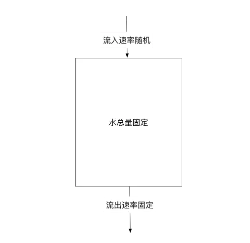

1）漏桶则是按照常量固定速率流出请求，流入请求速率任意，当流入的请求数累积到漏桶容量时，则新流入的请求被拒绝

2）漏桶限制的是常量流出速率（即流出速率是一个固定常量值，比如都是1的速率流出，而不能一次是1，下次又是2），从而平滑突发流入速率；

漏桶可以看作是一个带有常量服务时间的单服务器队列，如果漏桶（包缓存）溢出，那么数据包会被丢弃。 

在网络中，漏桶算法可以控制端口的流量输出速率，平滑网络上的突发流量，实现流量整形，从而为网络提供一个稳定的流量。

为了更好的控制流量，漏桶算法需要通过两个变量进行控制：一个是桶的大小，支持流量突发增多时可以存多少的水（burst），另一个是水桶漏洞的大小（rate）。

######  固定窗口算法

首先维护一个计数器，将单位时间段当做一个窗口，计数器记录这个窗口接收请求的次数：

1）当次数少于限流阀值，就允许访问，并且计数器+1

2）当次数大于限流阀值，就拒绝访问。

3）当前的时间窗口过去之后，计数器清零。

> 假设单位时间是1秒，限流阀值为3。在单位时间1秒内，每来一个请求,计数器就加1，如果计数器累加的次数超过限流阀值3，后续的请求全部拒绝。等到1s结束后，计数器清0，重新开始计数。

这个算法的弊端：

1）一段时间内（不超过时间窗口）系统服务不可用。

> 比如窗口大小为1s，限流大小为100，然后恰好在某个窗口的第1ms来了100个请求，然后第2ms-999ms的请求就都会被拒绝，这段时间用户会感觉系统服务不可用。

2）临界问题，窗口切换时可能会产生两倍于阈值流量的请求。

> 假设限流阀值为5个请求，单位时间窗口是1s,如果我们在单位时间内的前0.8-1s和1-1.2s，分别并发5个请求。虽然都没有超过阀值，但是如果算0.8-1.2s,则并发数高达10，已经超过单位时间1s不超过5阀值的定义啦，通过的请求达到了阈值的两倍。

为了解决这个问题，引入了滑动窗口。

###### 滑动窗口

滑动窗口可以简单理解为，设定的单位时间就是一个窗口，窗口可以分割多个更小的时间单元，随着时间的推移，窗口会向右移动。比如一个接口一分钟限制调用1000次，1分钟就可以理解为一个窗口，可以把1分钟分割为10个单元格，每个单元格就是6秒。当滑动窗口的格子划分的越多，滑动窗口滚动的就越平滑，限流的统计就会越精确。

######  计数限流

限流算法就是计数限流了，例如系统能同时处理100个请求，保存一个计数器，处理了一个请求，计数器加一，一个请求处理完毕之后计数器减一。

每次请求来的时候看看计数器的值，如果超过阈值要么拒绝。

非常的简单粗暴，计数器的值要是存内存中就算单机限流算法。存中心存储里，例如 Redis 中，集群机器访问就算分布式限流算法。

优点：简单粗暴，单机在 Java 中可用 Atomic 等原子类、分布式就 Redis incr。

缺点：假设我们允许的阈值是1万，此时计数器的值为0， 当1万个请求在前1秒内一股脑儿的都涌进来，这突发的流量可是顶不住的。缓缓的增加处理和一下子涌入对于程序来说是不一样的。

#### 熔断降级

Sentinel熔断降级会在调用链路中某个资源出现不稳定状态时（例如调用超时或异常异常比例升高），对这个资源的调用进行限制，让请求快速失败，避免影响到其它的资源而导致级联错误。

当资源被降级后，在接下来的降级时间窗口之内，对该资源的调用都进行自动熔断（默认行为是抛出DegradeException）。

#### 服务隔离

服务隔离是把每个依赖或调用的服务都隔离开来，防止级联失败引起整体服务不可用。

##### 线程池隔离

使用线程池隔离，比如说有 3 个服务 A、B、C，每个服务的线程池分配 10，20，30个线程，当 A 服务线程池中的 10 个线程都拿出来使用后，如果调用服务 A 的请求量增加，还想再增加线程是不行的，因为 A 服务分配的线程已经用完了，不会拿其他的服务的线程，这样就不会影响其他服务了。Hystrix 默认使用线程池隔离模式。


**线程池隔离技术优点**

- 依赖的服务都有隔离的线程池，即使自己的此案成池满了，也不会影响任何其他其他的服务调用。
- 线程池的健康状态会上报，可以近实时修改依赖服务的调用配置。
- 线程池具有异步特性，可以构建一层异步调用层。
- 具有超时检测的机制，尤其在服务间调用特别有用。

**线程池隔离技术缺点**

- 线程池本身就会带来一些问题，比如线程切换，线程管理，无疑增加了 CPU 的开销。
- 如果线程池中的线程利用率很低，则无疑是一种浪费。

##### 信号量隔离

简单来说就是一个池子里面放着一定数量的信号量，服务 A 每次调用服务 B 之前，需要从池子里面申请信号量，申请到了，才能去调用 B 服务。

 

##### 并发隔离控制

并发隔离控制是指基于资源访问的并发协程数来控制对资源的访问，思路和信号量隔离很类似，主要是控制对资源访问的最大并发数，避免因为资源的异常导致协程耗尽。

Sentinel 通过限制资源并发线程的数量，来减少不稳定资源对其它资源的影响。这样不但没有线程切换的损耗，也不需要您预先分配线程池的大小。

当某个资源出现不稳定的情况下，例如响应时间变长，对资源的直接影响就是会造成线程数的逐步堆积。当线程数在特定资源上堆积到一定的数量之后，对该资源的新请求就会被拒绝。堆积的线程完成任务后才开始继续接收请求。

### Sentinel vs hystrix 

- 从直观使用上

Hystrix需要我们程序员自己手工搭建监控平台，没有一套web界面可以进行更加细粒度化的配置

Sentinel单独一个组件，可以独立出来，直接界面化的细粒度统一配置

-  内部实现也不同


## Seata 

Seata 是一个开源的分布式事务解决方案，它提供了高可用的事务管理功能和高性能的本地事务处理能力。

解决分布式事务问题，有两个设计初衷：

- 对业务无侵入：即减少技术架构上的微服务化所带来的分布式事务问题对业务的侵入
- 高性能：减少分布式事务解决方案所带来的性能消耗

> Spring本地事务使用：@Transactional
>
> Seata全局事务使用：@GlobalTransactional

### 实现原理

#### 事务

**本地事务：**事务由本地资源管理器管理。

**分布式事务：**事务的操作位于不同的节点。

**分支事务：**在分布式事务中，由资源管理器管理的本地事务。

**全局事务：**一次性操作多个资源管理器完成的事务，由一组分支事务组成。

一般情况下，分支事务≈本地事务，分布式事务≈全局事务。

#### 唯一ID+三组件模型

Seata有三个组成部分，TM 和 RM 是作为 Seata 的客户端与业务系统集成在一起，TC 作为 Seata 的服务端独立部署：

- Transaction ID XID（全局唯一的事务ID）
- TC (Transaction Coordinator) - 事务协调者：维护全局和分支事务的状态，驱动全局事务提交或回滚。
- TM (Transaction Manager) - 事务管理器：<font color=red>一个分布式事务的发起者和终结者，</font>定义全局事务的范围，开启一个全局事务、提交或回滚全局事务。
- RM (Resource Manager) - 资源管理器：<font color=red>负责本地事务的运行，</font>管理分支事务处理的资源，与TC交谈以注册分支事务和报告分支事务的状态，并驱动分支事务提交或回滚。

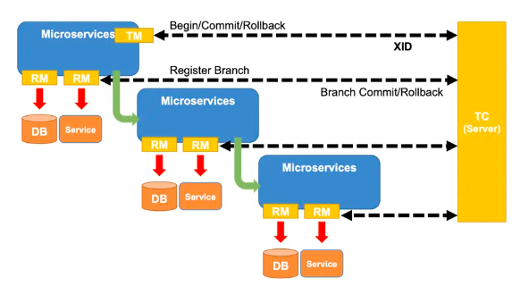

Seata 中事务生命周期：

- Begin(TM)
- Registry(RM)
- Commit(TM&TC)
- Rollback(TM&TC)

##### 事务创建-TM

Seata 中用于创建和决议事务结果的实体,一般集成于业务调用链路的上游。

##### 本地事务-RM

用于管理资源的实体，一般情况下等同于微服务中的提供方(provider)，管理其所在服务中的资源，如数据库资源等。

##### 事务协调-TC

Seata 中用于两段提交方式的事务模式统一协调事务的实体(SAGA除外),其可由事务管理者驱动或自身驱动进行事务的二阶段行为.

- Commit：

  Seata 中当事务管理器决议为提交时,TC才会进行对事务的二阶段提交行为下发,如TCC模式中的confirm,AT模式的undolog delete,XA模式的XA Commit。

- Rollback：

  Seata 中当事务管理器决议为回滚时,TC会进行对事务的二阶段回滚行为下发,如TCC模式中的cancel,AT模式的undo,XA模式的XA Rollback。

- TimeoutRollback：

  Seata 中当事务管理器创建事务时指定的Timeout时间到达后还未决议时,TC会主动将已超时的事务进行超时回滚,其超时行为等同上述Rollback行为。

#### 处理过程

1. TM 向 TC 申请开启一个全局事务，全局事务创建成功并生成一个全局唯一的 XID，XID 会在微服务调用链路的上下文中传播
2. 调用本地事务1，向 TC 注册分支事务，接着执行这个分支事务并提交，将执行结果汇报给TC
3. 调用本地事务2，向 TC 注册分支事务，接着执行这个分支事务并提交，将执行结果汇报给TC
4. TM 根据 TC 中所有的分支事务的执行情况，发起针对 XID 的全局提交或回滚决议；
5. TC 调度 XID 下管辖的全部分支事务完成提交或回滚请求。

> 例如 订单库存的分布式事务流程：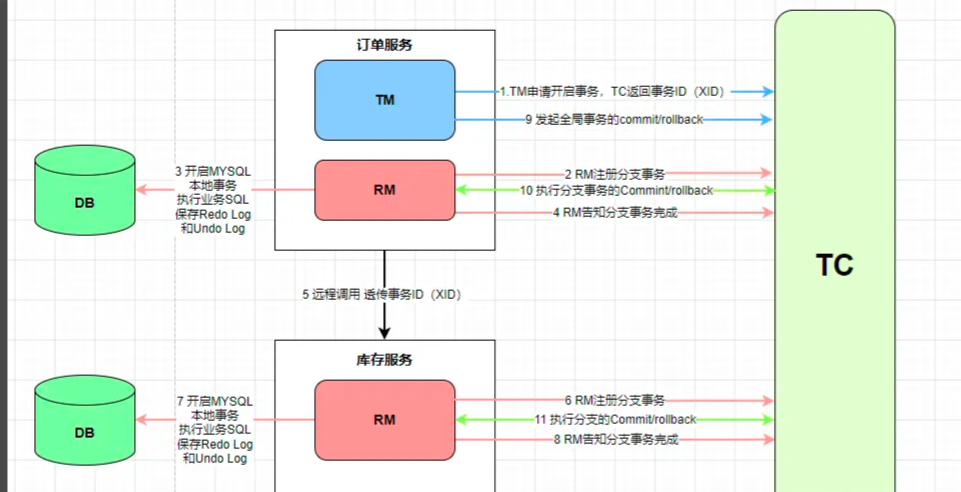


### 事务模式

Seata 将为用户提供了 AT、TCC、SAGA 和 XA 事务模式。

#### XA模式

> [!tip]XA模式使用两阶段提交（2PC）来保证事务的一致性和可靠性。

##### 前提

- 支持XA 事务的数据库。
- Java 应用，通过 JDBC 访问数据库。

##### 处理阶段

在 Seata 定义的分布式事务框架内，利用事务资源（数据库、消息服务等）对 XA 协议的支持，以 XA 协议的机制来管理分支事务的一种 事务模式。


**执行阶段**：

1. 可回滚：业务 SQL 操作放在 XA 分支中进行，由资源对 XA 协议的支持来保证可回滚
2. 持久化：XA 分支完成后，执行 XA prepare，同样，由资源对 XA 协议的支持来保证持久化

**完成阶段**：

1. 分支提交：执行 XA 分支的 commit
2. 分支回滚：执行 XA 分支的 rollback

##### 使用

无代码入侵。

添加配置seata:data-source-proxy-mode: XA

需要分布式事务的业务代码上添加注解@GlobalTransactional

##### 优缺点

优点：

- 一致性：XA模式通过两阶段提交协议，确保所有参与者要么一起提交事务，要么一起中断事务，从而保证事务的一致性。
- 可靠性：XA模式提供了强一致性和可靠性的保证，在分布式环境下可以确保事务的正确执行。
- 标准化：XA模式是一种标准的分布式事务处理协议，被广泛支持和应用于各种数据库和资源管理器中。

缺点：

- 性能开销：在XA模式中，需要进行多次网络通信和协调操作，这会引入额外的性能开销，并且可能会导致事务处理的延迟增加。
- 阻塞风险：在准备阶段和提交阶段，所有的参与者都需要等待事务协调器的指令，这可能导致一些参与者在等待期间被阻塞，影响系统的吞吐量和并发性能。
- 单点故障：在XA模式中，事务协调器起着关键的角色，如果事务协调器出现故障，整个分布式事务系统可能无法正常运行

#### AT模式

> [!tip]
>
> Seata AT模式是基于XA事务演进而来的。用户只需关注自己的“业务 SQL”，用户的 “业务 SQL” 作为一阶段，Seata 框架会自动生成事务的二阶段提交和回滚操作。

通过在每个参与者的本地事务中实现事务的原子性和隔离性，来保证分布式事务的一致性。

AT模式避免了全局锁和阻塞的问题，从而提高了系统的并发性能。在AT模式中，参与者的本地事务执行成功后即可提交，而不需要等待其他参与者的状态。

##### 前提

基于支持本地 ACID 事务的关系型数据库。

Java 应用，通过 JDBC 访问数据库。

##### 处理阶段

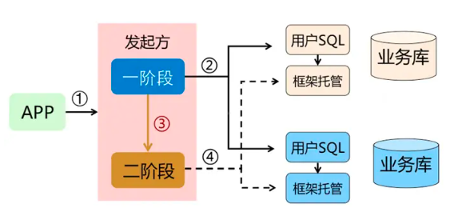

###### 一阶段

业务数据和回滚日志记录在同一个本地事务中提交，释放本地锁和连接资源。

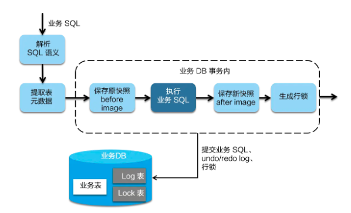

1. Seata 会拦截“业务 SQL”，首先解析 SQL 语义，找到“业务 SQL”要更新的业务数据

2. 在业务数据被更新前，将其保存成“before image”，然后执行“业务 SQL”更新业务数据

3. 在业务数据更新之后，再将其保存成“after image”，最后生成行锁。

以上操作全部在一个数据库事务内完成，这样保证了一阶段操作的原子性。

###### 二阶段

提交异步化，非常快速地完成。因为“业务 SQL”在一阶段已经提交至数据库， 所以 Seata 框架只需将一阶段保存的快照数据和行锁删掉，完成数据清理即可。

如果需要回滚，回滚方式便是用“before image”还原业务数据；但在还原前要首先要校验脏写，对比“数据库当前业务数据”和 “after image”，如果两份数据完全一致就说明没有脏写，可以还原业务数据，如果不一致就说明有脏写，出现脏写就需要转人工处理。

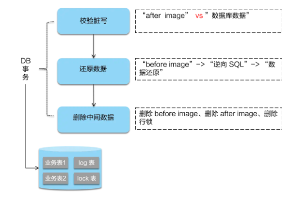

##### 优化

Seata的AT模式是在AT模式基础上进行了扩展和优化的实现。

- Seata引入了Seata Server和Seata Client的概念，通过Seata Server作为事务协调器，集中管理分布式事务的控制逻辑。
- Seata的AT模式还提供了更多的功能和工具，如分布式事务日志和分布式锁，以增强分布式事务的可靠性和性能。

##### 锁机制

AT模式是基于本地锁、全局锁机制。

###### 本地锁

本地锁指的就是数据库本身的行锁或者表锁，依赖数据库本身的commit和回滚操作，这也是为什么AT要求支持ACID的数据库。

分支事务通过本地锁实现了隔离，隔离级别默认为读已提交，即开启事务A的分支事务a1获得本地锁，一旦提交分支事务，就释放本地锁，别的事务就可以读到a1的数据；

本地锁带来的脏读问题：

<font color=red>开启事务A的分支事务a1获得本地锁，一旦提交分支事务，就释放本地锁，别的事务B就可以读到a1的数据，如果a1不回滚，就没问题；但若事务A回滚，B读到的即为脏数据。</font>

> [!ATTENTION] 因此本地锁需要解决的问题是，整个事务A没有提交的时候，a1不能被别的事务可见，也不能被别的事务修改。
>
> 由本地锁保障a1不能被别的事务修改；全局锁保障a1不能被别的事务可见。

###### 全局锁

全局锁是 Seata 自己实现的，保证了先拿到全局锁的全局事务做完了所有事之后，其它全局事务才能提交本地事务。

全局锁 是把分支事务数据库中的数据的主键的某个值注册到 TC，它是全局的，因此交全局锁，锁住的是分支事务数据库中要修改的那行记录，是行锁粒度的。

```java
protected LockDO convertToLockDO(RowLock rowLock) {
        LockDO lockDO = new LockDO();
        lockDO.setBranchId(rowLock.getBranchId());
        lockDO.setPk(rowLock.getPk());
        lockDO.setResourceId(rowLock.getResourceId());
        // row_key的生成
        lockDO.setRowKey(getRowKey(rowLock.getResourceId(), rowLock.getTableName(), rowLock.getPk()));
        lockDO.setXid(rowLock.getXid());
        lockDO.setTransactionId(rowLock.getTransactionId());
        lockDO.setTableName(rowLock.getTableName());
        return lockDO;
    }
//`row_key`是由`resource_id`、`tableName`、`pk`这三个字段连接生成的，也就意味着`row_key`是代表`表里面的具体一行数据`，也就是我们的`行记录`，所以确信`AT`模式的全局锁其实就是`行锁`。
```

> [!ATTENTION] 
>
> 本地锁的工作方式是，第一阶段提交后，就释放本地锁。
>
> 全局锁的工作方式是，只有第二阶段提交全局事务或者全局回滚时，才会释放全局锁。

###### 锁机制

一阶段本地事务提交前，需要确保先拿到**全局锁**：

- 拿不到全局锁 ，不能提交本地事务
- 拿全局锁的尝试被限制在一定范围内，超出范围将放弃，并回滚本地事务，释放本地锁
- 本地提交后，释放本地锁

> 两个全局事务 tx1 和 tx2，分别对 a 表的 m 字段进行更新操作，m 的初始值 1000。
>
> 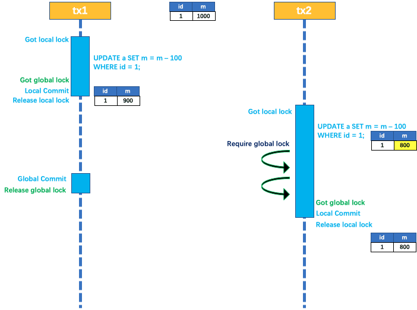
>
> tx1 先开始，开启本地事务，拿到本地锁，更新操作 m = 1000 - 100 = 900。本地事务提交前，先拿到该记录的 全局锁 ，本地提交释放本地锁。
>
> tx2 后开始，开启本地事务，拿到本地锁，更新操作 m = 900 - 100 = 800。本地事务提交前，尝试拿该记录的 全局锁 ，tx1 全局提交前，该记录的全局锁被 tx1 持有，tx2 需要重试等待 全局锁。
>
> tx1 二阶段全局提交，释放 全局锁 。tx2 拿到 全局锁 提交本地事务。
>
> -----------------------------------------------------------------
>
> 如果 tx1 的二阶段全局回滚，则 tx1 需要重新获取该数据的本地锁，进行反向补偿的更新操作，实现分支的回滚。
>
> 此时，如果 tx2 仍在等待该数据的 全局锁，同时持有本地锁，则 tx1 的分支回滚会失败。分支的回滚会一直重试，直到 tx2 的 全局锁 等锁超时，放弃 全局锁 并回滚本地事务释放本地锁，tx1 的分支回滚最终成功。
>
> 因为整个过程 全局锁 在 tx1 结束前一直是被 tx1 持有的，所以不会发生 脏写 的问题。
>
> 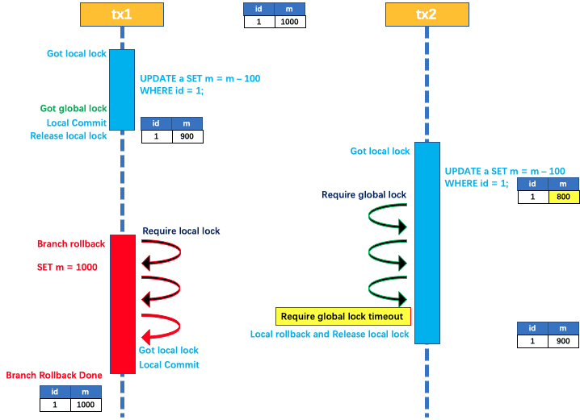

###### 脏写问题

假设业务代码是这样的：

- `updateAll()`用来同时更新A和B表记录，`updateA()` `updateB()`则分别更新A、B表记录
- `updateAll()`已经加上了`@GlobalTransactional`
- 业务一调用updateAll（UpdateA+UpdateB两个分支事务）；业务二调用updateA

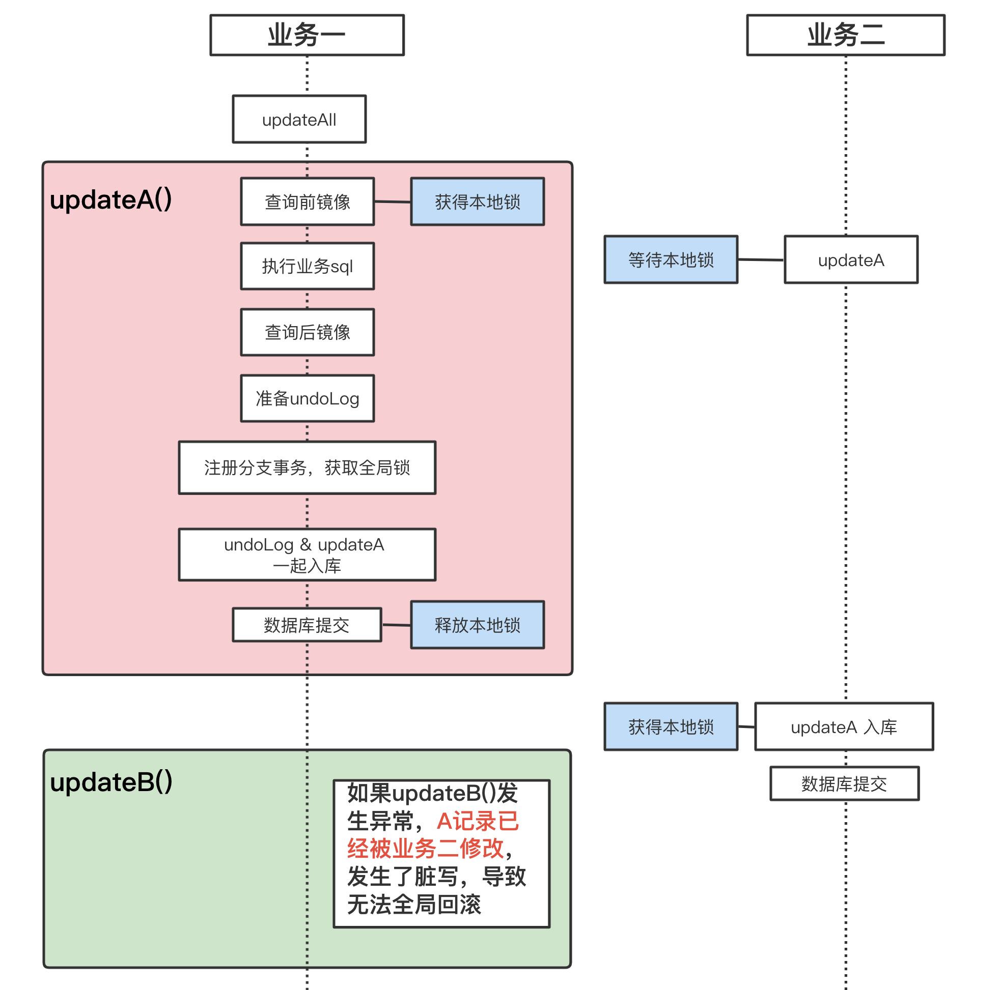

业务一调用UpdateB发生异常回滚时，发现A记录已被修改，会造成无法全局回滚。原因是业务二调用的UpdateA只是一个分支事务，没有使用`@GlobalTransactional`注解，按照本地事务处理，不会请求全局锁。

> [!WARNING] 这也是常会出现问题的一点，不要以为只要分布式事务使用全局事务标记了就没有问题，不要以为单独的本地事务不需要全局事务标记，可能会引发脏写、无法回滚。

【解决方案一：UpdateA使用`@GlobalTransactional`注解标记全局事务】

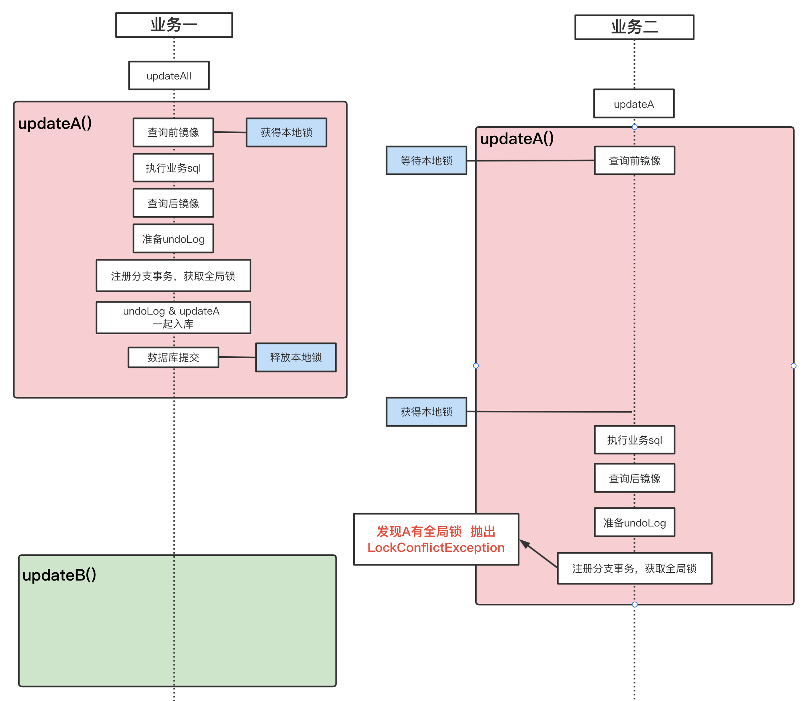

【解决方案二：用for update 或 GlobalLock申请全局锁】


###### 脏读问题

在数据库本地事务隔离级别 **读已提交（Read Committed）** 或以上的基础上，Seata（AT 模式）的默认全局隔离级别是 **读未提交（Read Uncommitted）** 。

如果应用在特定场景下，必需要求全局的读已提交 ，配合使用`@GlobalLock + select for update `,就可以形成读已提交隔离级别。

<font color=red>Seata改写了SELECT FOR UPDATE 语句的代理，SELECT FOR UPDATE 语句的执行会申请 全局锁 ，</font>如果 全局锁 被其他事务持有，则释放本地锁（回滚 SELECT FOR UPDATE 语句的本地执行）并重试。这个过程中，查询是被 block 住的，直到 全局锁 拿到，即读取的相关数据是已提交的才返回。

出于总体性能上的考虑，Seata 目前的方案并没有对所有 SELECT 语句都进行代理，仅针对 FOR UPDATE 的 SELECT 语句。

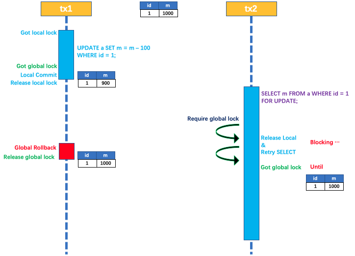

###### @GlobalLock

有的方法它可能并不需要`@GlobalTransactional`的事务管理，但是我们又希望它对数据的修改能够加入到seata机制当中。那么这时候就需要`@GlobalLock`了。

加上了`@GlobalLock`，在事务提交的时候会申请全局锁。

```java
@GlobalLock(lockRetryInternal = 100, lockRetryTimes = 100)
    @GetMapping("/GlobalLock")
    @Transactional
    public Object GlobalLock() {
        AccountTbl accountTbl = accountTblMapper.selectById(11111111);
        AccountTbl accountTbl1 = accountTbl.setMoney(accountTbl.getMoney() - 1);
        accountTblMapper.updateById(accountTbl1);
        return "成功执行！！！";
    }
```

注意事项，在使用@GlobalLock注解的时候：

1. 必须要添加@transaction注解
2. 最好写for update语句，在查询方法中添加排它锁，比如根据ID 查询时，需要如下SQL 书写：

```sql
<select id="selectById" parameterType="integer" resultType="com.hnmqet.demo01.entity.AccountTbl">
    SELECT id,user_id,money FROM account_tbl WHERE id=#{id} FOR UPDATE
</select>
```
这是因为，只有添加了 FOR UPDATE，Seata 才会进行创建<font color=red>**重试**</font>的执行器，这样事务失败时，会释放本地锁，等待一定时间再重试。如果不添加，则会一直占有本地锁，全局事务回滚需要本地锁，则全局事务就只能等@GlobalLock事务超时失败才能拿到本地锁释放全局锁，造成@GlobalLock永远获取不到全局锁。

> 只用`@GlobalLock`能不能防止脏写？
>
> 能。
>
> 但`select for update`能带来这么几个好处：
>
> - 锁冲突更“温柔”些。如果只有`@GlobalLock`，检查到全局锁，则立刻抛出异常，并不会重试，也许再“坚持”那么一下，全局锁就释放了，抛出异常岂不可惜了。
> - 在`updateA()`中可以通过`select for update`获得最新的A，接着再做更新。

##### 使用

无代码入侵。

添加配置seata:data-source-proxy-mode: AT

需要分布式事务的业务代码上添加注解@GlobalTransactional

##### 优缺点

优点：

- 较高的性能：AT模式在每个参与者的本地事务中执行操作，避免了全局锁和阻塞的问题，提高了系统的并发性能。
- 简化的实现：相对于XA模式，AT模式的实现相对简单，不需要涉及全局事务协调器，减少了开发和维护的复杂性。
- 本地事务的独立性：每个参与者在本地事务管理器中管理自己的事务，可以独立控制和优化本地事务的执行。

缺点：

- 弱一致性：AT模式对一致性的要求相对较低，可能会出现数据不一致的情况。在某些场景下，可能需要更高的一致性保证，需要考虑其他分布式事务处理模式。
- 隔离级别限制：由于AT模式依赖于本地事务的隔离性，参与者的隔离级别受限于本地事务管理器支持的隔离级别，可能无法满足某些特定的隔离需求。
- 容错性和恢复性：AT模式在发生故障或错误时，需要考虑如何处理事务的回滚和恢复，以确保数据的一致性和可靠性。

#### TCC模式

> [!tip]
>
> TCC 模式不依赖于底层数据资源的事务支持，需要用户根据自己的业务场景实现 Try、Confirm 和 Cancel 三个操作；事务发起方在一阶段执行 Try 方式，在二阶段提交执行 Confirm 方法，二阶段回滚执行 Cancel 方法。

##### 处理阶段

Try阶段（尝试阶段）：在这个阶段，参与者（服务）尝试预留或锁定资源，并执行必要的前置检查。如果所有参与者的Try操作都成功，表示资源可用，并进入下一阶段。如果有任何一个参与者的Try操作失败，表示资源不可用或发生冲突，事务将中止。

Confirm阶段（确认阶段）：在这个阶段，参与者进行最终的确认操作，将资源真正提交或应用到系统中。如果所有参与者的Confirm操作都成功，事务完成，提交操作得到确认。如果有任何一个参与者的Confirm操作失败，事务将进入Cancel阶段。

Cancel阶段（取消阶段）：在这个阶段，参与者进行回滚或取消操作，将之前尝试预留或锁定的资源恢复到原始状态。如果所有参与者的Cancel操作都成功，事务被取消，资源释放。如果有任何一个参与者的Cancel操作失败，可能需要进行补偿或人工介入来恢复系统一致性。

##### 优化

Seata的TCC模式是在TCC模式基础上进行了扩展和优化的实现。

- Seata引入了Seata Server作为事务协调器，集中管理分布式事务的控制逻辑。

- Seata的TCC模式还提供了分布式事务日志和分布式锁等功能，以增强事务的可靠性和性能。

- Seata的TCC模式可以更方便地集成到应用中，并提供了更好的事务管理和监控能力。

##### 使用

以账户转账为例。

- 定义参与者接口，实现try、confirm、cancel方法：

```java
public interface AccountService {
boolean tryTransfer(String fromAccount, String toAccount, double amount);
boolean confirmTransfer(String fromAccount, String toAccount, double amount);
boolean cancelTransfer(String fromAccount, String toAccount, double amount);
}
```

- 实现参与者逻辑：

```java
public class AccountServiceImpl implements AccountService {
@Override
public boolean tryTransfer(String fromAccount, String toAccount, double amount) {
// 执行转账操作，预留转出账户金额，检查账户余额等
// 如果成功，返回 true；如果失败，返回 false
}
@Override
public boolean confirmTransfer(String fromAccount, String toAccount, double amount) {
// 确认转账操作，将预留金额转出
// 如果成功，返回 true；如果失败，返回 false
}
@Override
public boolean cancelTransfer(String fromAccount, String toAccount, double amount) {
// 取消转账操作，将预留金额回滚到账户
// 如果成功，返回 true；如果失败，返回 false
}
}
```

- 客户端调用，先调用try，try成功，则commit，否则rollback

```java
// 获取Seata全局事务ID
String xid = RootContext.getXID();
// 开启全局事务
TransactionContext context = new TransactionContext();
context.setXid(xid);
GlobalTransaction tx = GlobalTransactionContext.getCurrentOrCreate();
try {
// 调用参与者的tryTransfer方法
	boolean tryResult = accountService.tryTransfer(fromAccount, toAccount, amount);
	if (tryResult) {
		// 提交全局事务
		tx.commit();
	} else {
	// 回滚全局事务
	tx.rollback();
	}
	} catch (Exception e) {
// 异常时回滚全局事务tx.rollback();
}
```

##### 优缺点

优点：

- 一阶段完成直接提交事务，释放数据库资源，性能好；
- 相比AT模型，无需生成快照，无需使用全局锁，性能最强；
- 不依赖数据库事务，而是依赖补偿操作，可以用于非事务型数据库；

缺点：

- 有代码侵入，需要人为编写try、Confirm和Cancel接口，太麻烦
- 软状态，事务是最终一致；
- 需要考虑Confirm和Cancel的失败情况,做好幂等处理

#### SAGA模式

##### 执行过程

执行正向操作：按照事务的逻辑顺序，依次执行正向操作。每个正向操作都会记录事务的执行状态。

- 如果所有的正向操作都成功执行，则事务提交完成。
- 如果某个正向操作失败，将会触发相应的补偿操作。补偿操作会撤销或修复正向操作的影响。

执行补偿操作：按照逆序依次执行已经触发的补偿操作。补偿操作应该具备幂等性，以便可以多次执行而不会造成副作用。
- 如果所有的补偿操作都成功执行，则事务回滚完成。
- 如果补偿操作也失败，需要人工介入或其他手段来解决事务的一致性问题。

##### 优化

Seata的Saga模式相对于传统的Saga模式，具有以下特点：

- 集成性：Seata的Saga模式与Seata框架紧密集成，可以与Seata的其他特性一起使用，如分布式事务日志和分布式锁等。
- 强一致性：Seata的Saga模式提供了强一致性的事务支持，确保事务的执行顺序和一致性。
- 可靠性：Seata的Saga模式在补偿操作的执行过程中，支持重试和恢复机制，提高了事务的可靠性和恢复能力。

##### 使用

以下订单-扣减库存为例。

定义参与者接口，实现创建和取消接口：

```java
public interface OrderService {
boolean createOrder(String orderId, String userId, String productId, int quantity);
boolean cancelOrder(String orderId);
}
public interface ProductService {
boolean reduceStock(String productId, int quantity);
boolean revertStock(String productId, int quantity);
}
```

实现参与者逻辑：

```java
public class OrderServiceImpl implements OrderService {
@Override
public boolean createOrder(String orderId, String userId, String productId, int quantity) {
// 执行订单创建逻辑，如创建订单记录、扣减用户余额等
// 如果成功，返回 true；如果失败，返回 false
}
@Override
public boolean cancelOrder(String orderId) {
// 执行订单取消逻辑，如回滚订单记录、恢复用户余额等
// 如果成功，返回 true；如果失败，返回 false
}
}
public class ProductServiceImpl implements ProductService {
@Override
public boolean reduceStock(String productId, int quantity) {
// 执行减少库存逻辑，如更新产品库存、记录库存变更日志等
// 如果成功，返回 true；如果失败，返回 false
}
@Override
public boolean revertStock(String productId, int quantity) {
// 执行恢复库存逻辑，如恢复产品库存、删除库存变更日志等
// 如果成功，返回 true；如果失败，返回 false}
}
```

客户端调用，按照事务的逻辑顺序，依次执行正向操作，操作结果成功，则提交全局事务：

```java
// 获取Seata全局事务ID
String xid = RootContext.getXID();
// 开启全局事务
TransactionContext context = new TransactionContext();
context.setXid(xid);
GlobalTransaction tx = GlobalTransactionContext.getCurrentOrCreate();
try {
	// 调用参与者的方法
	boolean createOrderResult = orderService.createOrder(orderId, userId, productId, quantity);
	boolean reduceStockResult = productService.reduceStock(productId, quantity);
	if (createOrderResult && reduceStockResult) {
		// 提交全局事务tx.commit();
	} else {
		// 回滚全局事务
	tx.rollback();
	}
	} catch (Exception e) {// 异常时回滚全局事务tx.rollback();
}
```

##### 优缺点

优点：

- 一阶段提交本地事务，无锁，高性能
- 事件驱动架构，参与者可异步执行，高吞吐
- 补偿服务易于实现，不用编写TCC中的三个阶段，实现简单

缺点：

- 没有锁，不保证隔离性，会有脏写；
- 软状态持续时间不确定，时效性差

#### 四种模式对比

|          | XA                             | AT                                         | TCC                                                      | SAGA                                                         |
| -------- | ------------------------------ | ------------------------------------------ | -------------------------------------------------------- | ------------------------------------------------------------ |
| 一致性   | 强一致                         | 弱一致                                     | 弱一致                                                   | 最终一致                                                     |
| 隔离性   | 完全隔离                       | 基于全局锁隔离                             | 基于资源预留隔离                                         | 无隔离                                                       |
| 代码侵入 | 无                             | 无                                         | 有，需要编写三个接口                                     | 有，需要编写状态机和补偿业务                                 |
| 性能     | 差                             | 好                                         | 非常好                                                   | 非常好                                                       |
| 场景     | 对一致性、隔离性有高要求的业务 | 基于关系型数据库的大多数分布式务场景都可以 | 1.对性能要求较高的事务；2.有非关系型数据库要参与的事务； | 1.业务流程长、业务流程多；2.参与者包含其它公司或遗留系统服务，无法提供TCC模式要求的三个接口 |

**XA 模式**： 是分布式强一致性的解决方案，但性能低而使用较少。

**AT 模式**： 是无侵入的分布式事务解决方案，适用于不希望对业务进行改造的场景，几乎0学习成本。

**TCC 模式**： 是高性能分布式事务解决方案，适用于核心系统等对性能有很高要求的场景。

**Saga 模式**： 是长事务解决方案，适用于业务流程长且需要保证事务最终一致性的业务系统，Saga 模式一阶段就会提交本地事务，无锁，长流程情况下可以保证性能，多用于渠道层、集成层业务系统。事务参与者可能是其它公司的服务或者是遗留系统的服务，无法进行改造和提供 TCC 要求的接口，也可以使用 Saga 模式。

### 实践经验

[分布式事务 Seata Saga 模式首秀以及三种模式详解 | Meetup#3 回顾 - 掘金 (juejin.cn)](https://juejin.cn/post/6844903913691283469#heading-11)

