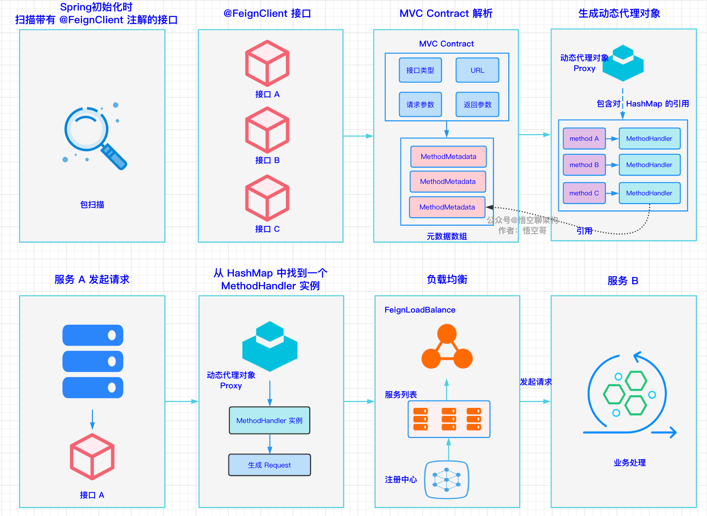
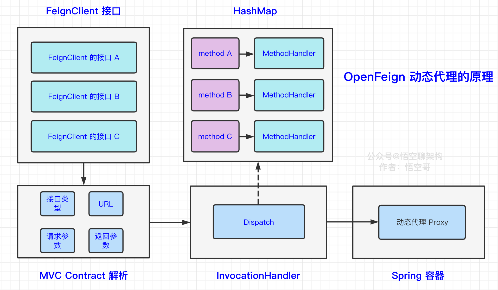
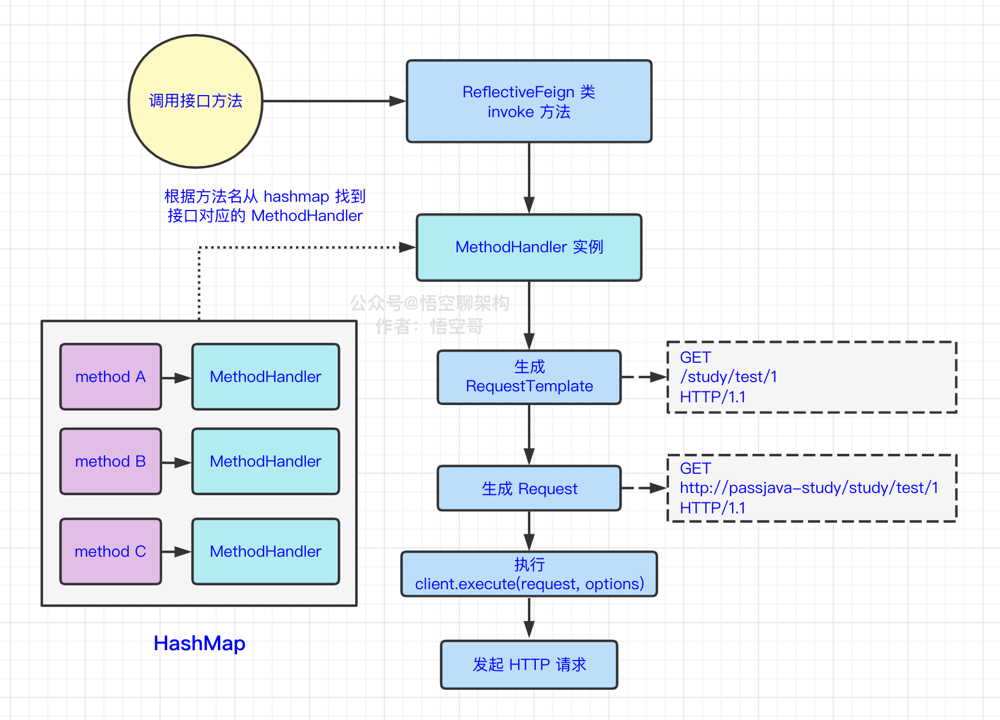
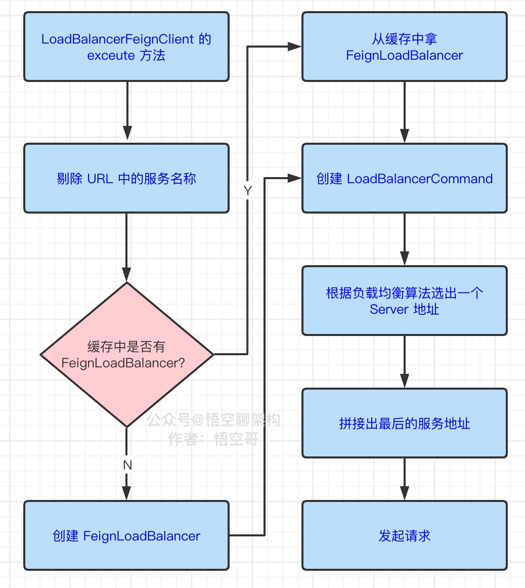

@autoHeader: 2.1.1.1.1.1

<p align="right">update time : {docsify-updated}</p>


## 简介 //todo

### 功能和组件

https://segmentfault.com/a/1190000022605186#Spring


## Ribbon

Spring Cloud Ribbon 是一套基于 Netflix Ribbon 实现的客户端负载均衡和服务调用工具，可以让我们轻松地将面向服务的REST请求自动转换成客户端负载均衡的服务调用。

### 负载均衡

#### 考虑因素

**设计一个负载均衡组件，该会怎么设计？**

需要考虑这几个因素：

- 如何获取及同步服务器列表？涉及到与注册中心的交互。
- 如何将负载进行分摊？涉及到分摊策略。
- 如何将客户端请求进行拦截然后选择服务器进行转发？涉及到请求拦截。

#### 负载均衡分类

##### 服务端负载均衡

客户端发送请求被服务端负载均衡拦截，根据负载均衡算法分发请求到具体服务器上处理请求。

服务端负载均衡包括两种，一种是硬件负载均衡，硬件比如：F5、Array等。另一种是软件负载均衡，软件比如：LVS、Nginx等。


##### 客户端负载均衡

在客户端负载均衡中，所有的客户端节点都有一份自己要访问的服务端清单，客户端在发起请求的时候会先自行选择一个服务端，向该服务端发起请求，从而实现负载均衡。


### 使用方式

#### demo

```java
@SpringBootApplication
@EnableEurekaClient
public class RibbonDemoApplication {

    public static void main(String[] args) {
        SpringApplication.run(RibbonDemoApplication.class, args);
    }

    @Bean
    @LoadBalanced
    RestTemplate restTemplate(){
        return new RestTemplate();
    }
}
```

- Ribbon客户端本身作为一个Eureka客户端存在，因此需要`@EnableEurekaClient`注解，并且向注册中心注册服务；

- `@Bean`和`@LoadBalanced`注解是注入一个RestTemplate实例，并标明是负载均衡使用的；

之后便使用restTemplate内部即做了负载均衡

```java
private static String EUREKA_URL = "http://eureka-client/getHello";
	public String getRibbonHello(HttpServletRequest request){
        String result = restTemplate.getForObject(EUREKA_URL, String.class);
        System.out.println(result);
        return result;
    }
```

### Ribbon负载均衡策略


**1 线性轮询均衡** 

RoundRobinRule，轮流依次请求不同的服务器。优点是无需记录当前所有连接的状态，无状态调度。

比如一共有 3 个服务，第一次调用服务 1，第二次调用服务 2，第三次调用服务3，依次类推。此策略的配置设置如下：

```
NFLoadBalancerRuleClassName: com.netflix.loadbalancer.RoundRobinRule 
#设置负载均衡
```

**2 加权响应时间负载均衡**

WeightedResponseTimeRule，为每个服务按响应时长自动分配权重，响应时间越长，权重越低，被选中的概率越低。

它的实现原理是，刚开始使用轮询策略并开启一个计时器，每一段时间收集一次所有服务提供者的平均响应时间，然后再给每个服务提供者附上一个权重，权重越高被选中的概率也越大。

```
NFLoadBalancerRuleClassName: com.netflix.loadbalancer.WeightedResponseTimeRule
```

**3 随机负载均衡**

RandomRule，随机选择服务器。适合并发比较大的场景。

```
NFLoadBalancerRuleClassName: com.netflix.loadbalancer.RandomRule #设置负载均衡
```

**4 最小连接数负载均衡**

Best Available，遍历服务提供者列表，选取连接数最小的⼀个服务实例。如果有相同的最小连接数，那么会调用轮询策略进行选取。

```
NFLoadBalancerRuleClassName: com.netflix.loadbalancer.BestAvailableRule #设置负载均衡
```

**5 重试负载均衡**

RetryRule，通过轮询均衡策略选择一个服务器，如果获取的服务实例为 null 或已经失效，则在指定的时间之内不断地进行重试来获取服务，如果超过指定时间依然没获取到服务实例则返回 null。

```
NFLoadBalancerRuleClassName: com.netflix.loadbalancer.RandomRule #设置负载均衡
ConnectTimeout: 2000 # 请求连接的超时时间
ReadTimeout: 5000 # 请求处理的超时时间
```

**6 可用性敏感负载均衡**

AvailabilityFilteringRule，过滤故障的服务，和并发连接数量超过阈值的服务，然后对剩余的服务列表按照轮询策略进行访问。

默认情况下，如果最近三次连接均失败，则认为该服务实例故障断路。

```
NFLoadBalancerRuleClassName: com.netflix.loadbalancer.AvailabilityFilteringRule
```

**7 区域感知负载均衡**

ZoneAvoidanceRule，根据服务所在区域（zone）的性能和服务的可用性来选择服务实例，在没有区域的环境下，该策略和轮询策略类似。

是Spring Cloud Ribbon 中默认的策略。

```
NFLoadBalancerRuleClassName: com.netflix.loadbalancer.ZoneAvoidanceRule
```

**8 自定义**

用户可以通过继承 RoundRibbonRule 来实现自定义负载均衡策略。

### Ribbon实现原理

#### 同步服务列表

Ribbon 首次从 Eureka 获取全量注册表后，就会隔一定时间获取注册表，默认初始化时1s 后执行一个 Runnable 线程，后面就是每隔 30s 执行 Runnable 线程。这个 Runnable 线程就是去获取 Eureka 注册表的。

#### 心跳检测查看服务是否可用

Ribbon 心跳检测原理：对自己本地缓存的 Server List 进行遍历，对每个服务发送一个心跳，查看服务是否可用。

```java
isAlive = status.equals(InstanceStatus.UP);
```

默认每隔 30s 执行以下 PingTask 调度任务，对每个服务执行 isAlive 方法，判断状态。

#### 拦截请求

有了服务列表后，Ribbon就可以拦截请求，根据负载均衡算法，在列表中选择一个实例发送请求：

第一步：Ribbon 拦截所有标注`@loadBalance`注解的 RestTemplate。RestTemplate 是用来发送 HTTP 请求的。

第二步：将 Ribbon 默认的拦截器 LoadBalancerInterceptor 添加到 RestTemplate 的执行逻辑中，当 RestTemplate 每次发送 HTTP 请求时，都会被 Ribbon 拦截。

第三步：拦截后，Ribbon 会创建一个 ILoadBalancer 实例。

第四步：ILoadBalancer 实例会使用 RibbonClientConfiguration 完成自动配置。就会配置好 IRule，IPing，ServerList。

第五步：Ribbon 会从根据负载均衡算法，从服务列表中选择一个服务，将请求转发给这个服务。

## OpenFegin 

### 简介

OpenFeign 声明式服务调用和负载均衡组件，核心是使用注解 + 接口的方式实现服务调用，可以像调用本地服务一样，调用远程服务，无需感知操作远程http请求。OpenFegin内置了Ribbon组件，因此也实现了负载均衡调用。

Feign 最早是由 Netflix 公司进行维护的，后来 Netflix 不再对其进行维护，最终 Feign 由社区进行维护，更名为 OpenFeign。

#### Feign vs OpenFegin

共同点：都提供了声明式调用。

区别：

1. Feign 最早是由 Netflix 公司进行维护的，目前Netflix公司已经不再维护，SpringCloud社区自行进行维护后，更名为 OpenFeign。
2. OpenFeign是Spring Cloud 在Feign的基础上支持了Spring MVC的注解，如@RequesMapping等。

### 使用方式

#### demo

**（1）引入pom依赖**

```xml
<dependency>
    <groupId>org.springframework.cloud</groupId>
    <artifactId>spring-cloud-starter-openfeign</artifactId>
</dependency>
```

**（2）启动类**

```java
@EnableFeignClients(basePackages = "com.jackson0714.passjava.member.feign")
@EnableDiscoveryClient
```

 启动类上添加 `@EnableFeignClients`注解开启远程调用服务，扫描OpenFeign接口所在的包，且需要开启服务发现

**（3）定义OpenFegin接口**

```java
@FeignClient("passjava-study")
public interface StudyTimeFeignService {
    @RequestMapping("study/studytime/member/list/test/{id}")
    public R getMemberStudyTimeListTest(@PathVariable("id") Long id);
}
```

1. 注解`@FeignClient`，而且括号里面指定了服务名：passjava-study，显示声明这个接口用来远程调用 `passjava-study`服务
2. 注解@RequestMapping声明远程服务的http接口样式

**(4) 调用OpenFeign接口**

```java
Autowired
private StudyTimeFeignService studyTimeFeignService;

studyTimeFeignService.getMemberStudyTimeListTest(id);
```

> 加了 @FeignClient 注解的接口后，我们就可以调用它定义的接口，然后就可以调用到远程服务了。
>
> 这里可以看到接口都没有实现，就可以调用了，剩下的工作都是OpenFeign框架中实现的。

#### 一些问题

##### GET请求传对象

Get 请求传对象，需要加 @SpringQueryMap注解

```java
@GetMapping("/member/v1/list")
R<List<Member>> getUserinfoList(@SpringQueryMap Member member);
```

### 实现原理

#### 整体流程



1、在 Spring 项目启动阶段，服务 A 的OpenFeign 框架会发起一个主动的扫包流程。

2、从指定的目录下扫描并加载所有被 @FeignClient 注解修饰的接口，然后将这些接口转换成 Bean，统一交给 Spring 来管理。

3、根据这些接口会经过 MVC注解解析，将方法上的注解都解析出来，获得方法名、参数类型、url等信息，存放在元数据数组中。

4、基于上面加载的每一个 FeignClient 接口，会生成一个动态代理对象，指向了一个包含对应方法的 MethodHandler 的 HashMap。MethodHandler 对元数据有引用关系。生成的动态代理对象会被添加到 Spring 容器中，并注入到对应的服务里。

5、服务 A 调用接口，准备发起远程调用。

6、从动态代理对象 Proxy 中找到一个 MethodHandler 实例，生成 Request，包含有服务的请求 URL（不包含服务的 IP）。

7、经过负载均衡算法找到一个服务的 IP 地址，拼接出请求的 URL

8、服务 B 处理服务 A 发起的远程调用请求，执行业务逻辑后，返回响应给服务 A。

#### MVC注解解析


比如 @RequestMapping，@PathVariable，这些注解统称为 Spring MVC 注解，需要对MVC注解进行解析。

解析的类就是 `SpringMvcContract` 类，调用 `parseAndValidateMetadata` 进行解析。解析完之后，就会生成元数据列表

```java
List<MethodMetadata> metadata = contract.parseAndValidateMetadata(target.type());
```

元数据中包含的信息包括：

- 方法的定义，如 StudyTimeFeignService 的 getMemberStudyTimeList 方法。
- 方法的参数类型，如 Long。
- 发送 HTTP 请求的地址，如 /study/studytime/member/list/test/{id}。

#### OpenFeign动态代理对象




1. 解析 FeignClient 接口上的注解，将解析到的数据封装成元数据，并为每一个方法生成一个对应的 MethodHandler 类，相当于把服务的请求地址、接口类型等都封装好了。
2. 所有Feign接口的 MethodHandler 方法会放到一个 HashMap 中，生成一个 InvocationHandler 用来管理这个 hashMap，其中 Dispatch 指向这个 HashMap。
3. 使用 Java 的 JDK 原生的动态代理，所有接口的调用都会被拦截，转交给刚才生成的InvocationHandler对象处理。
4. 当要调用接口方法时，在HashMap中根据据方法名找到对应的MethodHandler，调用其方法。

```java
public class ReflectiveFeign extends Feign {
  // 为 feign client 接口中的每个接口方法创建一个 methodHandler
    public <T> T newInstance(Target<T> target) {
    for(...) {
      methodToHandler.put(method, handler);
    }
    // 基于 JDK 动态代理的机制，所有对接口的调用都会被拦截，然后转交给 handler 的方法。
    InvocationHandler handler = factory.create(target, methodToHandler);
    T proxy = (T) Proxy.newProxyInstance(target.type().getClassLoader(),
          new Class<?>[] {target.type()}, handler);
}
```

> ReflectiveFeign 做的工作就是为带有 @FeignClient 注解的接口，创建出接口方法的动态代理对象。

#### 发送请求



在 ReflectiveFeign 类中，有一个 invoke 方法，会执行以下代码，也就是在hashmap中根据方法名找到对应的hanlder进行处理。

```java
dispatch.get(method).invoke(args);
```

在MethodHandler里做的工作就是生成RestTemplate发送请求，因为内置了Ribbon，使用Ribbon的逻辑选择负载均衡实例，最终拼接出服务地址并请求。

