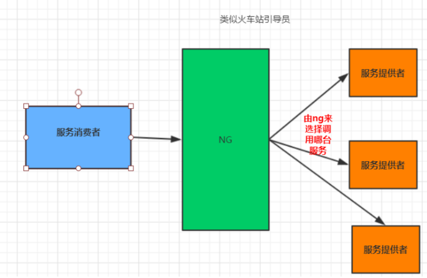
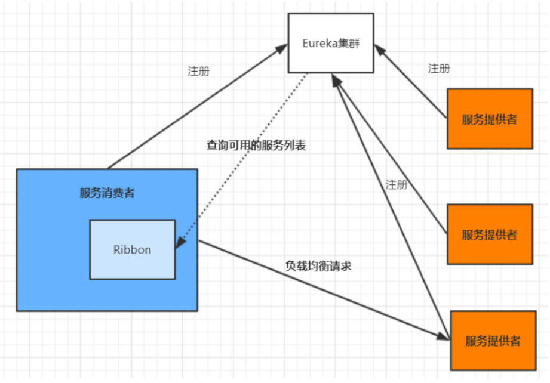
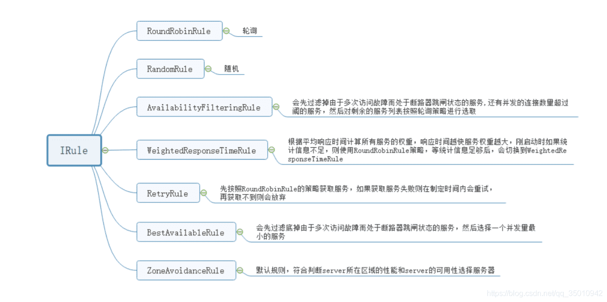

@autoHeader: 2.1.1.1.1.1

<p align="right">update time : {docsify-updated}</p>


## 简介 //todo

### 功能和组件

https://segmentfault.com/a/1190000022605186#Spring


## Ribbon

Spring Cloud Ribbon 是一套基于 Netflix Ribbon 实现的客户端负载均衡和服务调用工具，可以让我们轻松地将面向服务的REST请求自动转换成客户端负载均衡的服务调用。

### 负载均衡

#### 考虑因素

**设计一个负载均衡组件，该会怎么设计？**

需要考虑这几个因素：

- 如何获取及同步服务器列表？涉及到与注册中心的交互。
- 如何将负载进行分摊？涉及到分摊策略。
- 如何将客户端请求进行拦截然后选择服务器进行转发？涉及到请求拦截。

#### 负载均衡分类

##### 服务端负载均衡

客户端发送请求被服务端负载均衡拦截，根据负载均衡算法分发请求到具体服务器上处理请求。

服务端负载均衡包括两种，一种是硬件负载均衡，硬件比如：F5、Array等。另一种是软件负载均衡，软件比如：LVS、Nginx等。



##### 客户端负载均衡

在客户端负载均衡中，所有的客户端节点都有一份自己要访问的服务端清单，客户端在发起请求的时候会先自行选择一个服务端，向该服务端发起请求，从而实现负载均衡。



### 使用方式

#### demo

```java
@SpringBootApplication
@EnableEurekaClient
public class RibbonDemoApplication {

    public static void main(String[] args) {
        SpringApplication.run(RibbonDemoApplication.class, args);
    }

    @Bean
    @LoadBalanced
    RestTemplate restTemplate(){
        return new RestTemplate();
    }
}
```

- Ribbon客户端本身作为一个Eureka客户端存在，因此需要`@EnableEurekaClient`注解，并且向注册中心注册服务；

- `@Bean`和`@LoadBalanced`注解是注入一个RestTemplate实例，并标明是负载均衡使用的；

之后便使用restTemplate内部即做了负载均衡

```java
private static String EUREKA_URL = "http://eureka-client/getHello";
	public String getRibbonHello(HttpServletRequest request){
        String result = restTemplate.getForObject(EUREKA_URL, String.class);
        System.out.println(result);
        return result;
    }
```

### Ribbon负载均衡策略



**1 线性轮询均衡** 

RoundRobinRule，轮流依次请求不同的服务器。优点是无需记录当前所有连接的状态，无状态调度。

比如一共有 3 个服务，第一次调用服务 1，第二次调用服务 2，第三次调用服务3，依次类推。此策略的配置设置如下：

```
NFLoadBalancerRuleClassName: com.netflix.loadbalancer.RoundRobinRule 
#设置负载均衡
```

**2 加权响应时间负载均衡**

WeightedResponseTimeRule，为每个服务按响应时长自动分配权重，响应时间越长，权重越低，被选中的概率越低。

它的实现原理是，刚开始使用轮询策略并开启一个计时器，每一段时间收集一次所有服务提供者的平均响应时间，然后再给每个服务提供者附上一个权重，权重越高被选中的概率也越大。

```
NFLoadBalancerRuleClassName: com.netflix.loadbalancer.WeightedResponseTimeRule
```

**3 随机负载均衡**

RandomRule，随机选择服务器。适合并发比较大的场景。

```
NFLoadBalancerRuleClassName: com.netflix.loadbalancer.RandomRule #设置负载均衡
```

**4 最小连接数负载均衡**

Best Available，遍历服务提供者列表，选取连接数最小的⼀个服务实例。如果有相同的最小连接数，那么会调用轮询策略进行选取。

```
NFLoadBalancerRuleClassName: com.netflix.loadbalancer.BestAvailableRule #设置负载均衡
```

**5 重试负载均衡**

RetryRule，通过轮询均衡策略选择一个服务器，如果获取的服务实例为 null 或已经失效，则在指定的时间之内不断地进行重试来获取服务，如果超过指定时间依然没获取到服务实例则返回 null。

```
NFLoadBalancerRuleClassName: com.netflix.loadbalancer.RandomRule #设置负载均衡
ConnectTimeout: 2000 # 请求连接的超时时间
ReadTimeout: 5000 # 请求处理的超时时间
```

**6 可用性敏感负载均衡**

AvailabilityFilteringRule，过滤故障的服务，和并发连接数量超过阈值的服务，然后对剩余的服务列表按照轮询策略进行访问。

默认情况下，如果最近三次连接均失败，则认为该服务实例故障断路。

```
NFLoadBalancerRuleClassName: com.netflix.loadbalancer.AvailabilityFilteringRule
```

**7 区域感知负载均衡**

ZoneAvoidanceRule，根据服务所在区域（zone）的性能和服务的可用性来选择服务实例，在没有区域的环境下，该策略和轮询策略类似。

是Spring Cloud Ribbon 中默认的策略。

```
NFLoadBalancerRuleClassName: com.netflix.loadbalancer.ZoneAvoidanceRule
```

**8 自定义**

用户可以通过继承 RoundRibbonRule 来实现自定义负载均衡策略。

### Ribbon实现原理 //todo


## OpenFegin

