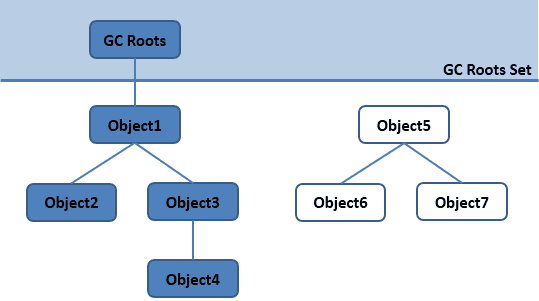
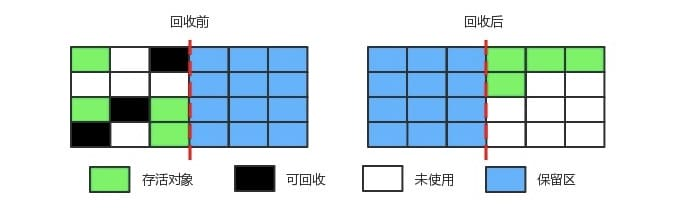
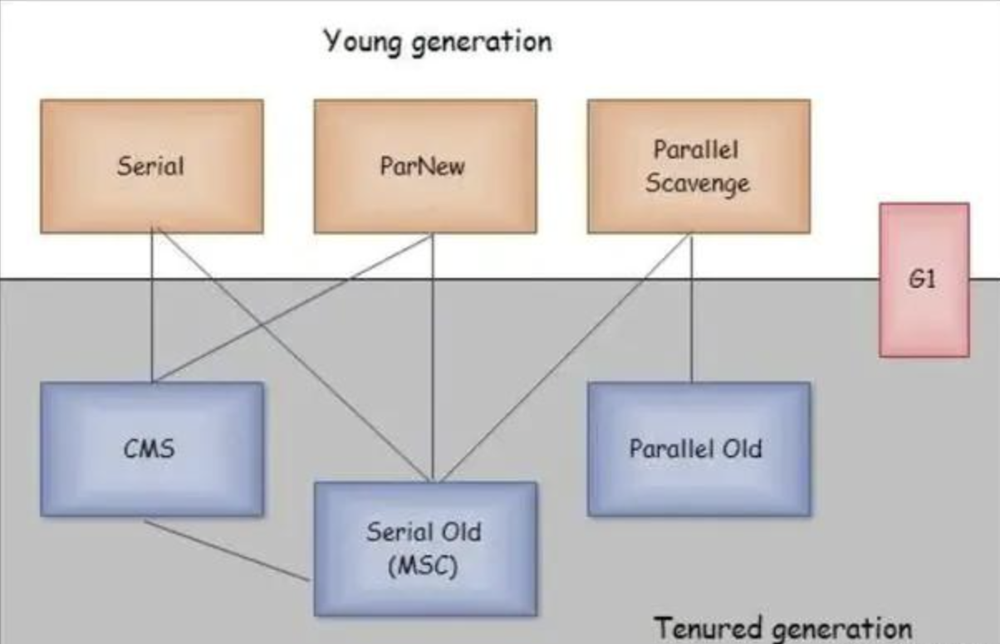

@autoHeader: 2.1.1.1.1.1

<p align="right">update time : {docsify-updated}</p>


## GC基础

### 一个对象是否可以回收

#### 引用计数算法

**描述**

给对象添加一个引用计数器，当对象增加一个引用时计数器加 1，引用失效时计数器减 1。引用计数为 0 的对象可被回收。

**缺点**

两个对象出现循环引用的情况下，此时引用计数器永远不为 0，导致无法对它们进行回收。

正因为循环引用的存在，因此 Java 虚拟机不使用引用计数算法。

```java
public class ReferenceCountingGC {

    public Object instance = null;

    public static void main(String[] args) {
        ReferenceCountingGC objectA = new ReferenceCountingGC();
        ReferenceCountingGC objectB = new ReferenceCountingGC();
        objectA.instance = objectB;
        objectB.instance = objectA;
    }
}
```

#### 可达性分析算法

**描述**

通过 GC Roots 作为起始点进行搜索，能够到达到的对象都是存活的，不可达的对象可被回收。



**GC Roots**

Java 虚拟机使用该算法来判断对象是否可被回收，在 Java 中 GC Roots 一般包含以下内容:

- 虚拟机栈中引用的对象：各个线程被调用的方法中使用到的参数、局部变量等
- 本地方法栈中引用的对象
- 方法区中类静态属性引用的对象
- 方法区中的常量引用的对象

**GC Root的特点**

GC Root采用栈方式存放变量和指针，所以如果一个指针，它保存了堆内存里面的对象，但是自己又不存放在堆内存里面，那它就是一个Root。

### 对象引用类型

判断对象是否存活都与”**引用**“有关系，引用分为强引用、软引用、弱引用、虚引用。

四种引用强度依次减弱： 

1. 强引用，只要强引用还存在，GC就不会回收被引用的对象。 
2. 软引用，在内存溢出异常之前才会回收被软引用的对象。 
3. 弱引用，无论当前内存是否足够，都会回收只被弱引用关联的对象。 
4. 虚引用，不会对该对象的生存时间造成任何影响，虚引用的目的是在这个对象被GC时能得到一个系统通知。 

#### 强引用

被强引用关联的对象不会被回收。

使用 new 一个新对象的方式来创建强引用。

```java
Object obj = new Object();
```

#### 软引用

被软引用关联的对象只有在内存不够的情况下才会被回收。

使用 SoftReference 类来创建软引用。

```java
Object obj = new Object();
SoftReference<Object> sf = new SoftReference<Object>(obj);
obj = null;  // 使对象只被软引用关联
```

#### 弱引用

被弱引用关联的对象一定会被回收，也就是说它只能存活到下一次垃圾回收发生之前。

使用 WeakReference 类来实现弱引用。

```java
Object obj = new Object();
WeakReference<Object> wf = new WeakReference<Object>(obj);
obj = null;
```

#### 虚引用

又称为幽灵引用或者幻影引用。一个对象是否有虚引用的存在，完全不会对其生存时间构成影响，也无法通过虚引用取得一个对象。

为一个对象设置虚引用关联的唯一目的就是能在这个对象被回收时收到一个系统通知。

使用 PhantomReference 来实现虚引用。

```java
Object obj = new Object();
PhantomReference<Object> pf = new PhantomReference<Object>(obj);
obj = null;
```

### 垃圾回收算法

#### 标记-清除

标记出所有需要回收的对象，标记完成之后统一回收所有被标记的对象。

不足:

- 标记和清除过程效率都不高；
- 会产生大量不连续的内存碎片，导致无法给大对象分配内存。


#### 标记-整理

将所有需要回收的对象标记出来，之后令还存活的对象向内存区域的一端移动，将需要回收的对象挤出边界外，之后直接清理掉边界外的内存。

不足：此种方法不会产生空间碎片，但是移动整理需要花费一定时间。


#### 复制

将内存分成大小相等两块，每次使用其中的一块，另外一块作为备用；当其中一块使用完，将存活的对象复制到另外一块中，之后清除整个这一块的内存。

此方法适用于生命周期不长的对象，存活下的对象比较少的情况，新生代就使用的这种方法。

不足：只使用了内存的一半



## GC机制

### 堆的分代GC

现在的商业虚拟机采用分代收集算法，它根据对象存活周期将内存划分为几块，不同块采用适当的收集算法。

一般将堆分为新生代和老年代：

- 新生代使用: 复制算法
- 老年代使用: 标记 - 清除 或者 标记 - 整理 算法

#### 策略

##### 新对象分配策略

大多数情况，对象在新生代Eden区分配。需要连续内存空间的大对象，如很长的字符串或者数组直接进入老年代。

##### 对象从新生代进入老年代

对象从新生代进入老年代，有两种情况：

- 对象年龄达到一定限额：为对象定义年龄计数器，对象在 Eden 出生并经过 Minor GC 依然存活，将移动到 Survivor 中，年龄就增加 1 岁，增加到一定年龄则移动到老年代中。

  -XX:MaxTenuringThreshold 用来定义年龄的阈值。

- Survivor 中相同年龄所有对象大小的总和大于 Survivor 空间的一半，则年龄大于或等于该年龄的对象可以直接进入老年代

##### 空间分配担保机制

在发生 Minor GC 之前，虚拟机先检查老年代最大可用的连续空间是否大于新生代所有对象总空间，如果条件成立的话，那么 Minor GC 可以确认是安全的。

如果不成立的话，虚拟机会查看 HandlePromotionFailure 设置值是否允许担保失败：

1. 如果允许：那么就会继续检查老年代最大可用的连续空间是否大于之前晋升到老年代对象的平均大小：
   1. 如果大于，将尝试着进行一次 Minor GC，如果尝试失败，则也会引发一次Full GC。
   2. 如果小于，将进行一次Full GC。
2. 如果 HandlePromotionFailure 设置不允许冒险，将进行一次 Full GC。

#### GC过程

1. 新生代： 

   1. 将新生代分为一块较大的Eden区，和两块较小的Survivor区，比例为 8 : 1 : 1 
   2. 每次使用Eden区和其中一块Survivor区，另外一块Survivor区保持空白，每次新创建的对象在Eden区中分配，除了很长的数组、字符串这种需要大量连续空间的大对象会直接进入老年代
   3. 当Eden的内存不够时，触发一次新生代GC：扫描Eden区一块Survivor区中还存活的对象，复制到另外一块Survivor区中，之后将Eden区一块Survivor区全部清空
   4. 每次从 Survivor移动到另外一个 Survivor区，仍然存活的对象，年龄+1，当年龄到达 15（默认配置是 15）时，升级为老生代
   5. 如果复制时Survivor区空间不够，则通过分配担保机制将Survivor空间无法容纳的对象提前移动到老年代中。为了更好适应内存情况，在新生代GC中，并不会一定要等到年龄达到设置的15才会移入老年代，如果Survivor区中对象年龄达到一定限额或者相同年龄的对象总和大于空间的一半，此时都会将这些对象移动到老年代。
2. 老年代：在MinorGC之前,会先检查老年代最大可用连续空间是否大于新生代所有对象总空间，如果大于就说明MinorGC是确保安全的，否则 
   1. 如果虚拟机设置允许担保失败，则会继续检查可用连续空间是否大于历次晋升到老年代对象的平均大小，大于的话则尝试Minor GC，成功就成功，失败也走第二步 
   2. 如果还是小于或者虚拟机设置不允许担保失败或者虽然大于但是尝试MinorGC失败，则要进行一次Full GC 


#### 触发时机

##### Minor GC

对于 Minor GC，其触发条件非常简单，当 Eden 空间满时，就将触发一次 Minor GC。

##### Full GC

1. **调用 System.gc()**

只是建议虚拟机执行 Full GC，但是虚拟机不一定真正去执行。不建议使用这种方式，而是让虚拟机管理内存。

2. **老年代空间不足**

老年代空间不足的常见场景为大对象直接进入老年代、长期存活的对象进入老年代等，导致老年代空间不足，不满足空间分配担保成功的条件时，引发Full GC

为了避免以上原因引起的 Full GC，应当尽量不要创建过大的对象以及数组。除此之外，可以通过 -Xmn 虚拟机参数调大新生代的大小，让对象尽量在新生代被回收掉，不进入老年代。还可以通过 -XX:MaxTenuringThreshold 调大对象进入老年代的年龄，让对象在新生代多存活一段时间。

3. **空间分配担保失败**

使用复制算法的 Minor GC 需要老年代的内存空间作担保，如果担保失败会执行一次 Full GC。

4. **JDK 1.7 及以前的永久代空间不足**

在 JDK 1.7 及以前，HotSpot 虚拟机中的方法区是用永久代实现的，永久代中存放的为一些 Class 的信息、常量、静态变量等数据。

当系统中要加载的类、反射的类和调用的方法较多时，永久代可能会被占满，在未配置为采用 CMS GC 的情况下也会执行 Full GC。如果经过 Full GC 仍然回收不了，那么虚拟机会抛出 java.lang.OutOfMemoryError。


> 其他：
>
> Concurrent Mode Failure
>
> 对于CMS收集器而言，执行 CMS GC 的过程中同时有对象要放入老年代，而此时老年代空间不足(可能是 GC 过程中浮动垃圾过多导致暂时性的空间不足)，便会报 Concurrent Mode Failure 错误，并触发 Full GC。

### 方法区GC

有些人认为方法区（如 Hotspot 虚拟机中的元空间或者永久代）是没有垃圾收集行为的，其实不然。《Java 虚拟机规范》对方法区的约束是非常宽松的，提到过可以不要求虚拟机在方法区中实现垃圾收集。

HotSpot中方法区的垃圾收集主要回收两部分内容：**常量池**中废弃的常量和不再使用的类型。

永久代在HotSpot1.8之后已经替换成元空间的概念了，改用本地内存，只受可用的本地内存限制。

#### 废弃的变量

HotSpot 虚拟机对常量池的回收策略是很明确的，只要常量池中的常量没有被任何地方引用，就可以被回收。

#### 不再使用的类型

判定一个类型是否属于“不再被使用的类”，需要同时满足三个条件：

- 该类所有的实例都已经被回收，也就是 Java 堆中不存在该类及其任何派生子类的实例
- 加载该类的类加载器已经被回收，这个条件除非是经过精心设计的可替换类加载器的场景，如 OSGi、JSP 的重加载等，否则通常很难达成
- 该类对应的 java.lang.Class 对象没有在任何地方被引用，无法在任何地方通过反射访问该类的方法

#### GC时机

##### 永久代

Java 虚拟机被允许对满足上述三个条件的无用类进行回收，这里说的仅仅是“被允许”，而并不是和对象一样，没有引用了就必然会回收。

关于是否要对类型进行回收，HotSpot 虚拟机提供了`-Xnoclassgc`参数进行控制，还可以使用`-verbose:class` 以及 `-XX:+TraceClassLoading`、`-XX:+TraceClassUnLoading`查看类加载和卸载信息

##### 元空间

Metaspace 只在 GC 运行并且卸载类加载器的时候才会释放空间。当然，在某些时候，需要主动触发 GC 来回收一些没用的 class metadata，即使这个时候对于堆空间来说，还达不到 GC 的条件。

Metaspace 可能在两种情况下触发 GC：

1、分配空间时：虚拟机维护了一个阈值，如果 Metaspace 的空间大小超过了这个阈值，那么在新的空间分配申请时，虚拟机首先会通过收集可以卸载的类加载器来达到复用空间的目的，而不是扩大 Metaspace 的空间，这个时候会触发 GC。这个阈值会上下调整，和Metaspace 已经占用的操作系统内存保持一个距离。

2、碰到 Metaspace OOM：Metaspace 的总使用空间达到了 MaxMetaspaceSize 设置的阈值，或者 Compressed Class Space 被使用光了，如果这次 GC 真的通过卸载类加载器腾出了很多的空间，这很好，否则的话，我们会进入一个糟糕的 GC 周期，即使我们有足够的堆内存。

## 垃圾收集器

垃圾收集算法是内存回收的方法论，那么垃圾收集器就是内存回收的具体实现。下图展示了7种作用于不同分代的收集器，其中用于回收新生代的收集器包括Serial、PraNew、Parallel Scavenge，回收老年代的收集器包括Serial Old、Parallel Old、CMS，还有用于回收整个Java堆的G1收集器。不同收集器之间的连线表示它们可以搭配使用。



- Serial收集器（复制算法): 新生代单线程收集器，标记和清理都是单线程，优点是简单高效；
- ParNew收集器 (复制算法): 新生代收并行集器，实际上是Serial收集器的多线程版本，在多核CPU环境下有着比Serial更好的表现；
- Parallel Scavenge收集器 (复制算法): 新生代并行收集器，追求高吞吐量，高效利用 CPU。吞吐量 = 用户线程时间/(用户线程时间+GC线程时间)，高吞吐量可以高效率的利用CPU时间，尽快完成程序的运算任务，适合后台应用等对交互相应要求不高的场景；
- Serial Old收集器 (标记-整理算法): 老年代单线程收集器，Serial收集器的老年代版本；
- Parallel Old收集器 (标记-整理算法)： 老年代并行收集器，吞吐量优先，Parallel Scavenge收集器的老年代版本；
- CMS(Concurrent Mark Sweep)收集器（标记-清除算法）： 老年代并行收集器，以获取最短回收停顿时间为目标的收集器，具有高并发、低停顿的特点，追求最短GC回收停顿时间。
- G1(Garbage First)收集器 (标记-整理算法)： Java堆并行收集器，G1收集器是JDK1.7提供的一个新收集器，G1收集器基于“标记-整理”算法实现，也就是说不会产生内存碎片。此外，G1收集器不同于之前的收集器的一个重要特点是：G1回收的范围是整个Java堆(包括新生代，老年代)，而前六种收集器回收的范围仅限于新生代或老年代。

### G1


## 常见问题


