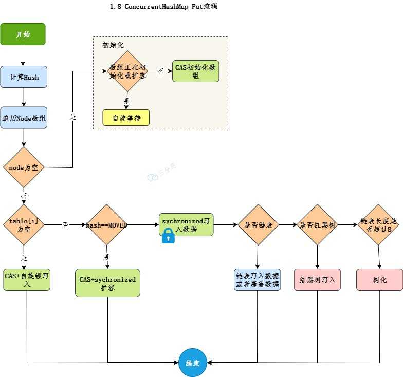

@autoHeader: 2.1.1.1.1.1

<p align="right">update time : {docsify-updated}</p>


JUC框架包括五个部分：

- Lock框架：锁机制
- Collections: 并发集合
- Atomic: 原子类
- Executors: 线程池
- Tools类：工具类

## 锁机制


### 抽象类

#### AQS

##### 概述

**AQS**是`AbstractQueuedSynchronizer`的简称，即`抽象队列同步器`，从字面上可以这样理解:

- 抽象：抽象类，只实现一些主要逻辑，有些方法由子类实现；
- 队列：使用先进先出（FIFO）的队列存储数据；
- 同步：实现了同步的功能。

AQS 是一个用来构建锁和同步器的框架，使用 AQS 能简单且高效地构造出应用广泛的同步器，比如ReentrantLock、Semaphore，ReentrantReadWriteLock、SynchronousQueue、FutureTask等等，都是基于 AQS 的。

当然了，我们也可以利用 AQS 轻松定制专属的同步器，只要实现它的几个`protected`方法就可以了。

##### 核心思想

AQS核心思想是：

如果被请求的共享资源空闲，则将当前请求资源的线程设置为有效的工作线程，并且将共享资源设置为锁定状态。

如果被请求的共享资源被占用，那么就需要一套线程阻塞等待以及被唤醒时锁分配的机制，即将暂时获取不到锁的线程加入到队列中。

##### 数据结构


#### AQLS

#### AOS

### 接口

#### Condition


#### Lock

#### ReadWriteLock

### 类

#### LockSupport


#### 可重入锁 ReentrantLock

ReentrantLock 重入锁，是实现Lock 接口的一个类，也是在实际编程中使用频率很高的一个锁，**支持重入性，表示能够对共享资源重复加锁，即当前线程获取该锁后再次获取不会被阻塞**

##### 实现原理

要想支持重入性，就要解决两个问题：

1. 在线程获取锁的时候，如果已经获取锁的线程是当前线程的话则直接再次获取成功；
2. 由于锁会被获取 n 次，那么只有锁在被释放同样的 n 次之后，该锁才算是完全释放成功。

```java
final boolean nonfairTryAcquire(int acquires) {
    final Thread current = Thread.currentThread();
    int c = getState();
    //1. 如果该锁未被任何线程占有，该锁能被当前线程获取
	if (c == 0) {
        if (compareAndSetState(0, acquires)) {
            setExclusiveOwnerThread(current);
            return true;
        }
    }
	//2.若被占有，检查占有线程是否是当前线程
    else if (current == getExclusiveOwnerThread()) {
		// 3. 再次获取，计数加一
        int nextc = c + acquires;
        if (nextc < 0) // overflow
            throw new Error("Maximum lock count exceeded");
        setState(nextc);
        return true;
    }
    return false;
}


protected final boolean tryRelease(int releases) {
	//1. 同步状态减1
    int c = getState() - releases;
    if (Thread.currentThread() != getExclusiveOwnerThread())
        throw new IllegalMonitorStateException();
    boolean free = false;
    if (c == 0) {
		//2. 只有当同步状态为0时，锁成功被释放，返回true
        free = true;
        setExclusiveOwnerThread(null);
    }
	// 3. 锁未被完全释放，返回false
    setState(c);
    return free;
}

```

ReentrantLock的加锁逻辑为：

1. 如果该锁未被任何线程占有，该锁能被当前线程获取
2. 若被占有，检查占有线程是否是当前线程
3. 若为当前线程，再次获取，计数加一

锁释放的逻辑为：

1. 同步状态减1
2.  必须等到同步状态为 0 时锁才算成功释放，否则锁仍未释放。如果锁被获取了 n 次，释放了 n-1 次，该锁未完全释放返回 false，只有被释放 n 次才算成功释放，返回 true。

##### 公平锁/非公平锁

ReentrantLock 支持两种锁：**公平锁**和**非公平锁**。

ReentrantLock 的构造方法无参时是构造非公平锁。

```java
public ReentrantLock() {
    sync = new NonfairSync();
}
```

另外还提供了一种方式，可传入一个 boolean 值，true 时为公平锁，false 时为非公平锁。

```java
public ReentrantLock(boolean fair) {
    sync = fair ? new FairSync() : new NonfairSync();
}
```

在非公平锁获取时（nonfairTryAcquire 方法），只是简单的获取了一下当前状态然后做了一些逻辑处理，并没有考虑到当前同步队列中线程等待的情况。

公平锁会判断当前节点在同步队列中是否有前驱节点的，如果有前驱节点，说明有线程比当前线程更早的请求资源，根据公平性，当前线程请求资源失败。如果当前节点没有前驱节点，才有做后面逻辑判断的必要性。

> [!tip]
>
> 公平锁的运行结果与非公平锁的运行结果一致，这是因为公平锁的实现方式与非公平锁的实现方式基本一致，只是在获取锁时增加了判断当前节点是否有前驱节点的逻辑判断。
>
> - 公平锁: 按照线程请求锁的顺序获取锁，即先到先得。
> - 非公平锁: 线程获取锁的顺序可能与请求锁的顺序不同，可能导致某些线程获取锁的速度较快。

##### 使用方式

```java
public class ReentrantLockTest {
    private static final ReentrantLock lock = new ReentrantLock();
    private static int count = 0;

    public static void main(String[] args) throws InterruptedException {
        Thread thread1 = new Thread(() -> {
            for (int i = 0; i < 10000; i++) {
                lock.lock();
                try {
                    count++;
                } finally {
                    lock.unlock();
                }
            }
        });
        Thread thread2 = new Thread(() -> {
            for (int i = 0; i < 10000; i++) {
                lock.lock();
                try {
                    count++;
                } finally {
                    lock.unlock();
                }
            }
        });
        thread1.start();
        thread2.start();
        thread1.join();
        thread2.join();
        System.out.println(count);
    }
}
```

错误示例：

```java
Lock lock = new XxxLock();
// ...
try {
    // 如果在此抛出异常，会直接执行 finally 块的代码
    doSomething();
    // 不管锁是否成功，finally 块都会执行
    lock.lock();
    doOthers();

} finally {
    lock.unlock();
} 
```

> [!ATTENTION]
>
> 使用 ReentrantLock 时，锁必须在 try 代码块开始之前获取，并且加锁之前不能有异常抛出，否则在 finally 块中就无法释放锁，ReentrantLock 的锁必须在 finally 中手动释放。

##### 和Synochronized的区别

ReentrantLock 与 synchronized 关键字都是用来实现同步的，它们的对比：

- ReentrantLock 是一个类，而 synchronized 是 Java 中的关键字
- ReentrantLock 可以实现多路选择通知（可以绑定多个 Condition)，而 synchronized 只能通过 wait 和 notify/notifyAll 方法唤醒一个线程或者唤醒全部线程（单路通知）；
- ReentrantLock 必须手动释放锁。通常需要在 finally 块中调用 unlock 方法以确保锁被正确释放。synchronized 会自动释放锁，当同步块执行完毕时，由 JVM 自动释放，不需要手动操作。
- ReentrantLock: 通常提供更好的性能，特别是在高竞争环境下。synchronized: 在某些情况下，性能可能稍差一些，但随着 JDK 版本的升级，性能差距已经不大了。

#### 读写锁 ReentrantReadWriteLock

ReentrantReadWriteLock 是 Java 的一种读写锁，它允许多个读线程同时访问，但只允许一个写线程访问，会阻塞所有的读写线程。

这种锁的设计可以提高性能，特别是在读操作的数量远远超过写操作的情况下。

##### 读写锁的特性

- 公平性选择

支持非公平性（默认）和公平的锁获取方式，非公平的吞吐量优于公平。

- 重入性

支持重入，读锁获取后能再次获取，写锁获取之后能够再次获取写锁，同时也能够获取读锁。

- 锁降级

写锁降级是一种允许写锁转换为读锁的过程。

写锁降级为读锁的过程有助于保持数据的一致性，而不影响并发读取的性能。通过这种方式，线程可以继续保持对数据的独占访问权限，直到它准备允许其他线程共享读取访问。这样可以确保在写操作和随后的读操作之间的数据一致性，并且允许其他读取线程并发访问。

通常的顺序是：
1. 获取写锁：线程首先获取写锁，确保在修改数据时排它访问。
2. 获取读锁：在写锁保持的同时，线程可以再次获取读锁。
3. 释放写锁：线程保持读锁的同时释放写锁。
4. 释放读锁：最后线程释放读锁。

```java
ReentrantReadWriteLock lock = new ReentrantReadWriteLock();
ReentrantReadWriteLock.WriteLock writeLock = lock.writeLock();
ReentrantReadWriteLock.ReadLock readLock = lock.readLock();

writeLock.lock(); // 获取写锁
try {
    // 执行写操作
    readLock.lock(); // 获取读锁
} finally {
    writeLock.unlock(); // 释放写锁
}

try {
    // 执行读操作
} finally {
    readLock.unlock(); // 释放读锁
}
```

##### state变量记录读还是写


- 同步状态state的低 16 位用来表示写锁的获取次数
- 同步状态state的高16 位用来表示读锁的获取次数

```java
//该方法是获取读锁被获取的次数，是将同步状态（int c）右移 16 次，即取同步状态的高 16 位
static int sharedCount(int c)   {
    return c >>> SHARED_SHIFT; 
}
//该方法是获取写锁被获取的次数，EXCLUSIVE_MASK 为 1 左移 16 位然后减 1，即为 0x0000FFFF。而 exclusiveCount 方法是将同步状态（state 为 int 类型）与 0x0000FFFF 相与，即取同步状态的低 16 位
static int exclusiveCount(int c){ 
    return c & EXCLUSIVE_MASK; 
}
```

##### 写锁获取

ReentrantReadWriteLock 的写锁是独占式锁，而实现写锁的同步语义是通过重写 AQS中的 tryAcquire 方法实现的。

**当读锁已经被读线程获取或者写锁已经被其他写线程获取，则写锁获取失败；否则，获取成功并支持重入，增加写状态**

```java
protected final boolean tryAcquire(int acquires) {
    Thread current = Thread.currentThread();
	// 1. 获取写锁当前的同步状态
    int c = getState();
	// 2. 获取写锁获取的次数
    int w = exclusiveCount(c);
    if (c != 0) {
        // (Note: if c != 0 and w == 0 then shared count != 0)
		// 3.1 当读锁已被读线程获取或者当前线程不是已经获取写锁的线程的话
		// 当前线程获取写锁失败
        if (w == 0 || current != getExclusiveOwnerThread())
            return false;
        if (w + exclusiveCount(acquires) > MAX_COUNT)
            throw new Error("Maximum lock count exceeded");
        // Reentrant acquire
		// 3.2 当前线程获取写锁，支持可重复加锁
        setState(c + acquires);
        return true;
    }
	// 3.3 写锁未被任何线程获取，当前线程可获取写锁
    if (writerShouldBlock() ||
        !compareAndSetState(c, c + acquires))
        return false;
    setExclusiveOwnerThread(current);
    return true;
}
```


##### 写锁释放

写锁释放通过重写 AQS的 tryRelease 方法。

需要注意的是，减少写状态 `int nextc = getState() - releases;` 只需要用当前同步状态state直接减去写状态，原因正是写状态是由同步状态state的低 16 位表示的

```java
protected final boolean tryRelease(int releases) {
    if (!isHeldExclusively())
        throw new IllegalMonitorStateException();
	//1. 同步状态减去写状态
    int nextc = getState() - releases;
	//2. 当前写状态是否为0，为0则释放写锁
    boolean free = exclusiveCount(nextc) == 0;
    if (free)
        setExclusiveOwnerThread(null);
	//3. 不为0则更新同步状态
    setState(nextc);
    return free;
}
```


##### 读锁获取

读锁不是独占式锁，即同一时刻该锁可以被多个读线程获取，也就是一种共享式锁。

实现共享式同步组件的同步语义需要通过重写 AQS 的 tryAcquireShared 方法和 tryReleaseShared 方法。

 **当写锁被其他线程获取后，读锁获取失败**，否则获取成功，会利用 CAS 更新同步状态。

```java
protected final int tryAcquireShared(int unused) {
    Thread current = Thread.currentThread();
    int c = getState();
	//1. 如果写锁已经被获取并且获取写锁的线程不是当前线程的话，当前
	// 线程获取读锁失败返回-1
    if (exclusiveCount(c) != 0 &&
        getExclusiveOwnerThread() != current)
        return -1;
    int r = sharedCount(c);
    if (!readerShouldBlock() &&
        r < MAX_COUNT &&
		//2. 当前线程获取读锁
        compareAndSetState(c, c + SHARED_UNIT)) {
		//3. 下面的代码主要是新增的一些功能，比如getReadHoldCount()方法
		//返回当前获取读锁的次数
        if (r == 0) {
            firstReader = current;
            firstReaderHoldCount = 1;
        } else if (firstReader == current) {
            firstReaderHoldCount++;
        } else {
            HoldCounter rh = cachedHoldCounter;
            if (rh == null || rh.tid != getThreadId(current))
                cachedHoldCounter = rh = readHolds.get();
            else if (rh.count == 0)
                readHolds.set(rh);
            rh.count++;
        }
        return 1;
    }
	//4. 处理在第二步中CAS操作失败的自旋已经实现重入性
    return fullTryAcquireShared(current);
}
```


##### 读锁释放

读锁释放的实现主要通过方法 tryReleaseShared。

```java
protected final boolean tryReleaseShared(int unused) {
    Thread current = Thread.currentThread();
	// 前面还是为了实现getReadHoldCount等新功能
    if (firstReader == current) {
        // assert firstReaderHoldCount > 0;
        if (firstReaderHoldCount == 1)
            firstReader = null;
        else
            firstReaderHoldCount--;
    } else {
        HoldCounter rh = cachedHoldCounter;
        if (rh == null || rh.tid != getThreadId(current))
            rh = readHolds.get();
        int count = rh.count;
        if (count <= 1) {
            readHolds.remove();
            if (count <= 0)
                throw unmatchedUnlockException();
        }
        --rh.count;
    }
    for (;;) {
        int c = getState();
		// 读锁释放 将同步状态减去读状态即可
        int nextc = c - SHARED_UNIT;
        if (compareAndSetState(c, nextc))
            
            return nextc == 0;
    }
}
```

##### 锁降级

读写锁支持锁降级，不支持锁升级。

遵循按照**<font color=red>获取写锁 --> 获取读锁 --> 释放写锁</font>**的次序，写锁能够降级成为读锁。

```java
void processCachedData() {
    rwl.readLock().lock();
    if (!cacheValid) {
        // Must release read lock before acquiring write lock
        rwl.readLock().unlock();
        rwl.writeLock().lock();
        try {
            // Recheck state because another thread might have
            // acquired write lock and changed state before we did.
            if (!cacheValid) {
                data = ...
        cacheValid = true;
      }
      // Downgrade by acquiring read lock before releasing write lock
      rwl.readLock().lock();
    } finally {
      rwl.writeLock().unlock(); // Unlock write, still hold read
    }
  }

  try {
    use(data);
  } finally {
    rwl.readLock().unlock();
  }
}
```

1. 获取读锁：首先尝试获取读锁来检查某个缓存是否有效。

2. 检查缓存：如果缓存无效，则需要释放读锁，因为在获取写锁之前必须释放读锁。

3. 获取写锁：获取写锁以便更新缓存。此时，可能还需要重新检查缓存状态，因为在释放读锁和获取写锁之间可能有其他线程修改了状态。

4. 更新缓存：如果确认缓存无效，更新缓存并将其标记为有效。

5. 写锁降级为读锁：在释放写锁之前，获取读锁，从而实现写锁到读锁的降级。这样，在释放写锁后，其他线程可以并发读取，但不能写入。

6. 使用数据：现在可以安全地使用缓存数据了。

7. 释放读锁：完成操作后释放读锁。

这个流程结合了读锁和写锁的优点，确保了数据的一致性和可用性，同时允许在可能的情况下进行并发读取。使用读写锁的代码可能看起来比使用简单的互斥锁更复杂，但它提供了更精细的并发控制，可能会提高多线程应用程序的性能。

#### 锁王StampedLock


## 集合类


### Map

#### ConcurrentHashMap

##### jdk 1.7

从结构上说，1.7版本的ConcurrentHashMap采用分段锁机制，里面包含一个Segment数组，Segment继承于ReentrantLock，Segment则包含HashEntry的数组，HashEntry本身就是一个链表的结构，具有保存key、value的能力能指向下一个节点的指针。

实际上就是相当于每个Segment都是一个HashMap，默认的Segment长度是16，也就是支持16个线程的并发写，Segment之间相互不会受到影响。


##### jdk1.8

jdk1.8实现线程安全不是在数据结构上下功夫，它的数据结构和HashMap是一样的，数组+链表+红黑树。


它实现线程安全的关键点在于put流程：

1. 如果没有初始化就先调用initTable（）方法来进行初始化过程 ；
2. 如果没有hash冲突就直接CAS插入，直接调用Unsafe的方法CAS插入该元素；
3. 如果还在进行扩容操作就先进行扩容 ；
4. 如果存在hash冲突，就加锁来保证线程安全，这里有两种情况，一种是链表形式就直接遍历到尾端插入，一种是红黑树就按照红黑树结构插入；
5. 最后一个如果该链表的数量大于阈值8，就要先转换成黑红树的结构，break再一次进入循环 ；
6. 如果添加成功就调用addCount（）方法统计size，并且检查是否需要扩容。




## 原子类

### CAS

CAS的全称为Compare-And-Swap，直译就是对比交换。

CAS是一条CPU的原子指令，其作用是让CPU先进行比较两个值是否相等，然后原子地更新某个位置的值。

其实现方式是基于硬件平台的汇编指令，就是说CAS是靠硬件实现的，JVM只是封装了汇编调用，那些AtomicInteger类便是使用了这些封装后的接口。  

> [!Note]CAS操作需要输入两个数值，一个旧值(期望操作前的值)和一个新值，在操作期间先比较下在旧值有没有发生变化，如果没有发生变化，才交换成新值，发生了变化则不交换。

CAS操作是原子性的，所以多线程并发使用CAS更新数据时，可以不使用锁。JDK中大量使用了CAS来更新数据而防止加锁来保持原子更新。

#### CAS原理

在CAS中，有这样三个值：

- V：要更新的变量(var)
- E：预期值(expected)
- N：新值(new)

比较并交换的过程如下：

1. 判断V是否等于E，如果等于，将V的值设置为N；
2. 如果不等，说明已经有其它线程更新了V，则当前线程放弃更新，什么都不做。

所以这里的**预期值E本质上指的是“旧值”**。

以一个简单的例子来解释这个过程，如果有一个多个线程共享的变量`i`原本等于5，在线程A中，想把它设置为新的值6，使用CAS来做这个事情：

1. 首先我们用i去与5对比，发现它等于5，说明没有被其它线程改过，那我就把它设置为新的值6，此次CAS成功，`i`的值被设置成了6；
2. 如果不等于5，说明`i`被其它线程改过了（比如现在`i`的值为2），那么我就什么也不做，此次CAS失败，`i`的值仍然为2。

那有没有可能我在判断了`i`为5之后，正准备更新它的新值的时候，被其它线程更改了`i`的值呢？

不会的。因为CAS是一种原子操作，它是一种系统原语，是一条CPU的原子指令，从CPU层面保证它的原子性。

**当多个线程同时使用CAS操作一个变量时，只有一个会胜出，并成功更新，其余均会失败，但失败的线程并不会被挂起，仅是被告知失败，并且允许再次尝试，当然也允许失败的线程放弃操作。**

#### Java中实现CAS的原理

在Java中，如果一个方法是native的，那Java不负责具体实现它，而是交给底层的JVM使用c或者c++去实现。

在Java中，有一个`Unsafe`类，它在`sun.misc`包中。它里面是一些`native`方法，其中就有几个关于CAS的：

```java
boolean compareAndSwapObject(Object o, long offset,Object expected, Object x);
boolean compareAndSwapInt(Object o, long offset,int expected,int x);
boolean compareAndSwapLong(Object o, long offset,long expected,long x);
```

当然，他们都是`public native`的。

Unsafe中对CAS的实现是C++写的，它的具体实现和操作系统、CPU都有关系。

Linux的X86下主要是通过`cmpxchgl`这个指令在CPU级完成CAS操作的，但在多处理器情况下必须使用`lock`指令加锁来完成。当然不同的操作系统和处理器的实现会有所不同，大家可以自行了解。

当然，Unsafe类里面还有其它方法用于不同的用途。比如支持线程挂起和恢复的`park`和`unpark`， LockSupport类底层就是调用了这两个方法。还有支持反射操作的`allocateInstance()`方法。

### Unsafe


### 原子类

JDK中提供了12个原子操作类。

#### 基本类型

使用原子的方式更新基本类型，Atomic包提供了以下3个类。

- AtomicBoolean: 原子更新布尔类型。
- AtomicInteger: 原子更新整型。
- AtomicLong: 原子更新长整型。

#### 数组类型

通过原子的方式更新数组里的某个元素，Atomic包提供了以下的3个类：

- AtomicIntegerArray: 原子更新整型数组里的元素。
- AtomicLongArray: 原子更新长整型数组里的元素。
- AtomicReferenceArray: 原子更新引用类型数组里的

这三个类的最常用的方法是如下两个方法：

- get(int index)：获取索引为index的元素值。
- compareAndSet(int i,E expect,E update): 如果当前值等于预期值，则以原子方式将数组位置i的元素设置为update值。

```java
public static void main(String[] args) throws InterruptedException {
        AtomicIntegerArray array = new AtomicIntegerArray(new int[] { 0, 0 });
        System.out.println(array);
        System.out.println(array.getAndAdd(1, 2));
        System.out.println(array);
    }
```

#### 引用类型

Atomic包提供了以下三个类：

- AtomicReference: 原子更新引用类型。
- AtomicStampedReference: 原子更新引用类型, 内部使用Pair来存储元素值及其版本号。
- AtomicMarkableReferce: 原子更新带有标记位的引用类型。

#### 字段更新器

Atomic包提供了四个类进行原子字段更新：

- AtomicIntegerFieldUpdater: 原子更新整型的字段的更新器。
- AtomicLongFieldUpdater: 原子更新长整型字段的更新器。
- AtomicReferenceFieldUpdater: 上面已经说过此处不在赘述。

这四个类的使用方式都差不多，是基于反射的原子更新字段的值。要想原子地更新字段类需要两步:

- 第一步，因为原子更新字段类都是抽象类，每次使用的时候必须使用静态方法newUpdater()创建一个更新器，并且需要设置想要更新的类和属性。
- 第二步，更新类的字段必须使用public volatile修饰。

## 线程池


## 工具类

