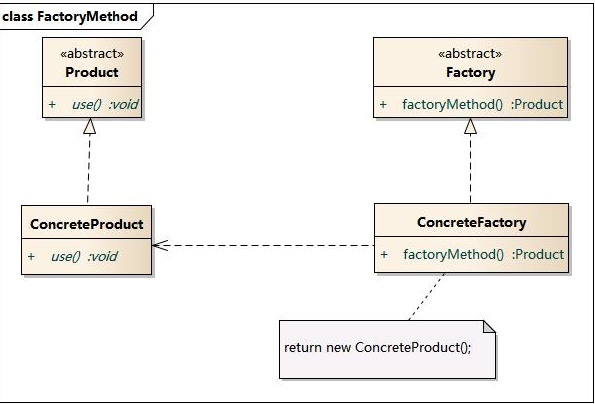
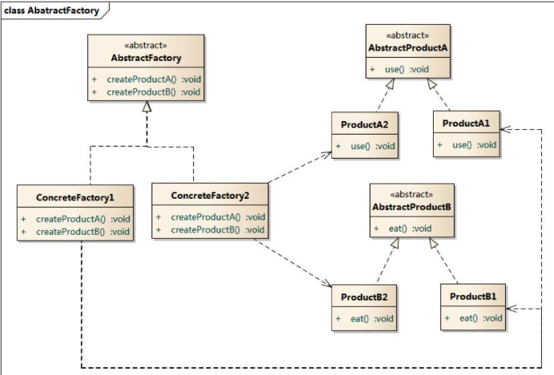

> [!Note] 23种设计模式：
>
> - 创建型5种： 工厂方法、抽象工厂、原型、单例、构建器
> - 结构型7种： 适（适配）、桥（桥接）、组（组合）、装（装饰）、外（外观）、享（享元）、代（代理）—【代桥组装适享外】
> - 行为型11种：其他

**创建型** 创建型模式主要用于创建对象，为设计类实例化新对象提供指南。 

| 模式名称                     | 是否包含类模式 | 特点           | 应用场景                   | 优缺点                                                       | UML                                                          |
| ---------------------------- | -------------- | -------------- | -------------------------- | ------------------------------------------------------------ | ------------------------------------------------------------ |
| 工厂方法 Factory Method   | 是             | 动态生产对象   |                            | 1.用户只需要知道具体工厂的名称就可得到所要的产品，无须知道产品的具体创建过程。 2.灵活性增强，对于新产品的创建，只需多写一个相应的工厂类。 3.典型的解耦框架。高层模块只需要知道产品的抽象类，无须关心其他实现类，满足迪米特法则、依赖倒置原则和里氏替换原则。 缺点： 1.类的个数容易过多，增加复杂度 2.增加了系统的抽象性和理解难度 |  1.Product：抽象产品 2.ConcreteProduct：具体产品 3. Factory：抽象工厂 4.ConcreteFactory：具体工厂 定义一个用于创建对象的工厂接口，声明工厂方法。子类实现工厂接口，重写工厂方法，返回实例对象，由子类决定实例化哪种实例对象。 |
| 抽象工厂 Abstract Factory |                | 生产成系列对象 | 例：系统支持多种类型数据库 | 1.可以在类的内部对产品族中相关联的多等级产品共同管理，而不必专门引入多个新的类来进行管理。 2.当需要产品族时，抽象工厂可以保证客户端始终只使用同一个产品的产品组。 3.抽象工厂增强了程序的可扩展性，当增加一个新的产品族时，不需要修改原代码，满足开闭原则。  其缺点是：当产品族中需要增加一个新的产品时，所有的工厂类都需要进行修改。增加了系统的抽象性和理解难度。 | 1.AbstractFactory：抽象工厂 2.ConcreteFactory：具体工厂  3.AbstractProduct：抽象产品  4.Product：具体产品 首先定义抽象工厂接口，其中包含多种不同产品创建的抽象方法，针对不同产品定义对应的实际创建工厂，实际创建工厂继承抽象工厂接口，并实现其中方法。 |
|                              |                |                |                            |                                                              |                                                              |
|                              |                |                |                            |                                                              |                                                              |
|                              |                |                |                            |                                                              |                                                              |
|                              |                |                |                            |                                                              |                                                              |

