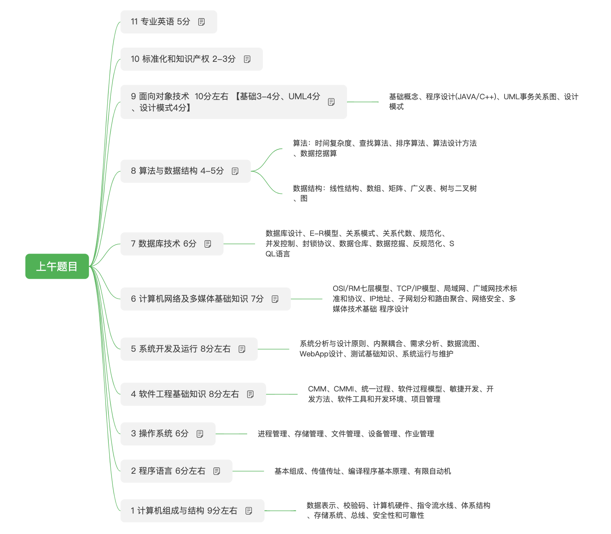

> 中级软考考试-软件设计师

> ![note] 已通过
>
> - [ ] 有空迁移，原印象笔记的备考材料迁移过来

## 上午考点

## 下午考点

第一题

为结构化分析与设计，考查数据流图DFD的绘制，考查形式：

\- 写出上下文数据流图中空缺的外部实体

\- 写出0层数据流图中空缺的数据存储

\- 写出遗漏的数据流及其起点和终点

------

第二题：

为数据库的分析和设计，考查ER图的绘制以及ER图与关系模式的映射，考查形式：

\- 补充完成ER图（增加实体，联系，以及联系类型，属性）

\- 将关系模式补充完整（属性，字段填空）

\- 找出关系模式的主键，外键

\- 增加部分信息，修改原实体关系图及实体间的联系

------

第三题：

为面向对象分析与设计，考查常用UML图形相关知识，如：用例图，类图，顺序图，活动图和状态图，考查形式为：

\- 图形填空，如给出空缺类名

\- 给出对应部分的多重度

\- 增加需求，对原类图进行修改

\- 采用了何种设计模式，采用的原因

------

第四个题：（应该是最难的题，可以最后做，防止做不完）

考查对常用数据结构和算法的掌握情况，如贪心算法，动态规划，回溯法，背包问题，最短路径，拓扑排序，堆排序等

考查形式：

\- C语言代码填空

\- 采用了什么设计策略

\- 时间，空间复杂度，算法稳定性分析

\- 输出结果是什么

------

第五，六题

为设计模式题（c++和java二选一）

考查对常见设计模式的掌握情况，通常结合一个设计模式实洌，给出类图和实例描述，然后进行代码填空，有c++和java两个语言版本，二选一

